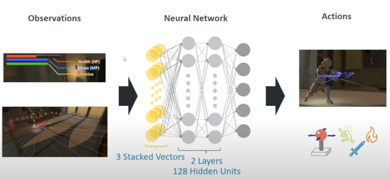

## Overview of machine learning

One way to implement a machine learning system is using _Neural Networks_. This is the method enabled by Unity ML Agents.

This method involves training a neural network model (a "brain") that takes inputs (observations), processes them, and produces outputs (decisions). These outputs drive the actions of the AI characters in the game.

Neural networks are a vast and complex subject. To simplify, they contain inputs (input nodes), outputs (output nodes), and internal nodes that process the input values. Input values get modified as they pass through the internal nodes to reach the output nodes.

Internal nodes have "weights" which are numerical parameters that affect a node's output to subsequent nodes. You train a neural network model by feeding sample input values, inspecting the output values, and comparing the output to expected values over many iterations. You change these node weights until satisfied with the results.

Neural networks with more than one layer of internal nodes are called _Multilayer Perceptrons_ (MLPs).

In a game, the outputs of such a model directly control the AI character's actions, which affect the data for each training iteration. It can take thousands of iterations before results are satisfactory and usable in a real game.

This computationally intensive process runs during the training stage only. You prepare the data (the model) before building and deploying the game. The training produces the model in the form of a data file that you embed in the game, loaded at runtime into your game's ML subsystem.

The goal of training is a network that produces desirable outputs (sensible decisions leading to sensible actions) from sensible inputs (observations).

Training the model becomes a separate new build step before bundling and deploying the game. Carefully choosing observations and actions is key to AI quality.

## What is Unity ML Agents toolkit?

The Unity ML Agents toolkit is an open source machine learning framework created and released by Unity Software Inc.

Written in C# and Python, it contains APIs and tools for training AI "Agents". On the Unity side, we have _Agents_ we train that provide observations and actions. The _Agents_ connect to the Python framework (_mlagents-learn_ program) which provides algorithms for _Reinforcement Learning_.

The training step produces a data file which would be our pre-trained model. This model is then embedded into our game and used at runtime to act as "the brain" of our AI character (the _Agent_).

## Dr Arm and Reinforcement Learning

Reinforcement learning is a type of machine learning where an "agent" is trained with the goal of maximizing some reward and/or minimizing some punishment.

Rewards and punishments are scores (floating point numbers). Inputs are "observations" of the environment and opponent (also turned into floating point numbers).

### The reward function

The reward tells the character if actions succeeded (positive) or failed (negative). This allows characters to learn to do the right thing - in this case, quick victories.

The model is rewarded with a value of 1 for winning and -1 for losing. A small negative reward accumulates over time and reduces the reward for slower wins. This will incentivize quick wins during training iterations.

### The inputs

There are a number of inputs that you will use - each input is in the form of a floating point number. The inputs include:

* Health, stamina and mana level of both characters
* Is the character rolling?
* Is the enemy rolling?
* Is the enemy facing the character?

### The outputs

The outputs from the neural network model directly translate to actions the character can perform. There are 3 outputs in total:

* A floating point value between -1 and 1, used as joystick input X
* A floating point value between -1 and 1, used as joystick input Y
* An integer value that will decide whether the character should attack, roll or use fireball (or none of them).

### Unity training scene

There is a dedicated scene that runs 6 battles simultaneously. Both characters are AI. This reduces training time.

## How does the training work?

Projects need to implement all the necessary hooks for Unity ML Agents to function. There are scripts for our "intelligent" characters that derive from the _Agent_ class and call the necessary ML-related functions at the correct times:

1. Setup training limits such as maximum simulation steps (so we don't allow a battle to go on forever)
1. Send observations (inputs) to the agent
1. Receive outputs from the agent (as described above)
1. Character performs actions based on the output from the agent
1. Send reward (positive or negative) to the agent

Training with Unity ML Agents toolkit leverages the Unity project itself in the training. Here is a quick overview of the steps:

1. Open your training scene in Unity
1. Run the _mlagents-learn_ python process
1. Launch your game in the Unity editor (if you wait too long the connection may fail)
1. ML Agents Toolkit will automatically connect and run the simulation
1. You can monitor the training by using TensorBoard (described later)

Training neural networks is computationally intensive and can take a long time (hours to potentially days), but can leverage GPU computing to reduce the time it takes.

It is worth mentioning that the time it takes to train a neural network is different to the runtime performance of using a pre-trained ML model. Runtime performance is crucial for end users who will be playing the game. Unity ML Agents runs very well on Arm devices.

The next section goes through the main Dr Arm scene and some of the key objects and ML components.
