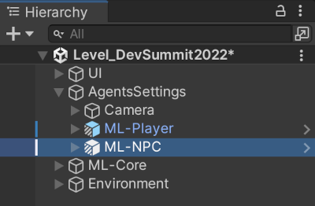
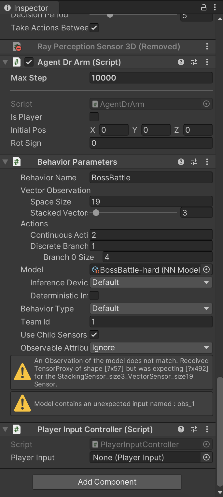
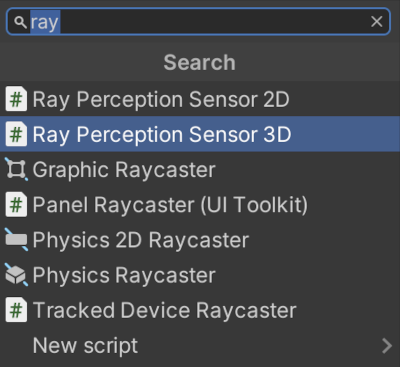
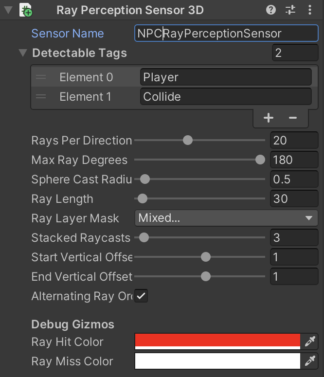
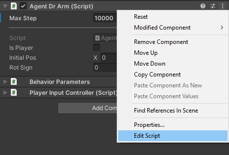
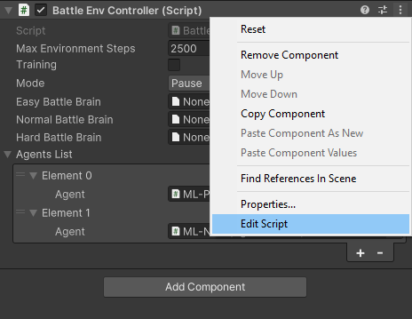

## Modify some key components to improve training

Next, complete the setup of the _ML-NPC_ object to enable a character for machine learning using Unity ML Agents.

## Configure the NPC _Ray Perception Sensor 3D_ component

First, add a _Ray Perception Sensor 3D_ component. This will cast 3D rays into the scene to inform your character about any nearby enemies or obstacles. The rays are cast at regular intervals. The results will form part of the inputs to the neural network.

1. Open the _Level_DevSummit2022_ scene. Navigate to the _Assets/#DevSummit2022/Scenes_ directory in the Project panel and double-click the _Level_DevSummit2022_ scene file.

1. Select the _ML-NPC_ object by going to the _Level-DevSummit2022->AgentsSettings->ML-NPC_, as per Figure 1.

    

1. In the Inspector window (usually on the right) click the _Add Component_ button at the bottom, as per Figure 2. Notice the 2 warnings in the Inspector as below:

    

1. Now type _ray_ in the filter edit box, to narrow down the search. From the filtered list, double-click on _Ray Perception Sensor 3D_ to add this component to the ML-NPC object.

    

    Notice that by adding the _Ray Perception Sensor 3D_ component, the _Model contains...._ warning message has now disappeared.

1. Change some properties to complete this component's set-up. Start by giving the sensor a sensible name:

    * Set the _Sensor Name_ property to "NPCRayPerceptionSensor"

1. Now tell the sensor what type of objects it should detect (i.e. which objects will get hit by each raycast)

    * Add 2 elements to the _Detectable Tags_ array and name them as follows:
        * "Player"
        * "Collide"

1. Now setup the rays. Ray casts are relatively costly so only use as many as you think will be needed for the situation. Some good numbers for this situation are:

    * Set _Rays Per Direction_ to "20"
    * Set _Max Ray Degrees_ to "180"
    * Set _Ray Length_ to "30"
    * Set _Stacked Ray Traces_ to "3"

    Notice how the _An Observation of the model..._ warning message has now disappeared.

1. Finally, set a positional offset for the rays because they are currently cast along the ground. (This can cause some rays to squeeze between the floor and walls and therefore not hit anything, leaving the character unaware of the walls.) The rays will start and finish around waist height:

    * Set _Start Vertical Offset_ to "1"
    * Set _End Vertical Offset_ to "1"

1. Save the scene by using _CTRL-S_ or the menu option _File->Save_

The fully configured component, with the correct properties updated, should look like this:



## Script modifications

### Edit AgentDrArm.cs

Both characters have the _AgentDrArm_ script component. The script behaves slightly differently depending on whether the character is currently player-controlled. During training, both characters are controlled by the AI. _AgentDrArm_ is derived from the Unity ML Agents _Agent_ class - the machine learning "brain".

Let's add some code to make the character aware of health statistics for itself and the other character. These statistics are observations that are passed into each character's ML Agent. The observations are fed into the neural network. The number of observations must fit within the limit set in the _BehaviourParameters_ component. We also need to implement our reward system (described earlier).

1. With the ML-NPC still selected, in the Inspector, on the right, scroll until you see the _Agent Dr Arm (Script)_. To the right are 3 vertical dots. Click them to pop-up the context menu and select the _Edit Script_ option, at the bottom.

    

    Your preferred code editor should launch and open the file _AgentDrArm.cs_:

    ```
    using Player;
    using PlayerInput;
    using UnityEngine;
    using Unity.MLAgents;
    using Unity.MLAgents.Sensors;
    using Unity.MLAgents.Actuators;
    using Unity.MLAgents.Policies;
    using static BattleEnvController;

    public enum Team
    {
        Player = 0,
        NPC = 1
    }

    public class AgentDrArm : Agent
    {
        [SerializeField] bool _isPlayer;

        [HideInInspector]
        public Team team;
        EnvironmentParameters m_ResetParams;
        BehaviorParameters m_BehaviorParameters;
        [HideInInspector]
        public bool enableBattle = true;

        ...
    }
    ```

1. In the script, scroll down to the _CollectObservations()_ method. This method collates information that is key to the reinforcement learning process to help the ML Agent make good decisions. Various bits of state information are returned as a list of observations, such as:

    * Roll/dodge flag (is the character currently rolling/dodging)

    * Is the character firing a weapon?

    * Is the opponent firing a weapon?

1. To add to that, look for _// WORKSHOP TODO:_ at line 145 and uncomment the 3 lines of code for Health, Stamina, and Mana observations.

    ```
    // WORKSHOP TODO: Uncomment the Health Stamina and Mana code below
    //sensor.AddObservation(_manager.Stats.CurrentHealth / _manager.Stats.MaxHealth);
    //sensor.AddObservation(_manager.Stats.CurrentStamina / _manager.Stats.MaxStamina);
    //sensor.AddObservation(_manager.Stats.CurrentMana / _manager.Stats.MaxMana);
    ```

1. You are adding values to the observations about the current character's:

    * Current health as a value between 0 and 1 (maximum health)

    * Current stamina as a value between 0 and 1 (maximum stamina)

    * Current mana as a value between 0 and 1 (maximum mana)

1. Now do the same again at line 172. Again look for _// WORKSHOP TODO:_. Add the same 3 values again. (This time they are for the opponent character, so each character is using the information from both characters.)

    ```
    // WORKSHOP TODO: Uncomment the Health, Stamina and Mana code below
    //sensor.AddObservation(_enemyManager.Stats.CurrentHealth / _enemyManager.Stats.MaxHealth);
    //sensor.AddObservation(_enemyManager.Stats.CurrentStamina / _enemyManager.Stats.MaxStamina);
    //sensor.AddObservation(_enemyManager.Stats.CurrentMana / _enemyManager.Stats.MaxMana);
    ```

1. Now scroll down to the _OnActionReceived()_ method. This is called every time the _ML Agent_ takes an action.

1. Again look for _// WORKSHOP TODO:_ on line 188 inside the function _OnActionReceived_. Uncomment the line below it, which uses the _m_Existential_ value that is calculated in the _Initialize()_ function based on the _Agent_ property _MaxStep_. It is effectively a small penalty (a negative reward) applied every time an action is taken. The longer it takes to win, the smaller the reward will be.

    ```
    // WORKSHOP TODO: Uncomment the code below
    //AddReward(-m_Existential);
    ```

    In addition to applying the reward value, an action needs to be performed. _OnActionReceived_ is given the results of the neural network which are the action buffers. The action buffers are mapped directly to the character controls for moving (forward/back and left/right), rolling and attack actions. These are applied in the function _ApplyMlMovement_ (called via _ActAgent_). The AI character is able to perform the same actions as the human player.

    * Remember to save the changes

### Edit BattleEnvController.cs

1. Select the _AgentsSettings_ object, in the _Hierarchy_ tab, on the left.


2. In the Inspector, scroll until you see the _Battle Environment Controller (Script)_. To the right are 3 vertical dots. Click on them to open the context menu and select the _Edit Script_ menu, at the bottom.



This will open the script _Assets/Scripts/MlAgents/BattleEnvController.cs_:

```
using Character;
using System.Collections;
using System.Collections.Generic;
using System;
using Unity.MLAgents;
using Unity.MLAgents.Policies;
using Unity.Barracuda;
using UnityEngine;

public class BattleEnvController : MonoBehaviour
{
    [SerializeField]
    [System.Serializable]
    public class PlayerInfo
    {
        public AgentDrArm Agent;
        [HideInInspector]
        public Vector3 StartingPos;
        [HideInInspector]
        public Quaternion StartingRot;
    }

    ...
}
```

#### The battle environment controller script

_BattleEnvController_ is a high level manager that manages game state and adjusts accordingly. One of its jobs is to look out for _game over_ conditions such as when a character wins. The following sections take you through some of the areas of the script.

##### Switching between brains based on the difficulty level

Go to Line _47_ of _BattleEnvController.cs_, where you will see a _BattleMode_ enumeration class to keep track of the difficulty level being fought.

This is used to determine which "brain" is used to make decisions - the brain is switched based on the difficulty level.

```
public enum BattleMode
{
    Easy,
    Normal,
    Hard,
    Demo,
    Pause,
    Default
}
```

Go to the _Update()_ method at line _106_. This is being called each frame, but it is only the begin, end, and pause that are detected here. If the mode changes (line _108_) then it's necessary to configure the agent and put the correct brain in.

```
void Update()
{
    if (mode != BattleMode.Default)
    {
        foreach (var item in AgentsList)
        {
            configureAgent(mode, item.Agent);
        }
        mode = BattleMode.Default;
    }
}
```

##### Check for game over

Go to line _118_, to the _FixedUpdate()_ method. This largely checks for end conditions, i.e. if the battle is over. If a character has died, the battle is over and we give the appropriate win or lose reward depending on which character died. We give the reward around line _150_.  

```
float reward = item.Agent.Win();
if (item.Agent.team == Team.Player)
{
    // Player wins
    playerReward = reward;
}
else
{
    // NPC wins
    NPCReward = reward;
}
```

##### The training

When training the model (line _165_) the end of the battle (or ML _episode_) is tracked and a message is put out to log who won/lost. The scene then gets reset.

```
if (Training)
{
    switch (retEpisode)
    {
        case 1:
            Debug.Log("[End Episode] Player win at step " + m_ResetTimer + ".  (player reward: " + playerReward + ", NPC reward: " + NPCReward + ")");
            break;
        case 2:
            Debug.Log("[End Episode] Player lose at step " + m_ResetTimer + ". (player reward: " + playerReward + ", NPC reward: " + NPCReward + ")");
            break;
    }
    ResetScene();
}
```

There is also a time limit for each battle. (Players can take as long as they want in a real battle, but during training this time limit prevents the characters from just standing around forever - after a timeout, they both lose.)

##### Reset between each battle

Regardless of who lost, the scene is reset for the next training iteration.

Go to the _ResetScene()_ method at line _244_. Here, during training (line _254_), the start position is varied so that characters don't always start from the exact same place. This allows the AI to learn to attack from any position. Character start positions are shifted randomly by a few meters so they start from slightly different places each time.

```
if (Training)
{
    var randomPos = UnityEngine.Random.Range(-4f, 4f);
    var newStartPos = item.StartingPos + new Vector3(randomPos, 0f, randomPos);
    var rot = item.Agent.rotSign * UnityEngine.Random.Range(80.0f, 100.0f);
    var newRot = Quaternion.Euler(0, rot, 0);
    item.Agent.transform.SetPositionAndRotation(newStartPos, newRot);
}
```

##### Player character does not need an AI brain

At line _213_ there is the _configureAgent()_ method. The battle (line 215) is enabled if not paused. For the player character (if not demo or training), the brain is turned off by setting it to null.

Otherwise, the brain is set appropriately (from line _223_) for the difficulty setting (below). In demo mode, the normal brain is used, and when paused the brain is removed to avoid odd behavior.

```
switch (mode)
{
    case BattleMode.Easy:
        agent.SetModel("BossBattle", easyBattleBrain, inferenceDevice);
        break;
    case BattleMode.Normal:
        agent.SetModel("BossBattle", normalBattleBrain, inferenceDevice);
        break;
    case BattleMode.Hard:
        agent.SetModel("BossBattle", hardBattleBrain, inferenceDevice);
        break;
    case BattleMode.Demo:
        agent.SetModel("BossBattle", normalBattleBrain, inferenceDevice);
        break;
    case BattleMode.Pause:
        agent.SetModel("BossBattle", null, InferenceDevice.Default);
        break;
}
```

The next section looks at the training phase, which requires Python and some additional packages.
