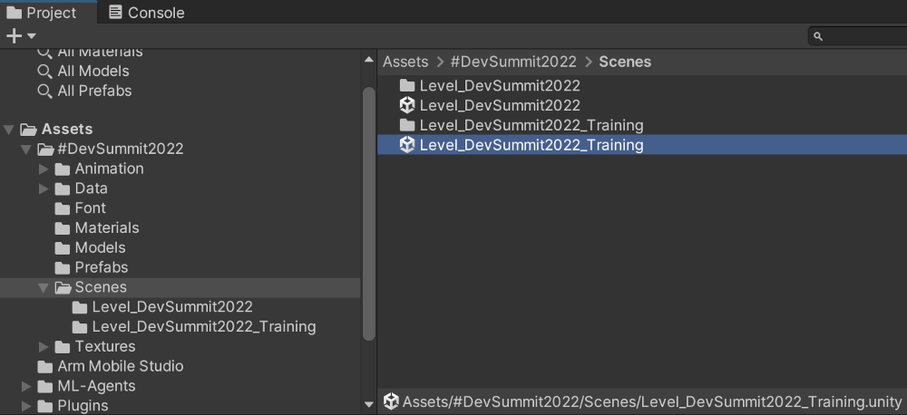
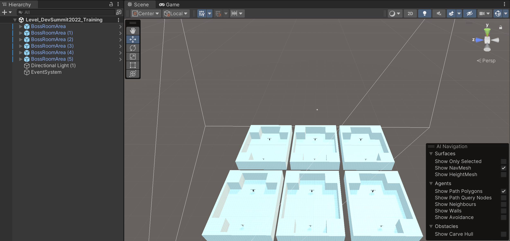
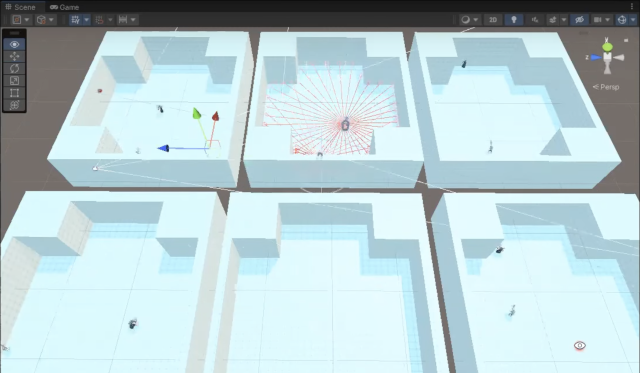
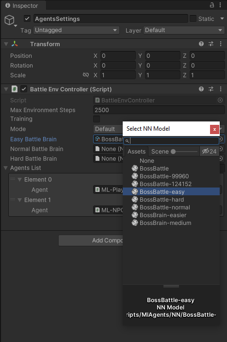
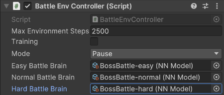

## A shortcut

Training can take several hours. If you would prefer to skip training, you can jump to the final section, _Use pre-made training data_. This section will guide you through reusing training data that has already been generated and included in the supporting zip file.

## Python and machine learning packages

Unity ML Agents Python package can be installed using the popular Python package manager Pip. The toolkit's Unity package can be installed via the Unity Package Manager.

Note: the Unity project already contains the ML Agents package, but you still need to have the Python and the ML Agents Pip packages installed.

Before running the training phase, you need to install some additional tools. These can be installed via Python and Pip, but if you would like more information on each package, please refer to the links below. (The next section describes the steps to get all of these installed.)

* Python - the ML Agents framework has been written in Python. [https://www.python.org](https://www.python.org/)

* Python Pip - the package installer for Python. [https://pypi.org/project/pip](https://pypi.org/project/pip/)

* PyTorch - a machine learning framework which ML Agents Toolkit wraps for Unity. [https://pytorch.org](https://pytorch.org/)

* TensorFlow - Machine learning library [https://www.tensorflow.org](https://www.tensorflow.org/)

* TensorBoard - visualization tool for TensorFlow [https://www.tensorflow.org/tensorboard](https://www.tensorflow.org/tensorboard)

* ML Agents - part of the ML Agents Toolkit from Unity which provides imitation and reinforcement learning [https://pypi.org/project/mlagents](https://pypi.org/project/mlagents/). The Unity ML Agents toolkit github is [https://github.com/Unity-Technologies/ml-agents](https://github.com/Unity-Technologies/ml-agents)


## Installing Python, Pip and the required packages

### Installing Python

Use Python 3.7.9, as future versions produced errors on some platforms when installing PyTorch.

In a command or terminal prompt (such as PowerShell):

1. Install Python 3.7.9 (or a later 3.7), and pip 20.1.1 or later. The official python installer can be found on:
https://www.python.org/downloads/

1. Ensure pip is installed by following the instructions for your operating system on this page: https://pip.pypa.io/en/stable/installation/

### Installing PyTorch and ML Agents

_Note 1._ If you are using a command prompt or PowerShell you may need to run with administrator permissions.

_Note 2._ In Windows you may need to enable [LongPath support](https://pip.pypa.io/warnings/enable-long-paths).

1. Open a command prompt (or similar such as Visual Studio Code Terminal)

1. Change directory to your copy of the Unity project

    ```
    cd MLAgentsWorkshopSupportingFiles
    ```

1. If you list the content of the directory, you should see the Unity project folders

    ```
    dir /b
    ```

    ```
    Assets
    MixamoNoLicense.png
    Packages
    ProjectSettings
    ```

1. Create a python virtual environment. 

    During the following you may need to use `python3` instead of `python`, depending on your installation:

    ```
    md python-envs
    ```

    ```
    python -m venv .\python-envs\mlagents-r18-env
    ```

    If you have problems installing PyTorch (step 7 below), try deleting "mlagents-r18-env" directory and retry with the py tool:

    ```
    py -3.7 -m venv .\python-envs\mlagents-r18-env
    ```

1. Activate the virtual environment:

    ```
    .\python-envs\mlagents-r18-env\Scripts\activate
    ```

    If activated successfully, your prompt will be prefixed by "(mlagents-r18-env)"

1. Check your active python version is the one you installed:

    ```
    python --version
    ```

    If you installed 3.7.9, it should show:

    ```
    Python 3.7.9
    ```

1. Install PyTorch:

    ```
    pip install torch==1.7.1 -f https://download.pytorch.org/whl/torch_stable.html
    ```

    If you are using Python 3.8 or later and you see errors while trying to install PyTorch 1.7.1 (such as distribution not found) you might want to go back to step 1 and try again using Python 3.7.

1. Install ml-agents python package:

    ```
    python -m pip install mlagents==0.28.0
    ```

1. The ml-agents python package depends on various packages including protobuf and tensorboard. Certain tensorboard versions are not compatible with protobuf 3.20 or higher. If you have problems, you may need to downgrade your version of protobuf:

    ```
    pip install protobuf==3.19.6
    ```

    If this complains use the `-I` option to force it.

#### Troubleshooting Python, mlagents-learn and TensorBoard

There are a few Python-related issues that can arise when trying to run _mlagents-learn_. Here are the ones we encountered with potential solutions.

* Error _module "numpy" has no attribute "float"_
    You might want to try an older version of numpy:

    ```
    pip install numpy<1.20
    ```

* _No module named 'six'_:

    ```
    pip install six
    ```

* _TensorFlow installation not found_:

    ```
    pip install tensorflow
    ```

* AttributeError: 'str' object has no attribute '_key' [seen here](https://github.com/Unity-Technologies/ml-agents/issues/5794):

    ```
    pip install importlib-metadata==4.4
    ```

## Run the training

The longer the training runs (as in the more iterations), the better the AI opponent. Training to a reasonably difficult level can take several hours or more.

### Loading the training scene

Go to the _Project_ tab (normally bottom left) and navigate to _Assets->#DevSummit2022->Scenes_ and this time double click the _Level_DevSummit2022_Training_ scene to open it. Make sure you save the gameplay scene before closing it if you haven't already.



Once the training scene is loaded, it should look similar to this:



### Start the training

The training takes a long time, so we recommend using a CUDA GPU to be faster. However, it is possible to run the training on the CPU.

_Note._ If you do not have an NVIDIA GPU that supports CUDA, you may see the following warning.

```
UserWarning: CUDA initialization: Found no NVIDIA driver on your system.
Please check that you have an NVIDIA GPU and installed a driver from http://www.nvidia.com/Download/index.aspx
```

1. Open up a console or terminal window

1. Make sure you are still in the Unity project directory:

    ```
    cd MLAgentsWorkshopSupportingFiles
    ```

1. Now we will activate the python virtual environment we set up in the **Preparation** section:
 
    ```
    .\python-envs\mlagents-r18-env\Scripts\activate
    ```

1. Once inside the python VM, change directory to where all the training scripts are grouped:

    ```
    cd Assets\Scripts\MlAgents
    ```

1. Now you should be able to run the training.

    _Note._ A firewall warning may popup - you need to allow access so the training can run.

    If you have a CUDA compatible GPU, you can specify exactly which CUDA device to use:

    ```
    mlagents-learn --torch-device cuda:0 .\config\BossBattle.yaml --run-id=firstrun --force
    ```

    If you don't have a CUDA compatible GPU, you may have success by trying "cpu" instead of "cuda:0"

    ```
    mlagents-learn --torch-device cpu .\config\BossBattle.yaml --run-id=firstrun --force
    ```

    See the help for more information:

    ```
    mlagents-learn --help
    ```

    The parameters we have used above are:

    * _--torch-device_: the compute device to use for training. _cuda:0_ is just the default GPU. Try _cpu_ if you do not have an Nvidia GPU.

    * _.\config\BossBattle.yaml_: the configuration for ML Agents.

    * _--run-id=firstrun_: creates a folder called "firstrun" (use your own name, if you like) to store the results of our training. You can use this run-id to resume training.

    * _--force_: overwrite a previous run of the same run-id.

    _Note:_ To resume a previous training session, you can use the _--resume_ option. This is useful for when you start your training and you either need to stop your computer, or you think you've done enough training but later decide your agents need more training.

1. Once _mlagents-learn_ starts, after a few seconds it will come up with a text Unity logo, that looks similar to this:

    

1. Notice at the bottom it tells you to _Start training by pressing the Play button in the Unity Editor_. Switch to the Unity Editor and do that.

1. Once the Unity Editor starts and the learning begins it will usually switch to the _Game_ tab, which can be disorientating as the camera is attached to a character running at high speed. Switch to the _Scene_ tab to see all 6 agents going through the learning process. It should look similar to this:

    

1. It is possible for the connection to time-out if you take too long to play the Unity scene. If this happens, simply start these steps again.

1. If you switch back to the console/terminal window, you should see the connection to the brains has been made and the parameter summary

    ```
    [INFO] Connected to Unity environment with package version 2.3.0-exp.3 and communication version 1.5.0
    [INFO] Connected new brain: BossBattle?team=1
    [INFO] Connected new brain: BossBattle?team=0
    [INFO] Hyperparameters for behavior name BossBattle:
            trainer_type:   ppo
            hyperparameters:
            batch_size:   1024
            buffer_size:  10240
            learning_rate:        0.0003
            beta: 0.01
            epsilon:      0.2
            lambd:        0.95
            num_epoch:    3
            learning_rate_schedule:       linear
            beta_schedule:        linear
            epsilon_schedule:     linear
            network_settings:
            normalize:    False
            hidden_units: 128
            num_layers:   2
            vis_encode_type:      simple
            memory:       None
            goal_conditioning_type:       hyper
            deterministic:        False
            reward_signals:
            extrinsic:
                gamma:      0.99
                strength:   1.0
                network_settings:
                normalize:        False
                hidden_units:     128
                num_layers:       2
                vis_encode_type:  simple
                memory:   None
                goal_conditioning_type:   hyper
                deterministic:    False
            init_path:      None
            keep_checkpoints:       30
            checkpoint_interval:    100000
            max_steps:      3000000
            time_horizon:   64
            summary_freq:   5000
            threaded:       False
            self_play:
            save_steps:   20000
            team_change:  100000
            swap_steps:   10000
            window:       10
            play_against_latest_model_ratio:      0.5
            initial_elo:  1200.0
            behavioral_cloning:     None
    ```

1. Every 5000 steps it will output the state of learning, similar to this:

    ```
    [INFO] BossBattle. Step: 5000. Time Elapsed: 89.481 s. Mean Reward: -1.000. Std of Reward: 0.000. Training.
    [INFO] BossBattle. Step: 10000. Time Elapsed: 121.890 s. Mean Reward: -1.000. Std of Reward: 0.000. Training.
    ```

1. Here's a run down of some of the more interesting parameters:

    * _Boss Battle_ : The name of the behavior that is training within our script that we are running. This matches the name we used earlier in the script component _BehaviourParameters_ property _BehaviourName_.

    * _Step_: How many steps/iteration have happened so far.

    * _Time Elapsed_: How much time has elapsed since the training began.

    * _Mean Reward_: The average reward given in each battle. -1.000 means we're always losing. Usually after 100,000 steps is when the agents start winning a bit more regularly.

    * _ELO_: Is awarded when someone actually wins. ELO (named after Arpad Elo) is a method for calculating the relative skill levels of players in zero-sum games. While the Mean Reward will get stuck around 0 (the other agent's skill increases with ours, meaning we lose about half the time), ELO can increase, giving us a better measure of progress.

1. When you interrupt the training (in Unity or the command prompt), if the training was successful you will see the following message:

    ```
    [INFO] Learning was interrupted. Please wait while the graph is generated.
    [INFO] Exported results\firstrun\BossBattle\BossBattle-24355.onnx
    [INFO] Copied results\firstrun\BossBattle\BossBattle-24355.onnx to results\firstrun\BossBattle.onnx.
    ```

    The _onnx_ file is our new brain! This file can be plugged in to the Unity ML Agent (_AgentDrArm_) via the _BattleEnvController_ script.
    
    Training to a competent level can take several hours; our setup typically took 6-8 hours.

    **NOTE**: If you don't want to wait to let the training run for hours, see section _Use pre-made training data_ below - which shows how to plug in pre-generated brains.

## TensorBoard

This section describes how TensorBoard can be used to monitor the training progress.

1. Open up a console or terminal window and navigate to the directory where you unzipped the project, then:

    ```
    cd Assets\Scripts\MlAgents
    ```

1. Launch _tensorboard_ by executing the following command:

    ```
    tensorboard --logdir results\firstrun --host localhost --port 6006 serve
    ```

1. If tensorboard fails, try:

    ```
    tensorboard --logDir results\firstrun --port 6006 --reload_multiple True
    ```

1. This monitors the Neural Network and calculates how learning is progressing.

1. Now open up your browser to http://localhost:6006 (the port that was passed to the launch command), which should look similar to this:

    

1. Some cards to take a note of:

    * _Episode Length_: Initially when no one is winning the episode length is maximum steps, until someone wins. Then the average slowly comes down. Once they start winning regularly it should come down a lot.

    * _Cumulative Reward_: Starts off being -1, because both sides is losing, but once they start regularly having a winner it will go up rapidly and will eventually settle around zero, as each (evenly-matched) player will lose as often as they win.

    * _ELO_: As mentioned previously this is the score over time, as characters win, giving you an idea of how well your training is going.

## The training configurations

You can control the training using a _yaml_ configuration file.

Within Visual Studio (or your code editor) open the _BossBattle.yaml_ and _BossBattle_separation.yaml_ files. You'll find both in the _Assets->Scripts->MlAgents->config_ subdirectory. _BossBattle.yaml_ looks like this:

```
behaviors:
  BossBattle:
    trainer_type: ppo
    hyperparameters:
      # common to PPO and SAC
      batch_size: 1024
      buffer_size: 10240
      learning_rate: 3.0e-4
      learning_rate_schedule: linear
      # PPO-specific
      beta: 1.0e-2
      epsilon: 0.2
      lambd: 0.95
      num_epoch: 3
    network_settings:
      normalize: false
      hidden_units: 128
      num_layers: 2
    reward_signals:
      extrinsic:
        gamma: 0.99
        strength: 1.0
    keep_checkpoints: 30
    checkpoint_interval: 100000
    max_steps: 3000000
    time_horizon: 64
    summary_freq: 5000
    self_play:
      save_steps: 20000
      team_change: 100000
      swap_steps: 10000
      play_against_latest_model_ratio: 0.5
      window: 10
```

You can see that _BossBattle.yaml_ contains a single definition of a _behavior_ object called _BossBattle_. This essentially gives both the Player and the NPC the same brain, although each with their own instance of it.

However, in the _BossBattle separation.yaml_ you will see two behaviors; a 'brain' for each character type, each with its own parameters. For now, use the same 'brain' (_BossBattle_) for both characters.

Some of the key behavior properties are:

* _trainer type:ppo_ : PPO is an ML-Agent algorithm. The name stands for Proximal Policy Optimization. There are quite a number of different algorithms and if you go onto their GitHub you can learn about all the different ones they have. This one works very well for this scenario.

* _hyperparameters_ : Normal machine learning hyperparameters

* _network settings_ : Sets up the actual size of the neural network. Notice it has _num layer: 2_ and _hidden units:128_ - this is 2 hidden layers of 128 units each. In a more complex scenario you might have 3 layers and 256 hidden units per layer. Have another look at the Multilayer Perceptron (MLP) in Figure 5.

    * The 1st layer is all of our observations. Note that there are 3 stacked vectors (for the last 3 frames), as input into the _neural network_.

    * Then in the _neural network_ there are 2 hidden layers, each with 128 units.

    * The NN output layer maps to _Actions_, which in this case is the joystick movements and the ability to dodge-roll, use sword or fireball attack.

        

* On line 23 is _keep_checkpoints_ : This is how many checkpoints it should keep saved. If there are more than this it will delete the oldest ones.
* On line 24 is _checkpoint_interval_ : This is the number of battles between checkpoints.
* _max steps_ : Tells the learning to stop after 3,000,000 battles.
* _self play_ (line 28): This is how often it switches between characters and brains
    * _team change_: This value means it will change between characters every 100,000 battles.
    * _swap steps_: This is the number of battles it should perform before creating a new brain for this character.

_BossBattle_separation.yaml_ contains two definitions - one for each of the different character types:

```
behaviors:
  Paladin:
    trainer_type: ppo
    hyperparameters:
      # common to PPO and SAC
      batch_size: 1024
      buffer_size: 10240
      learning_rate: 3.0e-4
      learning_rate_schedule: linear
      # PPO-specific
      beta: 1.0e-2
      epsilon: 0.2
      lambd: 0.95
      num_epoch: 3
    network_settings:
      normalize: false
      hidden_units: 128
      num_layers: 2
    reward_signals:
      extrinsic:
        gamma: 0.99
        strength: 1.0
    keep_checkpoints: 30
    checkpoint_interval: 100000
    max_steps: 3000000
    time_horizon: 64
    summary_freq: 5000
    self_play:
      save_steps: 20000
      team_change: 100000
      swap_steps: 10000
      play_against_latest_model_ratio: 0.5
      window: 10

  Vampire:
    trainer_type: ppo
    hyperparameters:
      # common to PPO and SAC
      batch_size: 1024
      buffer_size: 10240
      learning_rate: 3.0e-4
      learning_rate_schedule: linear
      # PPO-specific
      beta: 1.0e-2
      epsilon: 0.2
      lambd: 0.95
      num_epoch: 3
    network_settings:
      normalize: false
      hidden_units: 128
      num_layers: 2
    reward_signals:
      extrinsic:
        gamma: 0.99
        strength: 1.0
    keep_checkpoints: 30
    checkpoint_interval: 100000
    max_steps: 3000000
    time_horizon: 64
    summary_freq: 5000
    self_play:
      save_steps: 20000
      team_change: 100000
      swap_steps: 10000
      play_against_latest_model_ratio: 0.5
      window: 10
```

Within this yaml you have the ability to set-up 2 separate brains. One named _Paladin_ (for the knight) and another named _Vampire_ (for the NPC). Currently they have identical properties, but you could customize each to have slightly different behaviors.

## Use pre-made training data

3 data files have already been prepared; one for each difficulty level. If you haven't generated your own, plug these in:

1. In the Project tab (normally at the bottom left), if not open already, re-open the _Level_DevSummit2022_ scene by double-clicking it:

    `Assets->#DevSummit2022->Scenes->Level_DevSummit2022`

1. Now select the _AgentsSettings_ object, in the _Hierarchy_ tab (normally on the left).

    

1. Now in the _Inspector_ (normally on the right) scroll to the _Battle Env Controller (Script)_, and you should see properties for _Easy Battle Brain_, _Normal Battle Brain_ and _Hard Battle Brain_.

1. Next to the _Easy Battle Brain_ there is a circle. Click it to pop-up the _Select NN Model_ menu, as per Figure 2.

    
    Note that you can use the slider in the pop-up to change the icon size. Drag fully to the left to reduce to list detail view if needed.

1. For each brain there is already a pre-trained version you can use, or if your training has completed use that. Match up each Battle Brain property to an appropriate NN Model. We have used the name "BossBattle" in this learning path.

    

1. Once the brains are set we can launch the game in the Unity Editor, to make sure everything is working and wired up correctly. If you select "Demo" mode you can see the two ML Agents battle it out.

The next section (_Optimizations_) discusses optimizations to help reduce training time.
