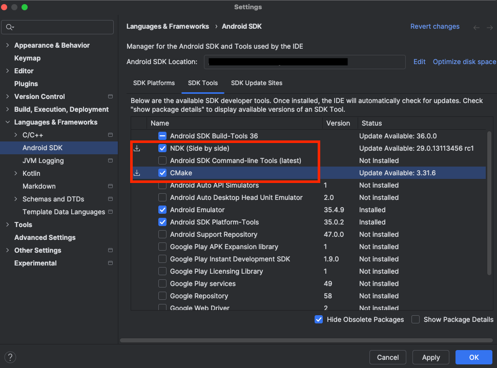

## Install Required Software

In this section, you'll set up your development environment by installing dependencies and preparing the Qwen vision model.

Install the Android NDK (Native Development Kit) and git-lfs. This Learning Path was tested with NDK version `28.0.12916984` and CMake version `4.0.0-rc1`.

For Ubuntu or Debian systems, install CMake and git-lfs with the following commands:

```bash
sudo apt update
sudo apt install cmake git-lfs -y
```

You can use Android Studio to obtain the NDK.

Click **Tools > SDK Manager** and navigate to the **SDK Tools** tab.

Select the **NDK (Side by side)** and **CMake** checkboxes, as shown below:



See [Install NDK and CMake](https://developer.android.com/studio/projects/install-ndk) for other installation methods.

Ensure that Python and pip are installed by verifying the version with these commands:

```bash
python --version
pip --version
```

You see the versions printed:

```output
Python 3.12.3
pip 24.0 from /usr/lib/python3/dist-packages/pip (python 3.12)
```

{}
If Python 3.x is not the default version, try running `python3 --version` and `pip3 --version`.
{}

It is recommended to use a python virtual environment:

```bash
python3.12 -m venv vision_llm
source vision_llm/bin/activate
```

## Set up Phone Connection

You need to set up an authorized connection with your phone. The Android SDK Platform Tools package, included with Android Studio, provides Android Debug Bridge (ADB) for transferring files.

Connect your phone to your computer using a USB cable, and enable USB debugging on your phone. To do this, tap the **Build Number** in your **Settings** app 7 times, then enable **USB debugging** in **Developer Options**.

Verify the connection by running:

```console
adb devices
```

If your device is connected you see it listed with your device id:

```output
List of devices attached
<DEVICE ID>     device
```

## Download the quantized Model

The pre-quantized model is available in Hugging Face, you can download with the following command:

```bash
git lfs install
git clone https://huggingface.co/taobao-mnn/Qwen2.5-VL-3B-Instruct-MNN
cd Qwen2.5-VL-3B-Instruct-MNN
git checkout a4622194b3c518139e2cb8099e147e3d71975f7a
cd ..
```

## (Optional) Download and Convert the Model
If you need to quantize the model with customized parameter, the following commands download the model from Hugging Face, and clone a tool for exporting the LLM model to the MNN framework.

```bash
cd $HOME
pip install -U huggingface_hub
hf download Qwen/Qwen2.5-VL-3B-Instruct --local-dir ./Qwen2.5-VL-3B-Instruct/
pip install llmexport
```
Use `llmexport` to quantize the model with these options:

```bash
llmexport --path ../Qwen2.5-VL-3B-Instruct/ --export mnn --quant_bit 4 \
    --quant_block 64 --dst_path Qwen2.5-VL-3B-Instruct-convert-4bit-64qblock
```

{}
If you run into issues where llmexport is not able to access utils, try the following
```bash
# From your project dir (inside the venv)
cat > llmexport_fixed.py <<'PY'
import sys, importlib
# make "utils" resolve to "llmexport.utils"
sys.modules.setdefault("utils", importlib.import_module("llmexport.utils"))

from llmexport.__main__ import main
if __name__ == "__main__":
    main()
PY

# Use this instead of the entrypoint:
python llmexport_fixed.py \
  --path Qwen2.5-VL-3B-Instruct \
  --export mnn --quant_bit 4 --quant_block 64 \
  --dst_path Qwen2.5-VL-3B-Instruct-convert-4bit-64qblock
```
{}

The table below gives you an explanation of the different arguments:

| Parameter        | Description | Explanation |
|------------------|-------------|--------------|
| `--quant_bit` | MNN quant bit, 4 or 8, default is 4. | `4` represents q4 quantization. |
| `--quant_block` | MNN quant block, default is 0. | `0` represents per-channel quantization; `64` represents 64 per-block quantization. |

To learn more about the parameters, see the [transformers README.md](https://github.com/alibaba/MNN/tree/master/transformers).

Verify that the model was built correctly by checking that the `Qwen2.5-VL-3B-Instruct-convert-4bit-64qblock` directory is at least 2GB in size.

## Push the model to Android device

Push the repository you cloned earlier onto the device:

```shell
adb shell mkdir /data/local/tmp/models/
adb push Qwen2.5-VL-3B-Instruct-MNN/ /data/local/tmp/models
```

With the model set up, you're ready to build and run an example application.
