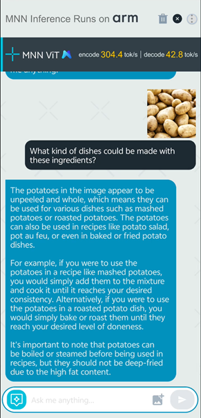

## Clone Vision Language Models repo

In this section, you will run the Qwen model in action using a demo application using a Android Package Kit (APK).

This repository is set up to enable building the app as an Android Studio project. 

Run the following commands to clone the repository and checkout the source tree:

```bash
git clone https://gitlab.arm.com/kleidi/kleidi-examples/vision-language-models
```

## Build the App Using Android Studio

You can use Android Studio to build the app and create an APK.

### Open project and build

Open Android Studio. 

Go to **File > Open**. 

Navigate to the vision-language-models directories, and click `Open`.

This triggers a build of the project, and you should see output similar to the following on completion:

```output
BUILD SUCCESSFUL in 1m 42s
```

### Generate and Run the APK

Navigate to **Build > Generate App Bundles or APKs**. Select **Generate APKs**.

The build will be executed, and then the app will be copied and installed on the Android device.

After opening the app, you will see the splash screen:


Finally, you can use the UI to chat with the app. Try uploading an image and ask a question on it.



The final step is to examine how KleidiAI can improve the performance of the model. Continue to the next section to find out.