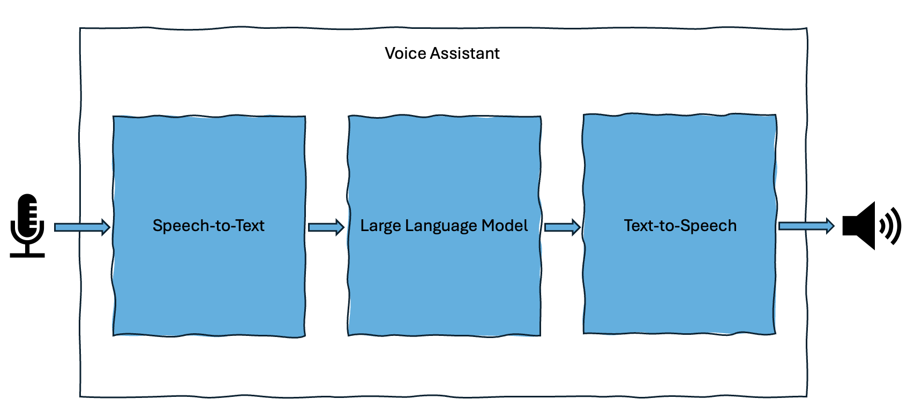

## Voice Assistant application workflow

The Voice Assistant application implements a full voice interaction pipeline on Android, enabling real-time, conversational interactions.




It generates intelligent responses using:
1. **Speech-to-Text (STT)** to transform the user's audio input into text.
2. A **Large Language Model (LLM)** to generate a response in text form.
3. Android **Text-to-Speech (TTS)** API to produce a spoken reply.


The following sections describe how each component works in the application.

## Speech-to-Text 

Speech-to-Text (STT), also known as Automatic Speech Recognition (ASR), converts spoken language into written text.

This process includes the following stages:
- The device's microphone captures spoken language as an audio waveform.
- The audio is segmented into short time frames.
- Features are extracted from each frame.
- A neural network analyzes these features to predict the most likely transcription based on grammar and context.
- The recognized text is passed to the next stage of the pipeline.

The voice assistant pipeline imports and builds a separate module to provide this STT functionality. You can access this at:

```
https://gitlab.arm.com/kleidi/kleidi-examples/speech-to-text
```

You can build the pipeline for various platforms and independently benchmark the STT functionality:

|Platform|Details|
|---|---|
|Linux|x86_64 - KleidiAI is disabled by default, aarch64 - KleidiAI is enabled by default.|
|Android|Cross-compile for an Android device, ensure the Android NDK path is set and correct toolchain file is provided. KleidiAI enabled by default.|
|macOS|Native or cross-compilation for a Mac device. KleidiAI and SME kernels can be used if available on device.|

Currently, this module uses [whisper.cpp](https://github.com/ggml-org/whisper.cpp) and wraps the backend library with a thin C++ layer. The module also provides JNI bindings for developers targeting Android based applications.

{}
You can get more information on how to build and use this module in the [speech-to-text README](https://gitlab.arm.com/kleidi/kleidi-examples/speech-to-text/-/blob/main/README.md?ref_type=heads)
{}

## Large Language Model  

Large Language Models (LLMs) enable natural language understanding and, in this application, are used for question-answering.

The text transcription from the previous part of the pipeline is used as input to the neural model. At initialization, the app sets a predefined persona that influences the tone, style, and character of the responses. 

By default, the LLM runs asynchronously, streaming tokens as they are generated. The UI updates in real time with each token, which is also passed to the final pipeline stage.

The voice assistant pipeline imports and builds a separate module to provide this LLM functionality. You can access this at:

```
https://gitlab.arm.com/kleidi/kleidi-examples/large-language-models
```

You can build this pipeline for various platforms and independently benchmark the LLM functionality:

|Platform|Details|
|---|---|
|Linux|x86_64 - KleidiAI is disabled by default, aarch64 - KleidiAI is enabled by default.|
|Android|Cross-compile for an Android device, ensure the Android NDK path is set and correct toolchain file is provided. KleidiAI enabled by default.|
|macOS|Native or cross-compilation for a Mac device. KleidiAI and SME kernels can be used if available on device.|

Currently, this module provides a thin C++ layer as well as JNI bindings for developers targeting Android based applications, supported backends are:
|Framework|Dependency|Input modalities supported|Output modalities supported|Neural Network|
|---|---|---|---|---|
|llama.cpp|https://github.com/ggml-org/llama.cpp|`image`, `text`|`text`|phi-2,Qwen2-VL-2B-Instruct|
|onnxruntime-genai|https://github.com/microsoft/onnxruntime-genai|`text`|`text`|phi-4-mini-instruct-onnx|
|mediapipe|https://github.com/google-ai-edge/mediapipe|`text`|`text`|gemma-2b-it-cpu-int4|


{}
You can get more information on how to build and use this module in the [large-language-models README](https://gitlab.arm.com/kleidi/kleidi-examples/large-language-models/-/blob/main/README.md?ref_type=heads)
{}

## Text-to-Speech 

This part of the application pipeline uses the Android Text-to-Speech API along with additional logic to produce smooth, natural speech.

In synchronous mode, speech playback begins only after the full LLM response is received. By default, the application operates in asynchronous mode, where speech synthesis starts as soon as a full or partial sentence is ready. Remaining tokens are buffered and processed by the Android Text-to-Speech engine to ensure uninterrupted playback.

You are now familiar with the building blocks of this application and can build these independently for various platforms. You can now build the multimodal Voice Assistant example which runs on Android OS in the next step.
