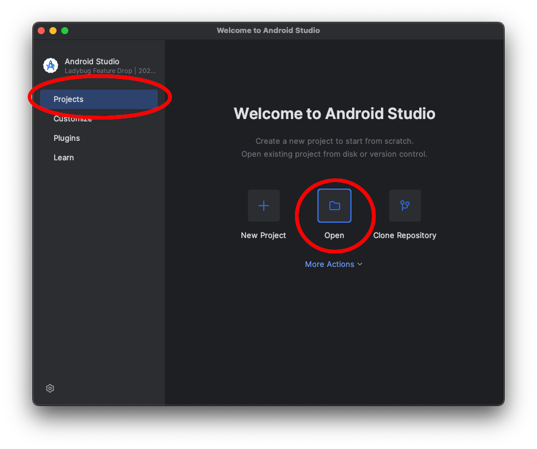
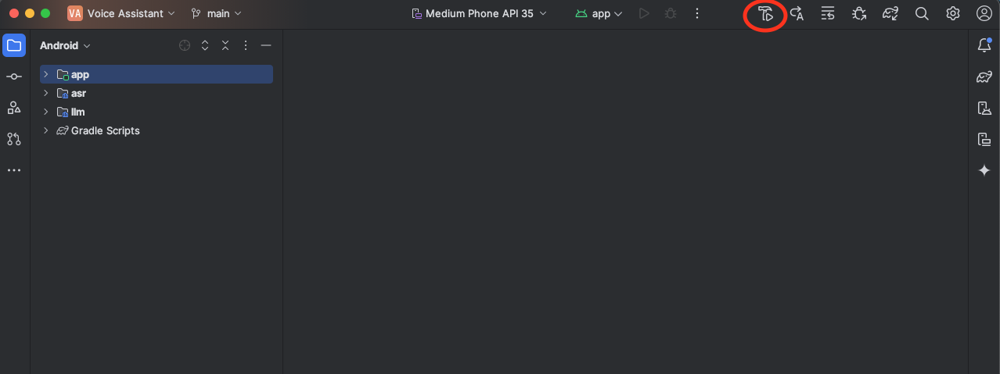
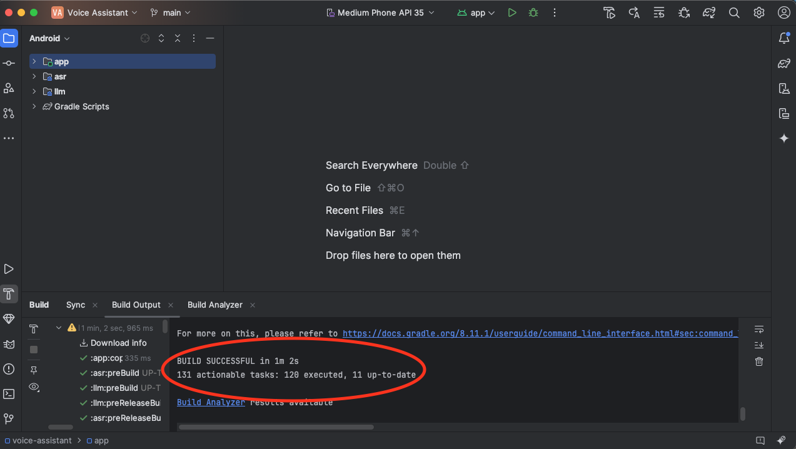

## Download the voice assistant

Start by cloning the repository with the complete example application code:

```bash
git clone https://git.gitlab.arm.com/kleidi/kleidi-examples/real-time-voice-assistant.git voice-assistant.git
```

## Build the voice assistant

Open Android Studio, select **Projects**, then click **Open** and navigate to the project you just downloaded:



To build the application with the default settings, click the hammer icon labeled 
**Make Module `VoiceAssistant.app`** in the upper right corner:



Android Studio will begin building the app. The first build might take longer if additional dependencies need to be downloaded:



Now that you have successfully built the Android application, you're ready to run the voice assistant in the next step.
