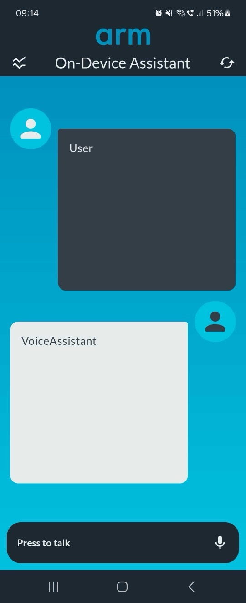
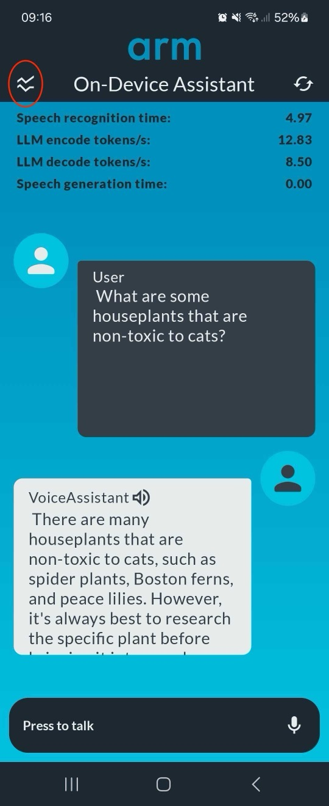
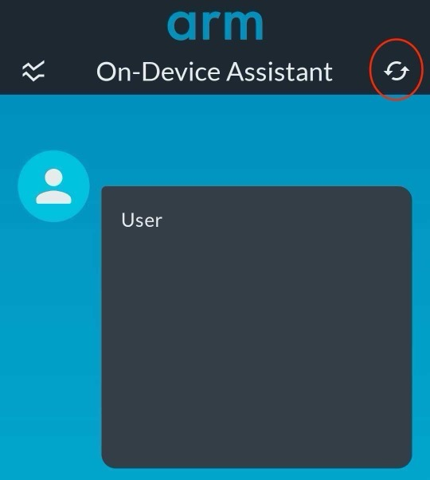

---

title: Run the Voice Assistant
weight: 6

### FIXED, DO NOT MODIFY
layout: learningpathall
---
## Switch to developer mode

In the previous section, you built the Voice Assistant application. Now, you'll install it on your Android phone. The easiest way is to enable developer mode and use a USB cable to upload the application.

By default, Android devices ship with developer mode disabled. To enable it, follow [these instructions](https://developer.android.com/studio/debug/dev-options).

## Install the Voice Assistant

Once developer mode is enabled, connect your phone to your computer with USB. It should appear as a running device in the top toolbar. Select the device and click **Run** (a small green triangle, as shown below). This transfers the app to your phone and launches it.

In the graphic below, a Samsung Galaxy Z Flip 6 phone is connected to the USB cable:

=======
## Launch the Voice Assistant

The app starts with this welcome screen:

Tap **Press to talk** at the bottom of the screen to begin speaking your request.

## Voice Assistant controls

### View performance counters

You can toggle performance counters such as:
- Speech recognition time.
- LLM encode tokens per second.
- LLM decode tokens per second.
- Speech generation time.

Click the icon circled in red in the top left corner to show or hide these metrics:

To reset the Voice Assistant's conversation history, click the icon circled in red in the top right:

