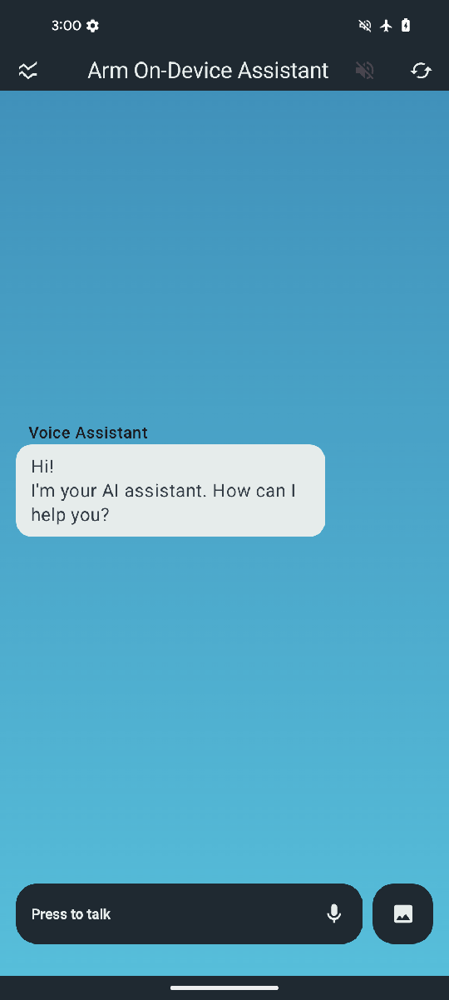
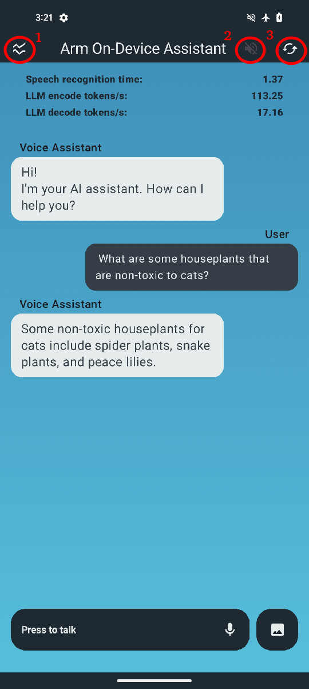
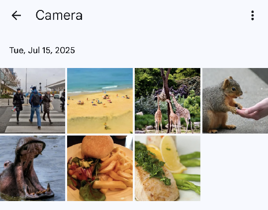
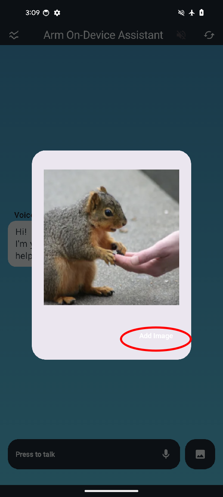

---

title: Run the Voice Assistant
weight: 6

### FIXED, DO NOT MODIFY
layout: learningpathall
---
## Switch to developer mode

In the previous section, you built the Voice Assistant application. Now, you'll install it on your Android phone. The easiest way is to enable developer mode and use a USB cable to upload the application.

By default, Android devices ship with developer mode disabled. To enable it, follow [these instructions](https://developer.android.com/studio/debug/dev-options).

## Install the Voice Assistant

Once developer mode is enabled, connect your phone to your computer with USB. It should appear as a running device in the top toolbar. Select the device and click **Run** (a small green triangle, as shown below). This transfers the app to your phone and launches it.

In the graphic below, a Google Pixel 8 Pro phone is connected to the USB cable:

## Launch the Voice Assistant

The app starts with this welcome screen, you can choose between the Chat and Benchmark mode:

Tap **Chat** to check the voice assistant pipeline in action.

## Voice Assistant Chat

In the chat mode, tap **Press to talk** at the bottom of the screen to begin speaking your request.

## Voice Assistant controls

You can use application controls to enable extra functionality or gather performance data.

|Button|Control name|Description|
|---|---|---|
|1|Back to welcome screen|Go back to welcome screen to select mode - chat or benchmark.|
|2|Speech generation|Speech generation is disabled by default, click this to use Android Text-to-Speech and get audible answers.|
|3|Reset conversation|By default, the application keeps context so you can follow-up questions, click this to reset voice assistant conversation history.|
|4|Memory used|This metric shows memory used by this application as well as memory available on the device.|
|5|Device thermal status|This metric shows current heat level of the device and whether the system is applying performance throttling to prevent overheating.|
|6|User performance metrics|Performance metrics for user's query including time to transcript the query (STT - Speech-to-Text module) and time for LLM to encode the query, measured in tokens per second.|
|7|Voice assistant metrics|Performance metrics for voice assistant's reply - decode performance measured in tokens per second.|

Click the icon circled in red in the top left corner to show or hide these metrics:

### Multimodal Question Answering

If you have built the application using the default `llama.cpp` backend, you can also use it in multimodal `(input + text)` question answering mode.

For this, click the image button first:

This will bring up the photos you can chose from:

Choose the image, and add image for voice assistant:

You can now ask questions related to this image, the large language model will you the image and text for multimodal question answering.

Now that you have explored how the android application is set up and built, you can see in detail how KleidiAI library is used in the next step.

