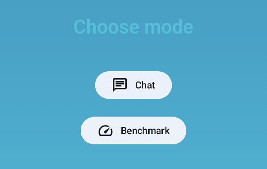
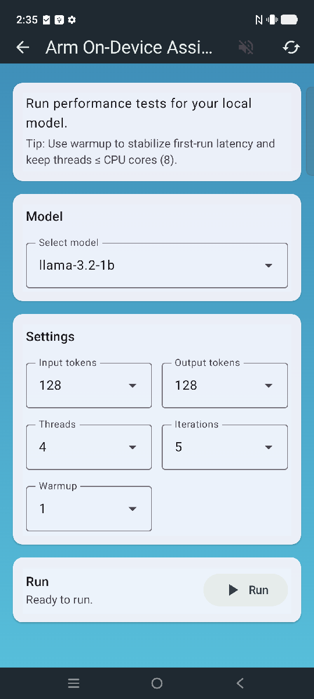

---

title: Performance

weight: 8

### FIXED, DO NOT MODIFY

layout: learningpathall

---

## Benchmarking

The Voice Assistant application also provides a benchmark mode so you can easily test out the performance of an LLM model with a sample number of input and output tokens.



Tap **Benchmark** to navigate to benchmark screen.



## Benchmark controls

You can use application controls to enable extra functionality or gather performance data.

|Setting|Default|Description|
|---|---|---|
|Input tokens|128|Number of prompt (input) tokens fed to the model before generation starts.|
|Output tokens|128|Number of new tokens the model should generate after the prompt.|
|Threads|4|Number of CPU threads used for inference.|
|Iterations|5|Number of measured benchmark runs to collect stable, averaged measurements.|
|Warmup|1|Number of warmup iterations which are not counted in benchmarking, these eliminate one-time overheads before measuring.|

## Benchmarking LLM on Android phone

You can also benchmark the LLM functionality on Android phone outside of RTVA application. For this, you can use the Large Language Models repository:

```
https://gitlab.arm.com/kleidi/kleidi-examples/large-language-models
```

and build for your chosen LLM backend, ensure that `NDK_PATH` is set properly. SME kernels are enabled by default, so let's first build with SME disabled:

```
cmake --preset=x-android-aarch64 -B build/ -DBUILD_BENCHMARK=ON -DLLM_FRAMEWORK=mnn -DMNN_SME2=OFF
cmake --build ./build
```

{}
For troubleshooting any build issues, refer to [large-language-models README](https://gitlab.arm.com/kleidi/kleidi-examples/large-language-models/-/blob/main/README.md?ref_type=heads)
{}

### Phone setup

Now that you have all the libraries and executables needed, you can create a benchmarking directory and push the needed libraries to the phone:

```sh
adb shell mkdir /data/local/tmp/benchmark_test/
adb push build/lib/* /data/local/tmp/benchmark_test/
```
```output
build/lib/archive/: 9 files pushed. 140.0 MB/s (36970298 bytes in 0.252s)
build/lib/libMNN.so: 1 file pushed. 139.5 MB/s (4973176 bytes in 0.034s)
build/lib/libarm-llm-jni.so: 1 file pushed. 153.8 MB/s (3832152 bytes in 0.024s)
11 files pushed. 137.0 MB/s (45775626 bytes in 0.319s)
```

This will copy the executables you can run:
```sh
adb push build/bin/* /data/local/tmp/benchmark_test/
```
```output
build/bin/arm-llm-bench-cli: 1 file pushed. 134.3 MB/s (3415344 bytes in 0.024s)
build/bin/llm-cpp-tests: 1 file pushed. 157.7 MB/s (17783848 bytes in 0.108s)
build/bin/llm_bench: 1 file pushed. 22.6 MB/s (85688 bytes in 0.004s)
build/bin/llm_demo: 1 file pushed. 12.6 MB/s (34656 bytes in 0.003s)
4 files pushed. 141.7 MB/s (21319536 bytes in 0.143s)
```
Finally, copy the models to benchmark:
```sh
adb push resources_downloaded/models/mnn/ /data/local/tmp/benchmark_test/
```

### Benchmarking the models

To make sure the screen stays on and the CPU is not throttled use the following commands:

```sh
adb shell svc power stayon true
adb shell dumpsys deviceidle disable
```

You can now run the executable in ADB shell, providing the path to libraries and the number of iterations to benchmark:

```sh
adb shell
cd /data/local/tmp/benchmark_test/
LD_LIBRARY_PATH=./ ./arm-llm-bench-cli -m mnn/llama-3.2-1b/ -i 128 -o 64 -t 1 -n 5 -w 1
```
```output

=== ARM LLM Benchmark ===

Parameters:
  model_path         : mnn/llama-3.2-1b/
  num_input_tokens   : 128
  num_output_tokens  : 64
  num_threads        : 1
  num_iterations     : 5
  num_warmup         : 1


======= Results =========

| Framework          | Threads | Test   | Performance                |
| ------------------ | ------- | ------ | -------------------------- |
| mnn                | 1       | pp128  |   192.788 ±  5.658 (t/s)   |
| mnn                | 1       | tg64   |    30.530 ±  3.186 (t/s)   |
| mnn                | 1       | TTFT   |   697.401 ± 29.332 (ms)    |
| mnn                | 1       | Total  |  2782.626 ± 211.955 (ms)   |

```

To get benchmark numbers with use of SME kernels, you can rerun the full Benchmarking LLM on Android phone section without the -DMNN_SME2=OFF as SME kernels are enabled by default.


## Example performance with a Vivo X300 Android phone

The table table shows the measurements (in tokens per second) measured on a Vivo X300 Android phone:

| LLM Framework     | Model                                     | Without SME2   | With SME2 | Uplift  |
|-------------------|-------------------------------------------|----------------|-----------|---------|
| mnn               | llama-3.2-1B                              | 187.06         | 334.57    | 78.87%  |
|                   | qwen25vl-3b                               | 73.5           | 132.46    | 80.22%  |


{}
The Android system enforces throttling, so your own results may vary slightly.
{}

As shown, SME2 brings a dramatic performance improvement.

