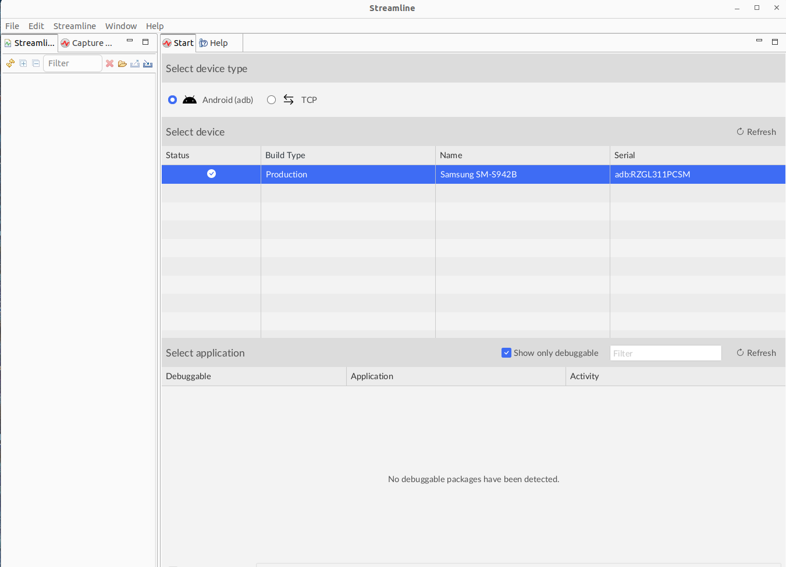
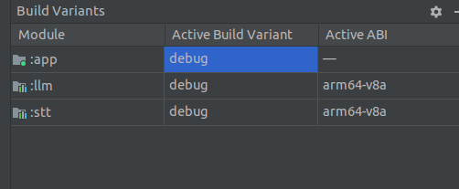

---

title: Use with Arm Streamline

weight: 9

### FIXED, DO NOT MODIFY

layout: learningpathall

---

## Arm Streamline

[Streamline](https://developer.arm.com/Tools%20and%20Software/Streamline%20Performance%20Analyzer)is an example of a sampling profiler that takes regular samples of various counters and registers in the system to provide a detailed view of the system's performance.

You can install Streamline and Arm Performance Studio on your host machine and connect to your target Arm device to capture the data. 

In this example, the target device is an Arm-powered Android phone. The data is captured over a USB connection, and then analyzed on your host machine.

For more information on Streamline usage, see [Tutorials and Training Videos](https://developer.arm.com/Tools%20and%20Software/Arm%20Performance%20Studio). 

## Build application with debug information

Ensure the test device is connected and visible in Streamline, you may see not see any debuggable applications available in Streamline yet:

Now choose a debug build variant in Android Studio to build a debuggable application:

Build and run the debug build variant of voice assistant in Android Studio, now you can select this application in Streamline:

