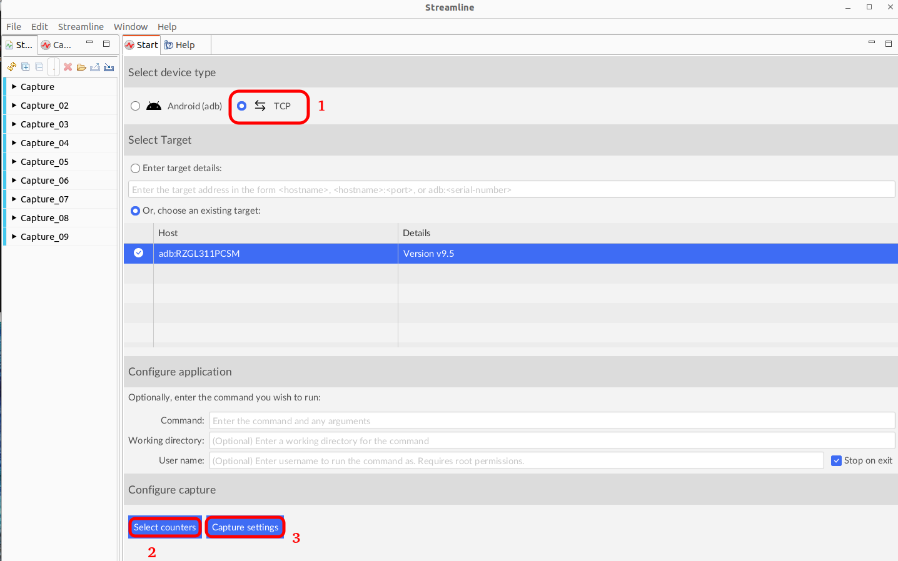
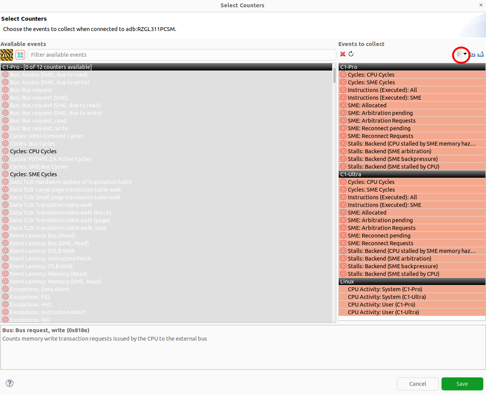
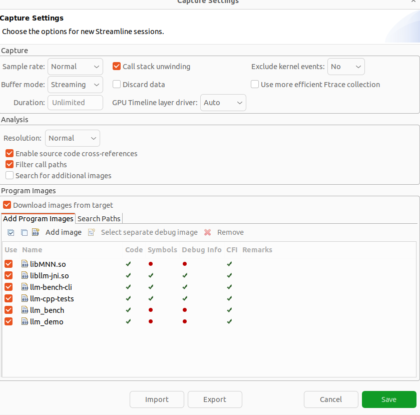
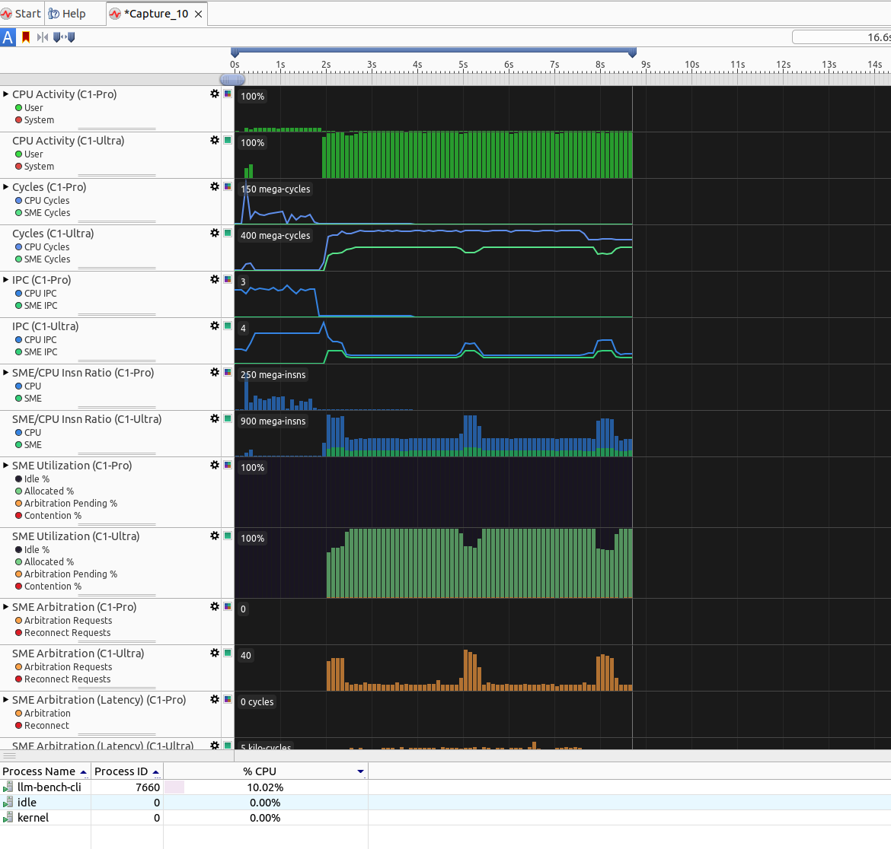
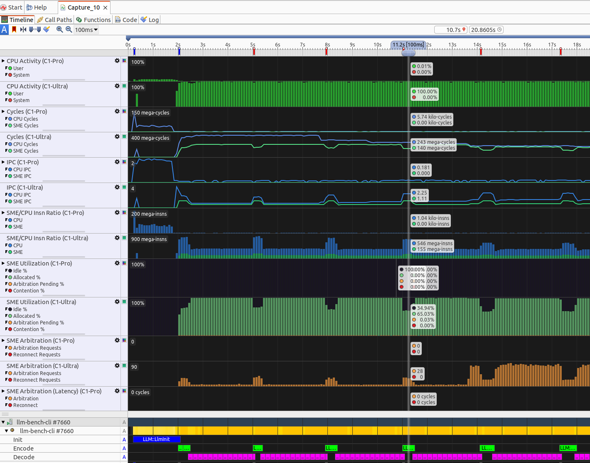
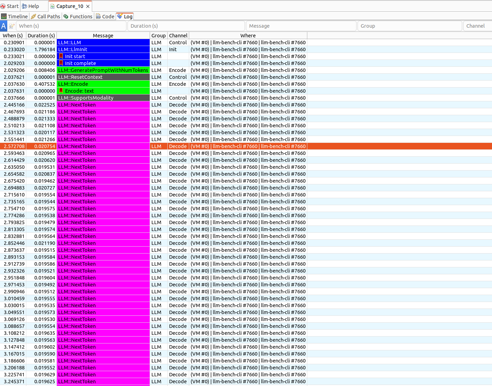
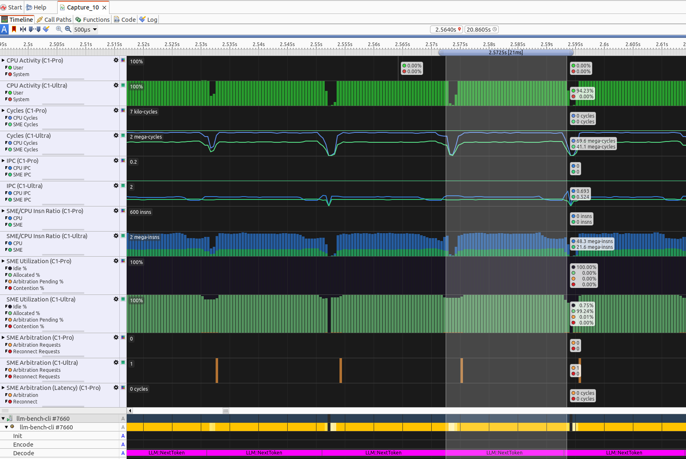

---

title: Performance with Streamline

weight: 10

### FIXED, DO NOT MODIFY

layout: learningpathall

---

## Benchmarking LLM on Android phone

You can also benchmark the LLM functionality on Android phone outside of RTVA application. For this, you can use the Large Language Models repository:

```
https://github.com/Arm-Examples/LLM-Runner
```

and build for your chosen LLM backend, ensure that `NDK_PATH` is set properly. You can use `ENABLE_STREAMLINE` flag to add streamline annotations:

```
cmake --preset=x-android-aarch64 -B build -DLLM_FRAMEWORK=mnn -DBUILD_BENCHMARK=ON -DENABLE_STREAMLINE=ON 
cmake --build ./build
```

{}
For troubleshooting any build issues, refer to [large-language-models README](https://github.com/Arm-Examples/LLM-Runner/blob/main/README.md)
{}

### Phone setup

Now that you have all the libraries and executables needed, you can create a benchmarking directory and push the needed libraries to the phone:

```sh
adb shell mkdir /data/local/tmp/benchmark_test/
adb push build/lib/* /data/local/tmp/benchmark_test/
```
```output
build/lib/archive/: 9 files pushed. 140.0 MB/s (36970298 bytes in 0.252s)
build/lib/libMNN.so: 1 file pushed. 139.5 MB/s (4973176 bytes in 0.034s)
build/lib/libllm-jni.so: 1 file pushed. 153.8 MB/s (3832152 bytes in 0.024s)
11 files pushed. 137.0 MB/s (45775626 bytes in 0.319s)
```

This will copy the executables you can run:
```sh
adb push build/bin/* /data/local/tmp/benchmark_test/
```
```output
build/bin/llm-bench-cli: 1 file pushed. 134.3 MB/s (3415344 bytes in 0.024s)
build/bin/llm-cpp-tests: 1 file pushed. 157.7 MB/s (17783848 bytes in 0.108s)
build/bin/llm_bench: 1 file pushed. 22.6 MB/s (85688 bytes in 0.004s)
build/bin/llm_demo: 1 file pushed. 12.6 MB/s (34656 bytes in 0.003s)
4 files pushed. 141.7 MB/s (21319536 bytes in 0.143s)
```
Finally, copy the models to benchmark:
```sh
adb push resources_downloaded/models/mnn/ /data/local/tmp/benchmark_test/
```

### Benchmarking the models

To make sure the screen stays on and the CPU is not throttled use the following commands:

```sh
adb shell svc power stayon true
adb shell dumpsys deviceidle disable
```

Copy the `gatord` binary from your Arm Performance Studio installation to your android device:

```sh
adb push ./streamline/bin/android/arm64/gatord /data/local/tmp/
```

Start the gator daemon on your android device and point to the benchmarking executable you profile, `--wait-process` flag will ensure you can start the gator daemon and wait for a process matching the specified command to launch before starting capture:

```bash
adb shell
cd /data/local/tmp
./gatord --allow-command --wait-process llm-bench-cli
```

In Streamline tool, you can use the following to configure the capture:
1. Select TCP target and ensure there's an existing target available
2. Use select counters button to select the counters you would like to see in the Streamline capture
3. Use capture settings button to add more information to your capture




Add counters from a template with the button shown below, select `SME2 Basic Utilization` and save:



In Capture Settings, add previously built libraries from `build/lib/` and executables from `build/bin/` to get a more detailed analysis:



You can now click `Start Capture` in Streamline and click `Save` which opens up a Capture file and waits for the process.

On your target device, run the executable in ADB shell, providing the path to libraries and the number of iterations to benchmark:

```sh
adb shell
cd /data/local/tmp/benchmark_test/
LD_LIBRARY_PATH=./ ./llm-bench-cli -m mnn/llama-3.2-1b/ -i 128 -o 128 -t 1 -n 5 -w 1
```

You will start to see the capture being populated once the benchmarking application starts:



Once the benchmarking application finishes, `Cancel` image download in streamline, it will take some time for capture to be analysed.

You can now look at the `Timeline` tab to see SME kernels utilization throughout the execution of your benchmarking application:



You can also look in `Log` tab to see the Streamline annotations you have enabled in LLM-Runner build:



By double-clicking on one of the annotations like `LLM::NextToken`, you can look at the timeline and SME/CPU instruction ratio for this specific part of LLM execution:



{}
The Android system enforces throttling, so your own results may vary slightly.
{}

These measurements show how fast the model processes (encodes) 128 input tokens when running on a single CPU thread. As the results illustrate, SME2 delivers a significant performance boost even when using just one or two CPU cores on an Android phone, meaning faster processing without needing to involve multiple CPU cores.

### What can Arm Streamline show?

To summarize, with use of Arm Streamline you can firstly confirm that SME2 kernels are being used by your chosen framework. By looking at the timeline, you can match SME2 activity to the benchmarking phases phases. For multithreaded code, compare threads. Good signs: SME2 activity across worker threads during the compute phase. Bad signs: one active thread, gaps, or long non-SME2 regions.


