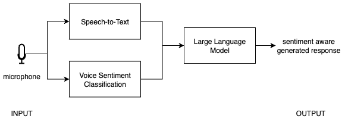

Voice-based LLM applications often rely primarily on transcribed text from speech input, such as in interactions with non-player characters in games or voice assistants. This approach can overlook vocal cues—like tone, pitch, and emotion—present in a speaker’s voice. As a result, responses may feel less natural and may not fully capture the user’s underlying intent.

To address this, voice-based sentiment classification analyzes audio input to determine the user’s emotional state, which is then incorporated into the LLM prompt to enable more context-aware responses. In this Learning Path, we will build a sentiment-aware voice assistant that runs entirely on-device. The application records audio, performs transcription—converting speech into written text—using Whisper, classifies sentiment directly from the voice signal, and combines the transcript and voice-based sentiment to guide responses from a local LLM running with llama.cpp.

You will start by building a baseline voice-to-LLM pipeline—capturing audio, transcribing it into text, and using it to generate responses with an LLM. You will then extend this pipeline with a voice-based sentiment classification model. This involves training the model, optimizing it for efficient on-device inference, and integrating it into a unified application.
