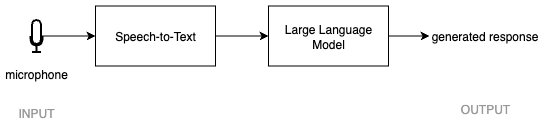

In this section, you will build an end-to-end pipeline that:

1. Records audio from your microphone
2. Transcribes it to text using Whisper
3. Sends the text to a locally hosted LLM
4. Displays the model's response

This forms the foundation of your voice assistant.



Before you begin, make sure you have completed the environment setup in the previous section and that your `llama-server` is still running.

### Step 1.1 - Create a basic Gradio UI

Start by creating a simple web interface that captures microphone input.
Gradio is a Python library for building simple browser-based interfaces. Here, you use it to create a small front end that records audio from your microphone.

This is a good first step because it lets you confirm that microphone capture works before you add transcription and model inference.

Create a file called `app.py`:

```python
import gradio as gr

with gr.Blocks() as demo:
    mic = gr.Audio(sources="microphone", type="filepath")

demo.launch()
```

Run the app:

```bash
python app.py
```

Open your browser at:

`http://127.0.0.1:7860`

You should now see a simple interface that allows you to record audio.
At this stage, the app only captures audio. It does not yet transcribe speech or send anything to the LLM.

### Step 1.2 - Add speech-to-text with Whisper

Next, add transcription using the Whisper model.
Whisper is a speech-to-text model. It takes audio as input and returns a text transcript. In this pipeline, it converts spoken input into text before anything is sent to the LLM.

Update `app.py` with the following code:

```python
import whisper

# Load a small Whisper model for local transcription
model = whisper.load_model("base")

def transcribe(audio):
    return model.transcribe(audio)["text"]
```

The first time you run this, Whisper will download the model, which may take a few minutes.

At this stage, your app can convert recorded audio into text.
The output of this step is a text transcript that represents what the user said.

### Step 1.3 - Connect to the local LLM

Define the OpenAI-compatible endpoint exposed by `llama-server`.
An endpoint is the URL your program uses to talk to another service. In this case, `llama-server` exposes a local API on your machine, and your app sends the transcript there to get a response.

Because the server is OpenAI-compatible, the request format looks like a standard chat completions API.

Update `app.py` with the following import and endpoint definition:

```python
import requests

LOCAL_LLM_URL = "http://127.0.0.1:8080/v1/chat/completions"
```

Make sure your `llama-server` from the previous section is running before continuing.
Without the local server running, the next step will not be able to generate an answer.

### Step 1.4 - Build the full pipeline

Now combine transcription and LLM interaction into a single function.
This function becomes the core of the application. Audio goes in, text is extracted, that text is sent to the model, and the response comes back out.

Keeping the logic in one function makes it easier to connect the pipeline to the user interface in the next step.

Update `app.py` by adding the following function:

```python
def handle_audio(audio):
    # Step 1: Transcribe audio
    text = transcribe(audio)

    # Step 2: Send transcript to local LLM
    response = requests.post(
        LOCAL_LLM_URL,
        json={
            "model": "local-model",
            "messages": [{"role": "user", "content": text}],
        },
    )

    if response.status_code != 200:
        return text, "Error: LLM request failed"

    data = response.json()
    answer = data["choices"][0]["message"]["content"]

    return text, answer
```

### Step 1.5 - Connect the UI to the pipeline

Update your UI so that recorded audio triggers the full pipeline and displays results.
This is the final integration step. You now connect the interface, transcription, and model request so the app behaves like a real voice assistant.

When the user records audio, Gradio calls your pipeline function. The app then shows both the transcript and the assistant response in the browser.

Update `app.py` so it contains the following complete version:

```python
import gradio as gr
import whisper
import requests

model = whisper.load_model("base")

LOCAL_LLM_URL = "http://127.0.0.1:8080/v1/chat/completions"

def transcribe(audio):
    return model.transcribe(audio)["text"]

def handle_audio(audio):
    text = transcribe(audio)

    response = requests.post(
        LOCAL_LLM_URL,
        json={
            "model": "local-model",
            "messages": [{"role": "user", "content": text}],
        },
    )

    if response.status_code != 200:
        return text, "Error: LLM request failed"

    data = response.json()
    answer = data["choices"][0]["message"]["content"]

    return text, answer

with gr.Blocks() as demo:
    mic = gr.Audio(sources="microphone", type="filepath")
    transcript = gr.Textbox(label="Transcript")
    response = gr.Textbox(label="LLM Response")

    mic.change(fn=handle_audio, inputs=mic, outputs=[transcript, response])

demo.launch()
```

## What you should see

After recording audio in the browser:

- Your speech is transcribed into text
- The transcript is sent to the local LLM
- The LLM response is displayed in the interface

## Troubleshooting

- No response from LLM: ensure `llama-server` is still running.
- Whisper is slow on first run: this is expected due to model download and initialization.
- Microphone not working: check browser permissions for microphone access.

At this point, you have a working voice-to-LLM pipeline. In the next section, you will extend this pipeline by adding a voice sentiment classification model.
