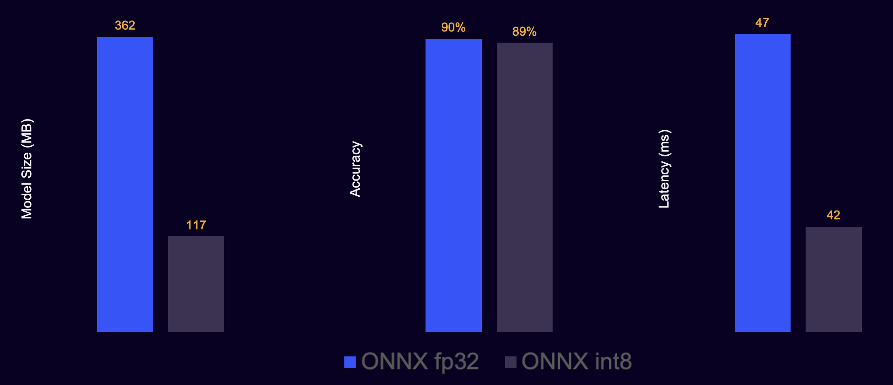

In this section, you will convert the trained model to ONNX format and compress it for efficient on-device inference. First, export the trained PyTorch model to ONNX. Then apply post-training quantization to reduce model size and improve runtime efficiency.

### Step 3.1 - Export to ONNX

This step loads the trained HuBERT checkpoint and exports it to an ONNX graph.
The exported ONNX model becomes the base file used in the quantization step.

ONNX export may take a few seconds. If it fails, ensure the trained model from the previous section exists in `models/hubert_vsa_ravdess`.

Save the following workflow as `convert_and_quantize_model.py`, or reuse the relevant parts in your own conversion script:

```python
import os, torch
from transformers import AutoFeatureExtractor, HubertForSequenceClassification

MODEL_DIR = "models/hubert_vsa_ravdess"
ONNX_DIR = "models/hubert_vsa_ravdess_onnx"
# Create the output directory for ONNX files.
os.makedirs(ONNX_DIR, exist_ok=True)

# Load trained model weights from the previous section.
model = HubertForSequenceClassification.from_pretrained(MODEL_DIR)
# Switch to evaluation mode for deterministic export behavior.
model.eval()

feature_extractor = AutoFeatureExtractor.from_pretrained(MODEL_DIR)

# Create a dummy 1-second input to define input tensor shapes.
dummy = feature_extractor(
    [0.0] * 16000,
    sampling_rate=16000,
    return_tensors="pt",
    return_attention_mask=True
)

# Export model graph and IO signatures to ONNX.
torch.onnx.export(
    model,
    (dummy["input_values"], dummy["attention_mask"]),
    os.path.join(ONNX_DIR, "hubert_vsa_ravdess.onnx"),
    input_names=["input_values", "attention_mask"],
    output_names=["logits"],
    opset_version=18
)
```

After this step, you should have `hubert_vsa_ravdess.onnx` in the ONNX output directory.

For production use, consider exporting with dynamic axes to support variable-length audio inputs.

You can verify the exported file with:

```bash
ls models/hubert_vsa_ravdess_onnx
```

### Step 3.2 - Quantize model

This step applies dynamic INT8 quantization to the ONNX model. The model weights are quantized to integer 8 bits ahead of time, while activations are quantized dynamically during inference.

Quantization typically reduces model size by around 3x to 4x and often improves CPU inference speed, depending on the hardware and model.

```python
from onnxruntime.quantization import quantize_dynamic, QuantType

quantize_dynamic(
    model_input="models/hubert_vsa_ravdess_onnx/hubert_vsa_ravdess.onnx",
    model_output="models/hubert_vsa_ravdess_onnx/hubert_vsa_ravdess_int8.onnx",
    weight_type=QuantType.QInt8
)
```

After this step, you should have a smaller quantized model file for deployment.

You can verify the quantized model file with:

```bash
ls models/hubert_vsa_ravdess_onnx
```

To compare file sizes more easily, you can also run:

```bash
ls -lh models/hubert_vsa_ravdess_onnx
```

### Step 3.3 - Run ONNX inference

This step validates that the quantized model can run inference with ONNX Runtime.
It also checks label decoding so you can confirm the output end to end.

You can add this inference check to `convert_and_quantize_model.py` after the quantization step, or run it separately in a short test script.

```python
import onnxruntime as ort
import numpy as np
import librosa
from transformers import AutoFeatureExtractor, AutoConfig

MODEL_DIR = "models/hubert_vsa_ravdess"
ONNX_PATH = "models/hubert_vsa_ravdess_onnx/hubert_vsa_ravdess_int8.onnx"
SAMPLE_PATH = "data/ravdess/Audio_Speech_Actors_01-24/Actor_01/03-01-01-01-01-01-01.wav"

# Initialize ONNX Runtime session with the quantized graph.
session = ort.InferenceSession(ONNX_PATH, providers=["CPUExecutionProvider"])

fx = AutoFeatureExtractor.from_pretrained(MODEL_DIR)
id2label = AutoConfig.from_pretrained(MODEL_DIR).id2label

# Load one sample at 16 kHz.
audio, _ = librosa.load(SAMPLE_PATH, sr=16000)

# Convert waveform to ONNX input tensors.
inputs = fx(
    audio,
    sampling_rate=16000,
    return_tensors="np",
    return_attention_mask=True
)

# Run inference and retrieve logits output.
logits = session.run(None, {
    "input_values": inputs["input_values"],
    "attention_mask": inputs["attention_mask"]
})[0]

# Convert highest-scoring class index to label name.
pred = int(np.argmax(logits))
print("Predicted:", id2label[pred])
```

If this file does not exist on your system, replace `SAMPLE_PATH` with any `.wav` file from your extracted RAVDESS dataset.

After this step, you have verified that quantized ONNX inference works with your trained model.

You should see a predicted label such as:

```text
Predicted: happy
```

This layout helps keep the training and deployment files separate and easy to manage.

```text
models/
  hubert_vsa_ravdess/
  hubert_vsa_ravdess_onnx/
    hubert_vsa_ravdess.onnx
    hubert_vsa_ravdess_int8.onnx
```

### Model compression results

We can also compare the model metrics before and after quantization.



Typical results look like:

```text
Original ONNX model: larger size, higher memory footprint
Quantized INT8 ONNX model: smaller size, lower memory footprint, faster CPU inference
```

## Troubleshooting

- ONNX export fails: ensure the trained model exists in `models/hubert_vsa_ravdess`.
- Inference error about missing inputs: confirm that both `input_values` and `attention_mask` are passed to the ONNX session.
- Slow inference: make sure you are using `hubert_vsa_ravdess_int8.onnx` rather than the unquantized ONNX model.

The model is now ready for integration into the voice pipeline in the next section.
