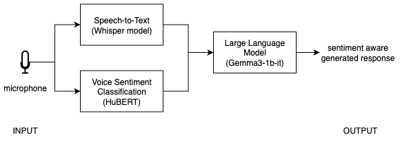

## Build the complete sentiment-aware voice assistant

In this section, you'll integrate the voice sentiment classification model into the baseline voice-to-LLM pipeline and build a sentiment-aware voice assistant. You'll update the prompt sent to the LLM so it includes both the transcript and the predicted sentiment, combining speech, emotion, and language understanding into a single application.

End-to-end response time may take a few seconds because the application runs Whisper transcription, ONNX sentiment inference, and local LLM generation for each interaction.



In Steps 4.1 to 4.4, continue editing the same `app.py` file you created in the baseline pipeline section (`~/voice-sentiment-assistant/app.py`).

### Step 4.1 - Load the voice sentiment classification model

This step initializes the trained and quantized ONNX model, then loads the matching preprocessing components used during training. You'll reuse these objects every time you run sentiment inference on new audio.

Add these imports and model-loading definitions to `app.py`:
- add the imports with your other imports at the top of the file
- add `MODEL_DIR`, `ONNX_PATH`, `session`, `feature_extractor`, and `id2label` near `LOCAL_LLM_URL` and your other global setup values

```python
import onnxruntime as ort
import numpy as np
import librosa
from transformers import AutoFeatureExtractor, AutoConfig

MODEL_DIR = "models/hubert_vsa_ravdess"
ONNX_PATH = "models/hubert_vsa_ravdess_onnx/hubert_vsa_ravdess_int8.onnx"

# Run the quantized model with the CPU execution provider.
session = ort.InferenceSession(
    ONNX_PATH,
    providers=["CPUExecutionProvider"]
)
feature_extractor = AutoFeatureExtractor.from_pretrained(MODEL_DIR)
id2label = AutoConfig.from_pretrained(MODEL_DIR).id2label
```

### Step 4.2 - Create the sentiment prediction function

Next, create a helper function that takes an audio file path, runs the sentiment model, and returns the predicted label. This adds the emotion-aware part of the assistant.

```python
def predict_sentiment(audio_path):
    audio, _ = librosa.load(audio_path, sr=16000, mono=True)

    inputs = feature_extractor(
        audio,
        sampling_rate=16000,
        return_tensors="np",
        return_attention_mask=True
    )

    logits = session.run(None, {
        "input_values": inputs["input_values"],
        "attention_mask": inputs["attention_mask"]
    })[0]

    pred = int(np.argmax(logits))
    return id2label[pred]
```

### Step 4.3 - Update pipeline to include sentiment

Now that the voice sentiment classification function is ready, combine transcription and sentiment prediction before sending the request to the local LLM. Reuse the `model`, `requests`, and `LOCAL_LLM_URL` definitions from the baseline voice-to-LLM pipeline section.

```python
def handle_audio(audio_path):
    if not audio_path:
        return "", "", ""

    # 1. Transcribe
    text = model.transcribe(audio_path)["text"]

    # 2. Predict sentiment
    sentiment = predict_sentiment(audio_path)

    # 3. Send to LLM with sentiment context
    prompt = f"The user said: '{text}'. Their tone sounds {sentiment}. Respond appropriately."

    response = requests.post(
        LOCAL_LLM_URL,
        json={
            "model": "local-model",
            "messages": [
                {
                    "role": "system",
                    "content": "Respond helpfully and acknowledge the user's emotional tone."
                },
                {"role": "user", "content": prompt},
            ],
        },
    )

    if response.status_code != 200:
        return text, sentiment, "Error: LLM request failed"

    answer = response.json()["choices"][0]["message"]["content"]

    return text, sentiment, answer
```

### Step 4.4 - Update user interface (UI)

In this step, update the interface so it displays three outputs: the transcript, the predicted sentiment, and the final LLM response. For consistency with the earlier page, connect the microphone input with `mic.change(...)`.

```python
with gr.Blocks() as demo:
    mic = gr.Audio(sources="microphone", type="filepath")

    transcript = gr.Textbox(label="Transcription")
    sentiment_box = gr.Textbox(label="Predicted sentiment")
    llm_output = gr.Textbox(label="LLM response")

    mic.change(
        fn=handle_audio,
        inputs=mic,
        outputs=[transcript, sentiment_box, llm_output]
    )

demo.launch()
```

### Step 4.5 - Run the final demo

Now that the voice classification model is integrated with the baseline pipeline, test the full end-to-end experience locally.

```bash
python app.py
```

Open:

`http://127.0.0.1:7860`

## Full final app

Update `app.py` so it combines the baseline voice-to-LLM pipeline with ONNX-based sentiment prediction into one complete application:

```python
import gradio as gr
import whisper
import requests
import onnxruntime as ort
import numpy as np
import librosa
from transformers import AutoFeatureExtractor, AutoConfig

MODEL_DIR = "models/hubert_vsa_ravdess"
ONNX_PATH = "models/hubert_vsa_ravdess_onnx/hubert_vsa_ravdess_int8.onnx"
LOCAL_LLM_URL = "http://127.0.0.1:8080/v1/chat/completions"

# Load Whisper for speech-to-text.
model = whisper.load_model("base")

# Load the quantized ONNX sentiment model and preprocessing config.
session = ort.InferenceSession(
    ONNX_PATH,
    providers=["CPUExecutionProvider"]
)
feature_extractor = AutoFeatureExtractor.from_pretrained(MODEL_DIR)
id2label = AutoConfig.from_pretrained(MODEL_DIR).id2label

def predict_sentiment(audio_path):
    audio, _ = librosa.load(audio_path, sr=16000, mono=True)
    inputs = feature_extractor(
        audio,
        sampling_rate=16000,
        return_tensors="np",
        return_attention_mask=True
    )

    logits = session.run(None, {
        "input_values": inputs["input_values"],
        "attention_mask": inputs["attention_mask"]
    })[0]

    pred = int(np.argmax(logits))
    return id2label[pred]

def handle_audio(audio_path):
    if not audio_path:
        return "", "", ""

    text = model.transcribe(audio_path)["text"]
    sentiment = predict_sentiment(audio_path)

    prompt = f"The user said: '{text}'. Their tone sounds {sentiment}. Respond appropriately."

    response = requests.post(
        LOCAL_LLM_URL,
        json={
            "model": "local-model",
            "messages": [
                {
                    "role": "system",
                    "content": "Respond helpfully and acknowledge the user's emotional tone."
                },
                {"role": "user", "content": prompt},
            ],
        },
    )

    if response.status_code != 200:
        return text, sentiment, "Error: LLM request failed"

    answer = response.json()["choices"][0]["message"]["content"]
    return text, sentiment, answer

with gr.Blocks() as demo:
    mic = gr.Audio(sources="microphone", type="filepath")
    transcript = gr.Textbox(label="Transcription")
    sentiment_box = gr.Textbox(label="Predicted sentiment")
    llm_output = gr.Textbox(label="LLM response")

    mic.change(fn=handle_audio, inputs=mic, outputs=[transcript, sentiment_box, llm_output])

demo.launch()
```

### What to expect

Try different tones of speech.

Example 1:

- Voice: frustrated
- Input: "This is not working at all"
- Sentiment: angry
- Response: empathetic and helpful

Example 2:

- Voice: cheerful
- Input: "This is awesome!"
- Sentiment: happy
- Response: enthusiastic

Voice-based sentiment classification can be ambiguous and sensitive to real-world variations. Voice captures how something is said (tone, pitch, emotion), but accents, speaking styles, background noise, and limited or unrepresentative training data can affect prediction accuracy. Text captures what is said (semantic meaning), which may not reflect intent. For example, a phrase like “That’s just great” may sound sarcastic in tone but appear positive in text, while facial signals may reinforce or contradict the tone.

A more robust approach is to combine voice with other modalities such as text and visual cues, and to train models on more diverse datasets. By fusing these signals with simple rules or weighted averaging, you can reduce ambiguity and produce more reliable sentiment before sending it to the LLM. You can further improve performance by collecting user voice data responsibly, with consent and privacy safeguards, to better capture real-world variations and refine the model over time.

## Troubleshooting

- No sentiment output: check that `ONNX_PATH` points to the quantized ONNX model from the previous section.
- Slow response: make sure you're using `hubert_vsa_ravdess_int8.onnx` and that `llama-server` is already running.
- LLM not responding: verify that `llama-server` is still available at `http://127.0.0.1:8080`.
- Microphone input not updating: check browser microphone permissions.


## Summary

In this section, you integrated the quantized ONNX sentiment model into the voice pipeline. The LLM now receives both the transcribed text and the predicted voice sentiment, allowing it to generate more context-aware responses.

You now have an end-to-end system that understands:

- what the user says (text)
- how they say it (sentiment)
- and generates context-aware responses
