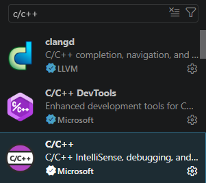
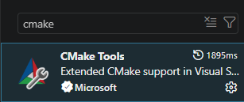
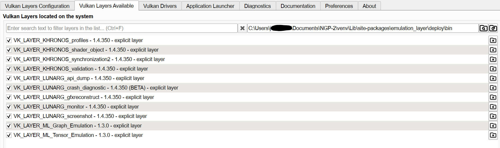
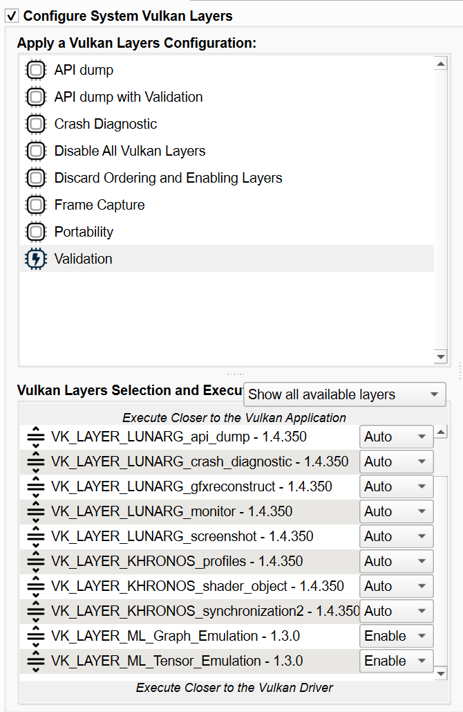

## Overview

To run the Vulkan Samples, you first need to set up your development environment.

This setup involves two main steps:

* Install the required tools on your development machine
* Download the ML emulation layers for Vulkan, which simulate the `VK_ARM_data_graph` and `VK_ARM_tensors` extensions

## Install required tools for development

Before building and running the samples, ensure the following tools are installed on your development machine:

- CMake (version 3.25 or later)
- Python 3
- Git

Git can be installed with the following command: 

```bash
winget install --id Git.Git -e
```

In VSCode create a new folder for this project then make sure you have the following extensions: 
  * C/C++ From Microsoft 
  * CMake Tools From Microsoft



 

The following commands will make a venv in your local version of python and install the required packages. 

```bash
py -m venv .venv
.\.venv\Scripts\Activate.ps1
python -m pip install --upgrade pip
python -m pip install ai-ml-emulation-layer-for-vulkan cmake
```

To verify your installation, run the following commands:

```bash
cmake --version
python --version
git --version
python -m pip show ai-ml-emulation-layer-for-vulkan
```

Each command should print the installed version of the tool or show where the appropriate files are located.

### Install Vulkan Software Development Kit

Go to the [Getting Started with the Windows Vulkan SDK](https://vulkan.lunarg.com/sdk/home) and download the SDK Installer for Windows. This installs **Vulkan Configurator** which is used to run the emulation layers.

{}

You must use a version >= 1.4.321 for the Vulkan SDK.

{}


## Enable the emulation layers in Vulkan Configurator

Next, enable the emulation layers using the Vulkan Configurator to simulate the `VK_ARM_data_graph` and `VK_ARM_tensors` extensions. Open **Vulkan Configurator**.

Under the **Vulkan Layers Available** tab, add the path to your `Emulation layer` folder that can be found in the site packages of your venv folder select the bin folder.




Under the **Vulkan layers Configuration** tab go through each setting in the top rigt except disable all Vulkan Layers and enable the Graph and Tensor Emulation

Ensure that the **Graph** layer is listed above the **Tensor** layer.



{}

Keep Vulkan Configurator running while you run the Vulkan samples.

{}

With the emulation layers configured, you're ready to build the Vulkan Samples. Continue to the next section to get started.

