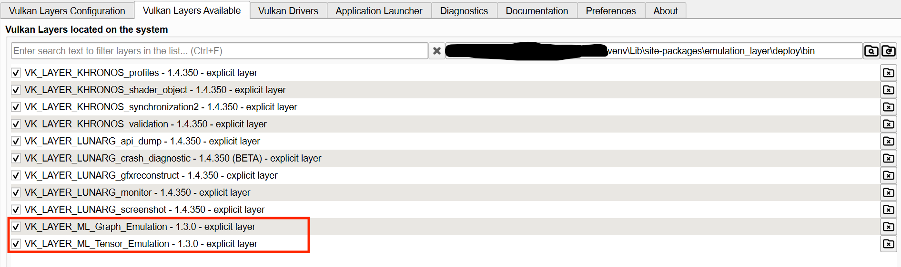
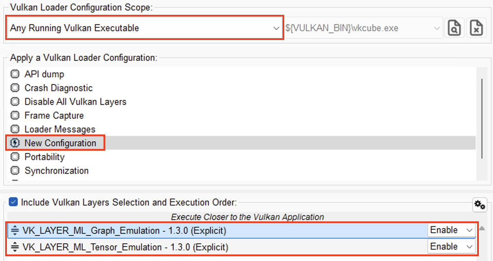

## Overview

To run the Vulkan Samples, you first need to set up your development environment.

This setup involves two main steps:

- Install the required tools on your development machine.
- Download the ML Emulation Layers for Vulkan, which simulate the `VK_ARM_data_graph` and `VK_ARM_tensors` extensions.

## Install required tools for development

Before building and running the samples, install these tools on your development machine:

- CMake (version 3.25 or later)
- Python 3
- Git

Install Git with the following command:

```bash
winget install --id Git.Git -e
```

In Visual Studio Code, create a folder for the project and install these Microsoft extensions:

- C/C++
- CMake Tools


Create a Python virtual environment and install the required packages:

```bash
py -m venv .venv
.\.venv\Scripts\Activate.ps1
python -m pip install --upgrade pip
python -m pip install ai-ml-emulation-layer-for-vulkan cmake
```

To verify your installation, run the following commands:

```bash
cmake --version
python --version
git --version
python -m pip show ai-ml-emulation-layer-for-vulkan
```

Each command prints the installed version of the tool or shows where the appropriate files are located.

### Install the Vulkan Software Development Kit

Download the Windows installer from [Getting Started with the Windows Vulkan SDK](https://vulkan.lunarg.com/sdk/home). The Vulkan Software Development Kit (SDK) includes **Vulkan Configurator**, which you use to run the emulation layers.

{}

Use Vulkan SDK version 1.4.321 or later.

{}


## Enable the emulation layers in Vulkan Configurator

Open **Vulkan Configurator** to enable the layers that emulate the `VK_ARM_data_graph` and `VK_ARM_tensors` extensions.

On the **Vulkan Layers Available** tab, browse to the emulation layer folder in your virtual environment's `site-packages` directory:

```output
.venv/Lib/site-packages/emulation_layer/deploy/bin
```



On the **Vulkan Layers Configuration** tab, set **Vulkan Loader Configuration Scope** to **Any Running Vulkan Executable**. Select **New Configuration**, then enable the **Graph Emulation** and **Tensor Emulation** layers.

Ensure that the **Graph** layer is listed above the **Tensor** layer.



{}

Keep Vulkan Configurator running while you run the Vulkan samples.

{}

With the emulation layers configured, you're ready to build the Vulkan Samples.
