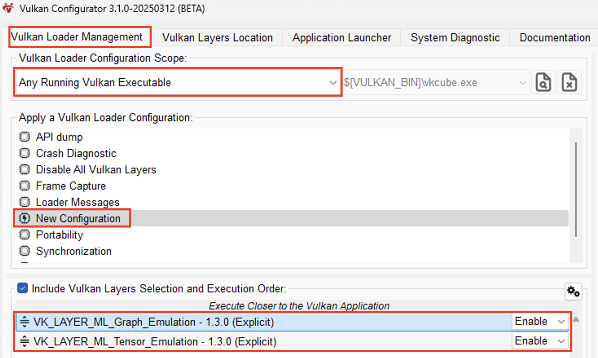

## Overview

To run the Vulkan Samples, you first need to set up your development environment.

This setup involves two main steps:

* Install the required tools on your development machine
* Download the ML emulation layers for Vulkan, which simulate the `VK_ARM_data_graph` and `VK_ARM_tensors` extensions

## Install required tools for development

Before building and running the samples, ensure the following tools are installed on your development machine:

- CMake (version 3.12 or later)
- Python 3
- Git

To verify your installation, run the following commands:

```bash
cmake --version
python3 --version
git --version
```

Each command should print the installed version of the tool.

### Install Vulkan Software Development Kit

Go to the [Getting Started with the Windows Vulkan SDK](https://vulkan.lunarg.com/sdk/home) and download the SDK Installer for Windows. This installs **Vulkan Configurator** which is used to run the emulation layers.

{}
You must use a version >= 1.4.321 for the Vulkan SDK.
{}

## Download the emulation layers

For this Learning Path, a pre-built of package of the emulation layers is available. Download them by clicking the link.

[ML Emulation Layer for Vulkan](https://www.arm.com/-/media/Files/developer/MLEmulationLayerForVulkan20251107)

Extract the downloaded file in a location of your choice. You’re now ready to enable the emulation layers in Vulkan Configurator.

## Enable the emulation layers in Vulkan Configurator

Next, enable the emulation layers using the Vulkan Configurator to simulate the `VK_ARM_data_graph` and `VK_ARM_tensors` extensions. Open **Vulkan Configurator**.

Under the **Vulkan Layers Location** tab, add the path to your `MLEmulationLayerForVulkan` folder.

Switch back to the **Vulkan Loader Management** tab. In the **Apply a Vulkan Loader Configuration** list, right-click and choose **Create a new Configuration**. You can give the new configuration any name, for example `tensor_and_data_graph`.


Ensure that the **Graph** layer is listed above the **Tensor** layer.



{}
Keep Vulkan Configurator running while you run the Vulkan samples.
{}

With the emulation layers configured, you're ready to build the Vulkan Samples. Continue to the next section to get started.

