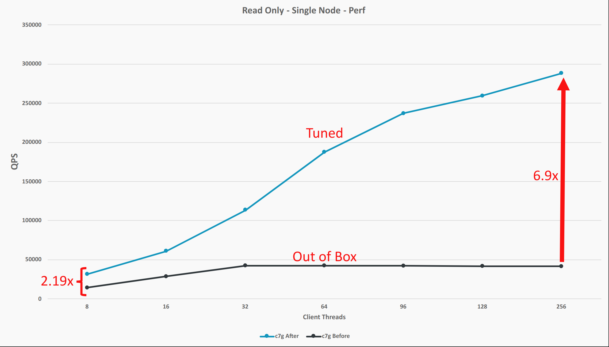

---
# User change
title: "Tuning MySQL"

weight: 3 # 1 is first, 2 is second, etc.

# Do not modify these elements
layout: "learningpathall"
---

In this section we will discuss MySQL tuning parameters.

##  Why Application Performance Tuning is Important

Application tuning allows us to gain performance without scaling our deployment up or out. This also gives us the option to either use the gained performance, or to trade it for cost savings by reducing the total amount of compute resources provisioned. Below is a graph that shows how big of a difference performance tuning on MySQL can make.



##  A Note on Tuning

Keep in mind that deployment configurations and the profile of SQL requests that are made by clients will be different. This means there is not a one size fits all set of tuning parameters for MySQL. Use the below to get some ideas around how MySQL can be tuned.

##  Storage Technology & File System Format

The underlying storage technology and the file system format can impact performance significantly. In general, locally attached SSD storage will perform best. However, network based storage systems can perform very well too. As always, performance is dependent on the request profile coming from clients. We suggest that the reader spends some time studying and experimenting with different storage technologies and configuration options.

Aside from the storage technology, it is also worth testing different file system formats with MySQL. We've found that xfs is a good starting point (ext4 is probably fine too).

##  MySQL Storage Engines

There are different storage engines to choose from for MySQL. The default is InnoDB. This is the storage engine we use to do performance testing and tuning on MySQL. Information on alternative storage engines can be found in the [MySQL documentation](https://dev.mysql.com/doc/refman/8.0/en/storage-engines.html).

##  Kernel Configurations

MySQL can benefit from adjustments to kernel parameters. Below is a list of some kernel related settings that can have a positive impact on performance.

### Linux-PAM Limits

Linux-PAM limits can be changed in the ```/etc/security/limits.conf``` file, or by using the `ulimit` command. We leave it up to the reader to learn how to edit the `limits.conf` file or use the `ulimit` command.

```
memlock (ulimit -l): Max locked-in-memory address space
```

memlock is the only PAM limit we've found is useful to adjust. This is suggested to be set to unlimited when using huge pages with MySQL. Enabling huge pages is something we strongly suggest readers try in their deployment because it can result in significant performance gains. We discuss huge pages further below. The suggestion to set memlock when huge pages are enabled can be found in the [MySQL documentation](https://dev.mysql.com/doc/refman/8.0/en/large-page-support.html).

### Linux Virtual Memory Subsystem

Making changes to the Linux Virtual Memory subsystem can also help performance. These settings can be changed in the `/etc/sysctl.conf` file, or by using the `sysctl` command. We leave it up to the reader to learn how to edit the `sysctl.conf` file or use the `sysctl` command. Documentation on each of these parameters can be found in the [admin-guide for sysctl in the Linux source](https://github.com/torvalds/linux/blob/master/Documentation/admin-guide/sysctl/vm.rst).

### vm.nr_hugepages

We've found that MySQL benefits greatly from using huge memory pages. This is because huge pages reduces how often virtual memory pages are mapped to physical memory. Before we look at this parameter, we'd like to show the reader how the current huge page configuration can be checked on any linux host. Run the following command on the host:

```
cat /proc/meminfo | grep ^Huge
```

The output should look something like the below:
```

HugePages_Total:       0
HugePages_Free:        0
HugePages_Rsvd:        0
HugePages_Surp:        0
Hugepagesize:       2048 kB
Hugetlb:               0 kB
```

This tells us we are not using huge pages because `HugePages_Total` is set to 0 (this is the default). Also take note of what `Hugepagesize` is set to; in our case it's set to 2MB which is the typical default for huge pages on Linux. This huge page size can be adjusted along with other parameters not discuss here. We leave learning about those other parameters up to the reader.

The setting that enables huge pages is shown below:

```
vm.nr_hugepages
```

This parameter sets the number of huge pages we want the kernel to make available to applications. The total amount of memory that will be used for huge pages will be this number (defaulted to 0) times the `Hugepagesize` we saw earlier (2MiB in our case). As an example, if we want a total of 1GB of huge page space, then we should set `vm.nr_hugepages` to 500 (500x2MB=1GB).

*What should we set `vm.nr_hugepages` to for MySQL?*

We should set `vm.nr_hugepages` to a value that gives us a total huge page space of slightly bigger than the MySQL buffer pool (discussed later). The reason we need to make it slightly larger than the buffer pool is because MySQL will use additional memory for other control structures. Also note, that we also need to configure MySQL to use the huge pages (discussed below).

More information on the different parameters that affect the configuration of huge pages can be found in the [admin-guide for hugetlbpage in the Linux source](https://github.com/torvalds/linux/blob/master/Documentation/admin-guide/mm/hugetlbpage.rst).

##  MySQL Configuration

There are different ways to set configuration parameters for MySQL. This is discussed in the [MySQL Programs documentation](https://dev.mysql.com/doc/refman/8.0/en/programs.html). The configurations we show below can be directly copied and pasted into a MySQL configuration file under the group `mysqld`. It's also possible to specify these configurations on the `mysqld` command line (typically within a linux service file). We leave figuring out how to do this on the `mysqld` command line to the reader.

### Connections and Prepared Transactions

```
max_connections=100000    # Default 151
max_prepared_stmt_count=4194304   # Default 16382
```

`max_connections` doesn't impact performance, but if a high client connection count is expected/required, it's a good idea to raise this in order to not reject request from clients. Keep in mind that more client connections means more resources will be consumed (especially memory). Setting this to something higher is completely dependent on use case and requirements.

`max_prepared_stmt_count` is 16382 by default. It's a good idea to set this as small as possible in order to help prevent denial-of-service attacks. We set it very large because we are in a test environment that uses many prepared statements.

### Memory Related Configuration

```
large_pages=ON    # default is ON
innodb_buffer_pool_size=<up to 80% of system memory>    # Default is 128MB
```

Turning on `large_pages` can result in significant performance gains. Using larger pages helps to reduce how often physical memory has to get mapped to virtual memory. Note that huge pages needs to be turned on at the kernel level for this to work (discussed above).

`innodb_buffer_pool_size` is one of the most important configuration parameters that can be set. It determines how much memory can be used to store indexes and table data. It's a cache that improves read/write latency and relieves pressure on storage. The [MySQL documentation](https://dev.mysql.com/doc/refman/8.0/en/innodb-buffer-pool.html) suggests this be set to up to 80% of total system memory. Our testing is in agreement with this recommendation, but we also found that going lower (50%-70%) seemed sufficient too. In any case, going significantly larger than the default of 128MB is a good idea.

Other memory related configurations that could be worth exploring are the [Buffer Pool Prefetching](https://dev.mysql.com/doc/refman/8.0/en/innodb-performance-read_ahead.html) configurations. In our experimentation, we found some modest performance gains by decreasing the `innodb_read_ahead_threshold` a little. The default is very conservative and will result in very little to no prefetching. Some workloads may benefit from being less conservative. Aside from that, we found that turning on random prefetch (`innodb_random_read_ahead`) doesn't seem to help, and in fact, hurts performance. In any case, it is up to the reader to experiment with these parameters under their use case. Results could be different from ours.

### Logging and Disk Flush Behavior

```
innodb_use_fdatasync=ON    # Default is OFF
innodb_log_file_size=20GB    # Default is 48MB
```

Setting `innodb_use_fdatasync` to ON helps reduce the number of system calls that occur when flushing data to disk. In short, using fdatasync reduces flushing by not updating the meta data associated with files when those files are written to. For most use cases, this is acceptable.

Setting `innodb_log_file_size` to much larger than the default (48MB) helps reduce how much flushing and checking pointing occurs. See the [MySQL documentation](https://dev.mysql.com/doc/refman/8.0/en/innodb-parameters.html#sysvar_innodb_log_file_size) for more. Also note, there is another parameter called `innodb_log_buffer_size` that may be worth experimenting with as well. We currently do not have a recommendation for this parameter. [Documentation](https://dev.mysql.com/doc/refman/8.0/en/innodb-parameters.html#sysvar_innodb_log_buffer_size) on this parameter is also available. 

### Concurrency Configuration

Increasing parallelism allow us to use our available resources more efficiently. It's always a good idea to look at parameters related to parallel execution.

```
innodb_io_capacity=1000    # Default is 200
innodb_io_capacity_max=2000    # Default is 2x innodb_io_capacity
innodb_read_io_threads=<system CPU count>    # Default is 4
innodb_write_io_threads=<system CPU count>    # Default is 4
```

`innodb_io_capacity` tells the innodb storage engine how much IOPS it can issue to storage. The default of 200 is on the smaller side and more appropriate for rotational storage. Modern SSD storage and even cloud based storage can benefit greatly from increasing this value. The [MySQL InnoDB I/O Capacity documentation](https://dev.mysql.com/doc/refman/8.0/en/innodb-configuring-io-capacity.html) suggests this be set to around 1000 for higher performing storage. Our testing agrees with this suggestion. However, because there are all sorts of storage technologies available; we strongly suggest experimenting with this setting.

`innodb_io_capacity_max` defaults to 2x of `innodb_io_capacity`. It might be worth experimenting with this further in use cases that experience heavy disk usage.

`innodb_read_io_threads` and `innodb_write_io_threads` sets the number of threads used for IO disk operations. In our experience, setting this to be equal to the number of CPUs on the system provided performance benefits. We suggest that readers experiment with these parameters since a value that is smaller then the total number of CPUs on the system may also be sufficient.

### Spin Lock Configuration

```
innodb_sync_spin_loops=120    # Default is 30
```

We suggest that readers try experimenting with the `innodb_sync_spin_loops` parameter. This sets the number of times a thread checks for an InnoDB mutex to be free before yielding execution to another thread. When we profiled MySQL with Linux Perf, we found that MySQL spends a lot of time waiting for locks to be freed. Thus, we figured that experimenting with tuning parameters around locks might help. In our experimentation, we found that increasing the number of times a lock is checked before the thread yields reduces context switching. This reduction in context switching gave us an increase in performance. We settled on 120 by doing a binary search with `innodb_sync_spin_loops`. That is, we tested this parameter set to 30, 60, 120, and 240. We found 120 yielded the highest query throughput and lowest query latency. We could have further tested with 180 (taking the binary search further), but we decided to stop at 120.