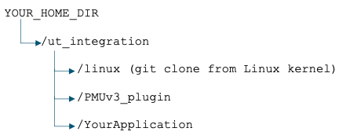
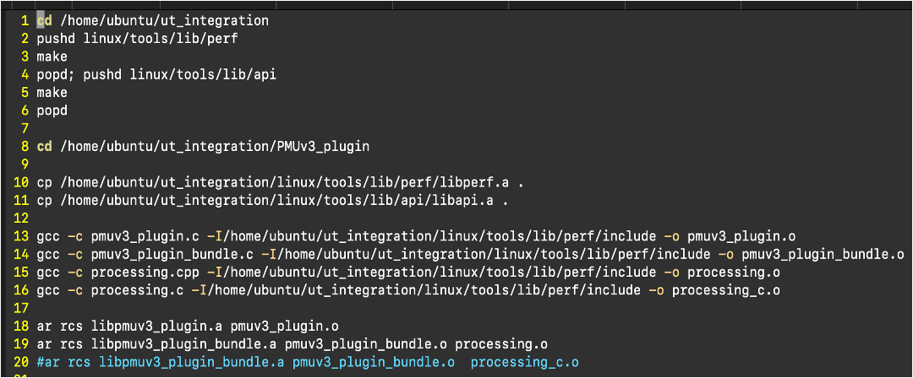

## Before you begin

We recommend the directory structure to be as follows. Kindly place your codebase/project within 

/YOUR_HOME_DIR/ut_integration.




### STEP 1: Clone Linux and PMUv3_plugin
```yaml
git clone git://git.kernel.org/pub/scm/linux/kernel/git/stable/linux.git
git clone https://github.com/GayathriNarayana19/PMUv3_plugin.git
```
(Below step OPTIONAL, good to enable once.)
Enable userspace access : To ascertain if userspace access to the PMU counters is allowed, check the perf_user_access file.
```yaml
cat /proc/sys/kernel/perf_user_access
0
sudo sysctl kernel/perf_user_access=1
kernel/perf_user_access=1
cat /proc/sys/kernel/perf_user_access
1
```
## STEP 2: Run ./build.sh
To do the static library compilation, run ./build.sh from /home/ubuntu/ut_integration/PMUv3_plugin/directory.
Run ./build.sh if you are going to instrument around a C++ codebase. If it is a C codebase, then comment line 19 of build.sh and uncomment line 20 and run ./build.sh



## STEP 3: Include the static library in Makefile/CMakelists or relevant files
In your application's Makefile or CMakeLists files, make sure to add or include this -lpmuv3_plugin_bundle.a static library and -L to point its location. 

