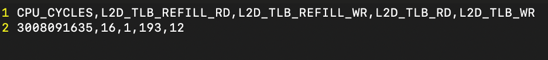
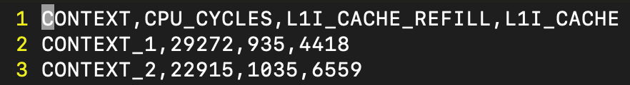

## BUILD YOUR PROJECT AND RUN THE TEST !

DON'T FORGET TO COMPILE AFTER THE INSTRUMENTATION!

STEP 1: After making the above changes, from build directory of your codebase or project,

```yaml
cmake ../
make
( or)
run the "make" command specific to your codebase.
```

STEP 2: Run the specific benchmark or testcase into which you instrumented the above APIs around a specific code block.
You need to pass a bundle num from 0 – 14 as argument to visualize the output from a specific bundle of interest

```yaml
./your_testcase 0
./your_testcase 1
./your_testcase 2
.
.
.
.
./your_testcase 13
./your_testcase 14
```

Once you run, CSV files would get generated as follows since post processing files like processing.cpp, processing.hpp, processing.c, processing.h are provided within the plugin itself. You would be using either C or C++ files depending on your SCENARIO.

```yaml
bundle0.csv
bundle1.csv
.
.
.
bundle13.csv
bundle14.csv
```

## SAMPLE OUTPUT

EXAMPLE 1: CSV of a project from Scenario II




EXAMPLE 2 : CSV of a project from Scenario I (It has an additional column – context)

- It was instrumented in two places with two different Contexts.




