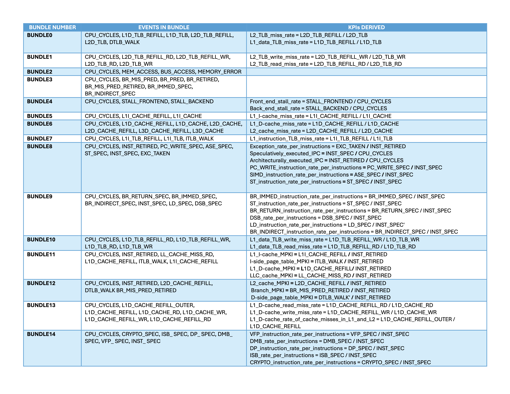

## Why should one use PMUv3 Plugin?

There is a way to measure profiling of the target application as a whole box, but sometimes we need to add the instrumentation into the code itself to get more fine-grained and precise measurement of the functions handling a specific task we are interested to know its performance. For that intention, we developed the PMUv3 Plugin to allow the users to do so. This performance monitoring plugin helps to do performance analysis based on the Hardware events available in PMUV3.

To access the user space registers directly, we employ the mmap() system call on the perf event file descriptor. This action prompts the kernel to enable user space access and furnish us with a handle to read the raw counter registers. We have supported the simplest way of measuring CPU Cycle counts as well as measuring many different bundles of events in one shot (like Cache misses et al along with CPU cycles)

The PMUv3_plugin not only records values of raw counter registers but also provides support to visualize the results in a CSV format by providing a post processing code. The PMUv3 source file is written in C language. Hence one can call the APIs within a C codebase by including the header file and in the case of a C++ codebase, one can include the headers within extern. This documentation explains the usage information in detail.

The [Arm Neoverse N2 PMU guide](https://developer.arm.com/documentation/PJDOC-466751330-590448/2-0/?lang=en)  describes the behavior of the different Performance Monitoring Unit (PMU) events 

## Features of the Plugin

The plugin is grouped into 15 categories also known as bundles, and each bundle has a set of PMU events. This section briefs the PMU events in every bundle and KPIs that can be derived out of every
bundle along with raw event values.

## Detailed documentation (In addition to this learning path)

If you need a more detailed documentation, request repo access from author and access this [Documentation-PMUV3_plugin](https://github.com/GayathriNarayana19/PMUv3_plugin/blob/main/Documentation-PMUV3_plugin.pdf)
                                                                                                         

