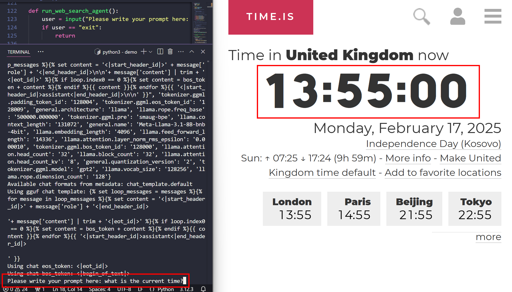
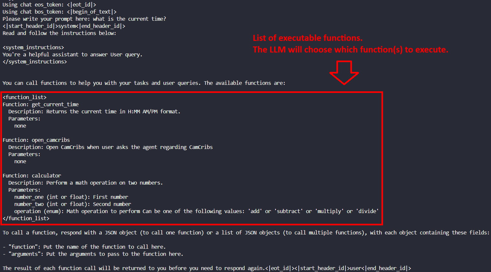
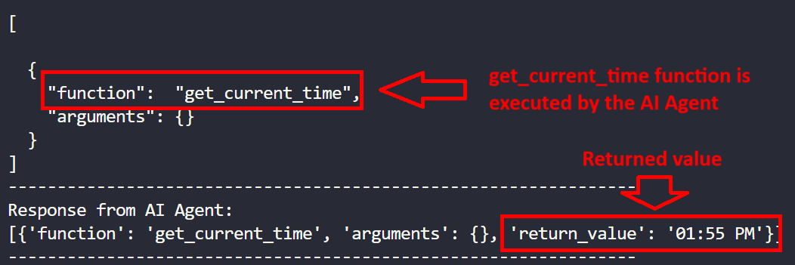

## Explain how LLM which function to use

Below is a brief explanation of how LLM can be configured and used to execute Agent tasks.

- This code creates an instance of the quantized `llama3.1` model for more efficient inference on Arm-based systems.
```
llama_model = Llama(
    model_path="./models/llama3.1-8b-instruct.Q4_0_arm.gguf",
    n_batch=2048,
    n_ctx=10000,
    n_threads=64,
    n_threads_batch=64,
)
```

- Here, you define a provider that leverages the llama.cpp Python bindings.
```
provider = LlamaCppPythonProvider(llama_model)
```

- The function’s docstring guides the LLM on when and how to invoke it.
```
def function(a,b): 
    """ 
    Description about when the function should be called

    Args:
        a: description of the argument a
        b: description of the argument b

    Returns:
        Description about the function's output
    """

    # ... body of your function goes here
```

- `from_functions` creates an instance of `LlmStructuredOutputSettings` by passing in a list of callable Python functions. The LLM can then decide if and when to use these functions based on user queries.
```
LlmStructuredOutputSettings.from_functions([function1, function2, etc])
```

- With this, the user’s prompt is collected and processed through `LlamaCppAgent`. The agent decides whether to call any defined functions based on the request.
```
user = input("Please write your prompt here: ")

llama_cpp_agent = LlamaCppAgent(
    provider,
    debug_output=True,
    system_prompt="You're a helpful assistant to answer User query.",
    predefined_messages_formatter_type=MessagesFormatterType.LLAMA_3,
)

result = llama_cpp_agent.get_chat_response(
    user, structured_output_settings=output_settings, llm_sampling_settings=settings
)
```


## Example

- If the user asks, “What is the current time?”, the AI Agent will choose to call the `get_current_time()` function, returning a result in **H:MM AM/PM** format.



- As part of the prompt, a list of executable functions is sent to the LLM, allowing the agent to select the appropriate function:



- After the user prompt, the AI Agent decides to invoke the function and return thre result:




## Next Steps
- You can ask different questions to trigger and execute other functions.
- Extend your AI agent by defining custom functions so it can handle specific tasks. You can also re-enable the `TaviliySearchResults` function to unlock search capabilities within your environment.


