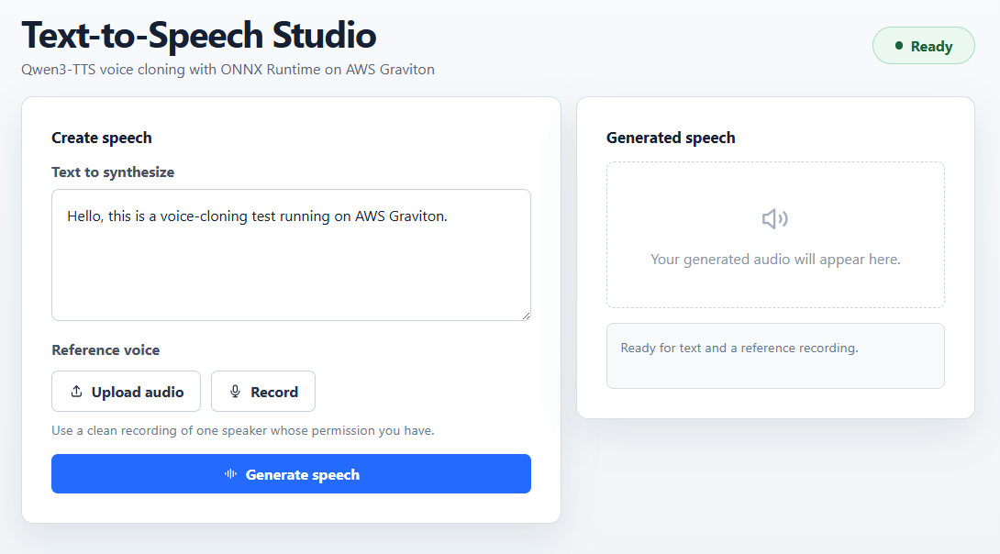

## Start the web application

The browser workflow is the recommended way to run Qwen3-TTS. You can use the web application to do the following without manually copying audio files between your computer and the instance:
 
- Record or upload a reference voice
- Generate speech on the instance
- Play or download the result 

Start the application by running the following command:

```bash
python tts_web.py \
  --model-dir . \
  --threads 4
```

The application checks the runner, cascade driver, and text-path files. It also checks the FFmpeg installation and thread count, then listens on `127.0.0.1:8000`. Leave the application running while you use the browser interface.

## Connect from your local browser

Open another terminal on your local computer and create an SSH tunnel to the application. Replace the placeholders with the values that you use to connect to your instance. If your connection requires an identity file, add `-i path-to-key` before `-L`:

```bash
ssh -L 8000:127.0.0.1:8000 <ssh-user>@<ip-address>
```

The tunnel forwards port `8000` on your computer to the web application without exposing the service on a public network interface.

Open [http://127.0.0.1:8000](http://127.0.0.1:8000) in your local browser.

## Record or upload a reference voice

Use a clean recording of the voice of a speaker whose permission you have. A recording of approximately 5-15 seconds with little background noise provides a useful starting point.

Choose one of the following options in the **Reference voice** section:

- Select **Record**, allow microphone access if the browser asks for permission, speak clearly, and select **Stop**.
- Select **Upload audio** and choose an existing recording from your computer.

The selected recording appears with an audio player. Listen to the recording before generating speech, or select **Discard** to replace it.

## Generate and download speech

Enter the sentence that you want to synthesize, then select **Generate speech**. The ONNX cascade runs on the instance, so generation can take several minutes.

When generation finishes, use the **Generated speech** player to listen to the result. Select **Download WAV** to save `generated_voice.wav` directly to your computer.



The web application wraps the same `onnx_tts_runner.py` script used by the terminal workflow. FastAPI handles the text and audio upload. FFmpeg converts the reference recording to a 24 kHz mono WAV file, and the generated WAV file is returned to the browser. The service remains bound to the instance loopback interface and is accessible only through the SSH tunnel.

Stop the application with **Ctrl+C**. Keep the Python environment active if you want to try the terminal workflow.

## (Optional) Run the model from the terminal

The browser is the recommended workflow because it handles recording, upload, playback, and download. If you use the terminal workflow, you're responsible for copying reference and generated audio files to and from the Arm Neoverse-based machine.

Run the model with the provided reference recording:

```bash
python onnx_tts_runner.py \
  --text "Hello, this is a voice-cloning test running on AWS Graviton." \
  --ref-audio sample_input.wav \
  --out generated_voice.wav \
  --intra-op-threads 4
```

Run the model with your own reference recording by replacing `reference_voice.wav` with its filename:

```bash
python onnx_tts_runner.py \
  --text "This sentence should sound like my reference recording." \
  --ref-audio reference_voice.wav \
  --out my_generated_voice.wav \
  --intra-op-threads 4
```

## What you've accomplished and what's next

You've used a browser to record or upload a reference voice, generate speech on an Arm Neoverse machine, and play and download the resulting WAV file. You've also learned how to run the same model directly from the terminal if you prefer a command-line workflow.

Next, you'll learn how the web application and the runner work.
