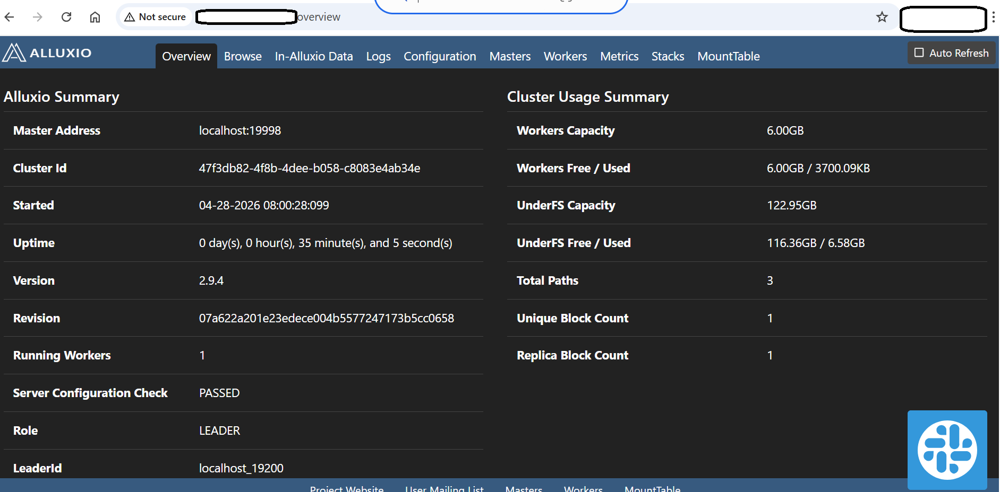

## Deploy Alluxio on Azure Cobalt 100 (Arm)

This section guides you through installing Alluxio on an Azure Cobalt 100 Arm-based virtual machine and configuring it with local storage.

You will set up a unified data orchestration layer that sits between compute frameworks and storage systems.

### Why Alluxio?

- Speeds up data access using memory caching 
- Reduces repeated disk I/O  
- Improves performance for analytics workloads  

## Update your system

```bash
sudo apt update && sudo apt upgrade -y
```

## Install required dependencies
These tools are required for downloading and extracting software:

```bash
sudo apt install -y wget curl tar rsync nano
```

## Install Java 11 (Required)

Alluxio supports **Java 8 and Java 11**.
Java 17 will cause runtime errors sometimes (as already experienced).

```bash
wget -qO - https://packages.adoptium.net/artifactory/api/gpg/key/public | \
sudo gpg --dearmor -o /usr/share/keyrings/adoptium.gpg

echo "deb [signed-by=/usr/share/keyrings/adoptium.gpg] https://packages.adoptium.net/artifactory/deb noble main" | \
sudo tee /etc/apt/sources.list.d/adoptium.list

sudo apt update
sudo apt install -y temurin-11-jdk
```

**Set Java:**

```bash
sudo update-alternatives --config java
```

- Select Java 11

**Verify:**

```bash
java -version
```

The output is similar to:

```output
openjdk version "11.0.30" 2026-01-20
openJDK Runtime Environment Temurin-11.0.30+7 (build 11.0.30+7)
openJDK 64-Bit Server VM Temurin-11.0.30+7 (build 11.0.30+7, mixed mode)
```

## Download and install Alluxio

```bash
cd /opt
sudo wget https://downloads.alluxio.io/downloads/files/2.9.4/alluxio-2.9.4-bin.tar.gz
sudo tar -xvzf alluxio-2.9.4-bin.tar.gz
sudo mv alluxio-2.9.4 alluxio
sudo chown -R $USER:$USER /opt/alluxio
```

## Configure environment variables
This allows you to run Alluxio commands globally.

```bash
echo 'export ALLUXIO_HOME=/opt/alluxio' >> ~/.bashrc
echo 'export PATH=$PATH:$ALLUXIO_HOME/bin' >> ~/.bashrc
source ~/.bashrc
```

## Configure Alluxio
Navigate to configuration directory:

```bash
cd /opt/alluxio/conf
cp alluxio-env.sh.template alluxio-env.sh
cp alluxio-site.properties.template alluxio-site.properties
```

## Configure RAM-based storage
Alluxio uses memory for fast data access.

**Edit:**

```bash
nano alluxio-env.sh
```

**Add:**

```bash
export ALLUXIO_RAM_FOLDER=/dev/shm
```

`/dev/shm` is a Linux in-memory filesystem (RAM-backed storage)

## Configure core properties

```bash
nano alluxio-site.properties
```

```bash
alluxio.master.hostname=localhost
alluxio.worker.memory.size=6GB
alluxio.master.mount.table.root.ufs=/mnt/data
```

**Explanation:**

- `master.hostname` → where Alluxio master runs
- `worker.memory.size` → RAM allocated for caching
- `root.ufs` → underlying storage (your disk)

## Setup storage directory
This is your underlying file system (UFS).

```bash
sudo mkdir -p /mnt/data
sudo chmod -R 777 /mnt/data
```

## Start Alluxio
Format metadata (first time only):

```bash
alluxio format
```

**Start Alluxio in local mode:**

```bash
alluxio-start.sh local NoMount
```

The output is similar to:

```output
Starting to monitor all local services.
 -----------------------------------------
 --- [ OK ] The master service @ alluxio-arm64.xaxcsurvhrzefjc5ihdpsf2vbc.rx.internal.cloudapp.net is in a healthy state.
 --- [ OK ] The job_master service @ alluxio-arm64.xaxcsurvhrzefjc5ihdpsf2vbc.rx.internal.cloudapp.net is in a healthy state.
 --- [ OK ] The worker service @ alluxio-arm64.xaxcsurvhrzefjc5ihdpsf2vbc.rx.internal.cloudapp.net is in a healthy state.
 --- [ OK ] The job_worker service @ alluxio-arm64.xaxcsurvhrzefjc5ihdpsf2vbc.rx.internal.cloudapp.net is in a healthy state.
 --- [ OK ] The proxy service @ alluxio-arm64.xaxcsurvhrzefjc5ihdpsf2vbc.rx.internal.cloudapp.net is in a healthy state.
```

## Verify Alluxio services

```bash
jps
```

**Expected output:**

```output
AlluxioJobWorker
AlluxioJobMaster
Jps
AlluxioMaster
AlluxioProxy
AlluxioWorker
```

**Open:**
Open in your browser:

```text
http://<VM-IP>:19999
```



## Alluxio UI Overview

What you can see:

- Master status (Leader node)
- Worker memory usage
- Storage capacity
- Cached data blocks
- Cluster health

## What you've learned and what's next

You have successfully:

- Installed Alluxio on an Arm-based VM
- Configured compute and storage layers
- Enabled memory-based data caching
- Verified cluster health via UI

You are now ready to integrate Alluxio with analytics frameworks.
