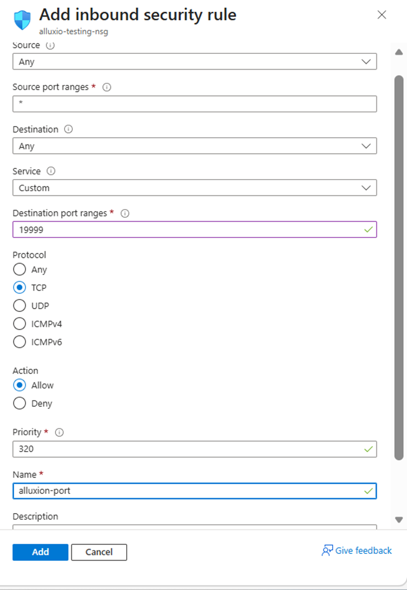

## Configure Azure firewall for Alluxio Web UI

To allow external traffic on port **19999** for Alluxio running on an Azure virtual machine, open the port in the Network Security Group (NSG) attached to the virtual machine's network interface or subnet.

{}For more information about Azure setup, see [Getting started with Microsoft Azure Platform](/learning-paths/servers-and-cloud-computing/csp/azure/).{}

## Create a firewall rule in Azure

To expose the TCP port **19999**, create a firewall rule.

Navigate to the [Azure Portal](https://portal.azure.com), go to **Virtual Machines**, and select your virtual machine.

In the left menu, select **Networking** and in the **Networking** select **Network settings** that's associated with the virtual machine's network interface.

Navigate to **Create port rule**, and select **Inbound port rule**.

Configure the inbound security rule with the following settings:

- **Source:** Any  
- **Source port ranges:** *  
- **Destination:** Any  
- **Destination port ranges:** **19999**  
- **Protocol:** TCP  
- **Action:** Allow  
- **Name:** allow-alluxio-port

After filling in the details, select **Add** to save the rule.

The network firewall rule is now created, allowing Alluxio Web UI to be accessed over port **19999**.

## What you've learned and what's next

You've configured the Azure Network Security Group to allow incoming traffic on port 19999. This firewall rule enables external access to the Alluxio Web UI for monitoring cluster status and storage usage.

Next, you'll integrate Alluxio with Apache Spark and begin analyzing cached data performance.
