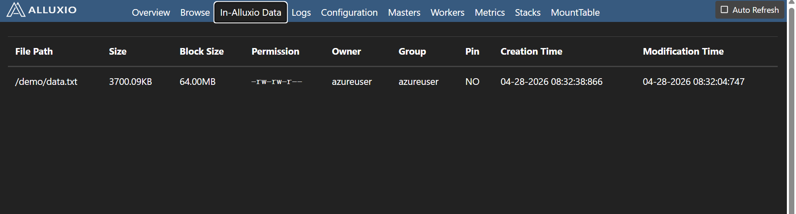
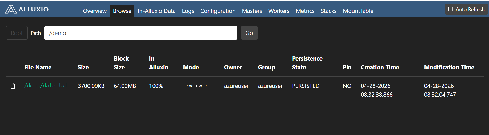

## Integrate Alluxio with Apache Spark

This section demonstrates how to integrate Alluxio with Apache Spark, enable caching, and optimize data access performance.

In this section, you will learn how to:

- Connect Spark with Alluxio
- Enable in-memory caching
- Measure performance improvements

## Why integrate Alluxio with Spark?

**Without Alluxio:**

```text
Spark → Disk → Slow (every time)
```

**With Alluxio:**

```text
Spark → Alluxio → Memory → Fast
```

Alluxio caches frequently accessed data in memory, reducing repeated disk reads.

## Install Apache Spark

```bash
cd ~
wget https://archive.apache.org/dist/spark/spark-3.4.2/spark-3.4.2-bin-hadoop3.tgz
tar -xvzf spark-3.4.2-bin-hadoop3.tgz

sudo mv spark-3.4.2-bin-hadoop3 /opt/spark
sudo chown -R $USER:$USER /opt/spark
```

## Configure Spark environment

```bash
echo 'export SPARK_HOME=/opt/spark' >> ~/.bashrc
echo 'export PATH=$PATH:$SPARK_HOME/bin' >> ~/.bashrc
source ~/.bashrc
```

## Connect Spark with Alluxio
Edit Spark configuration:

```bash
nano $SPARK_HOME/conf/spark-defaults.conf
```

**Add:**

```bash
spark.hadoop.fs.alluxio.impl=alluxio.hadoop.FileSystem
spark.driver.extraClassPath=/opt/alluxio/client/alluxio-2.9.4-client.jar
spark.executor.extraClassPath=/opt/alluxio/client/alluxio-2.9.4-client.jar
```

**Explanation:**

- Enables Spark to read from `alluxio://`
- Adds Alluxio client libraries to Spark

## Create dataset

```bash
rm -rf /mnt/data/demo
mkdir -p /mnt/data/demo
```

```bash
for i in {1..100000}; do
  echo "record $i - alluxio spark learning" >> /mnt/data/demo/data.txt
done
```

**Verify:**

```bash
wc -l /mnt/data/demo/data.txt
```

The output is similar to:

```output
100000 /mnt/data/demo/data.txt
```

## Run Spark

```bash
spark-shell
```

The output is similar to:

```output
Welcome to
 ____ __
 / __/__ ___ _____/ /__
 _\ \/ _ \/ _ `/ __/ '_/
 /___/ .__/\_,_/_/ /_/\_\ version 3.4.2
 /_/

Using Scala version 2.12.17 (OpenJDK 64-Bit Server VM, Java 11.0.30)
 Type in expressions to have them evaluated.
 Type :help for more information.

scala>
```

## Load data via Alluxio

```bash
val df = spark.read.text("alluxio:///demo/data.txt")
df.count()
```

**Expected output:**

```output
100000
```

## Enable caching

```bash
df.cache()
df.count()
```

This loads data into memory (Alluxio + Spark cache)

## Measure performance

**First run:**

```bash
val t1 = System.nanoTime()
df.count()
val t2 = System.nanoTime()
println((t2 - t1)/1e9 + " seconds")
```

**Second run (cached):**

```bash
val t3 = System.nanoTime()
df.count()
val t4 = System.nanoTime()
println((t4 - t3)/1e9 + " seconds")
```

```output
Disk read:            ~0.44 seconds
Alluxio first read:   ~0.44 seconds
Alluxio cached read:  ~0.39 seconds
```

**Performance analysis**

- First read → data comes from disk
- Second read → data is served from memory (cache)
- Cached read is faster due to reduced disk I/O


## Verify in Alluxio UI

**Open:**

```text
http://<VM-IP>:19999
```





### What this shows:

- Files stored in Alluxio namespace
- Cached dataset visibility
- Data available for fast access

### Alluxio UI (Caching in Action)

What to observe:
Increased worker memory usage
Cached file blocks
Active data access

## Compare with direct file access

```bash
val df1 = spark.read.text("file:///mnt/data/demo/data.txt")
val df2 = spark.read.text("alluxio:///demo/data.txt")
```

This shows the advantage of using Alluxio as a caching layer.

## Key concepts

- Alluxio sits between compute and storage
- Frequently used data is cached in memory
- Spark reads cached data instead of disk
- This improves analytics performance significantly

## What you've learned and what's next

You have successfully:

- Integrated Spark with Alluxio
- Enabled distributed caching
- Measured performance improvements
- Validated results using real data

You are now ready to extend this setup with cloud storage, Spark SQL, and distributed clusters.
