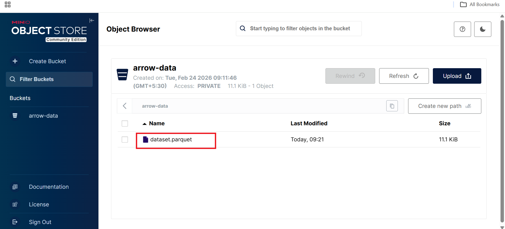
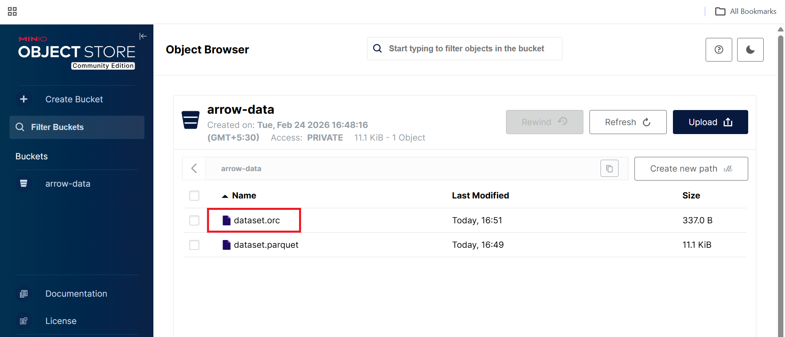

## Columnar Analytics with Apache Arrow

In this section, you use **Apache Arrow’s columnar execution engine to read and write analytical datasets stored in MinIO (S3)**. You will work with **Parquet and ORC formats** and explore predicate pushdown and column pruning, which are key performance optimizations in modern analytics engines.

This section demonstrates how Arrow delivers **high-performance, vectorized analytics** on Arm64 (Axion).

## Architecture Overview

```text
Python Analytics Scripts
        |
        v
Apache Arrow Dataset API
        |
        v
Parquet / ORC Columnar Files
        |
        v
MinIO (S3 Object Storage)
```

**What this architecture shows:**

- Compute and execution happen in-memory using Apache Arrow
- Data is stored in object storage (MinIO) using open columnar formats
- Only required data is read from storage, reducing I/O and latency

## Write Parquet Data to MinIO
In this step, you create a sample dataset in memory using Apache Arrow and write it to MinIO in Parquet format, the most common columnar format used in analytics engines.
Create a file named `write_parquet.py`.

```python
import pyarrow as pa
import pyarrow.parquet as pq
import s3fs

table = pa.table({
    "id": list(range(1000)),
    "value": [i * 10 for i in range(1000)]
})

fs = s3fs.S3FileSystem(
    key="minioadmin",
    secret="minioadmin",
    client_kwargs={"endpoint_url": "http://127.0.0.1:9000"}
)

pq.write_table(table, "arrow-data/dataset.parquet", filesystem=fs)
```

### Run it

```bash
python write_parquet.py
```

The output is similar to:
```output
Parquet file written to MinIO
```

### Verify in MinIO UI

Open the arrow-data bucket in the MinIO console.

```test
dataset.parquet
```



**What this confirms:**

- Apache Arrow successfully serialized in-memory data
- Parquet files were written directly to S3-compatible storage
- No local filesystem dependency is required

## Read Parquet Using Arrow Dataset API
Next, you read the Parquet dataset using the Arrow Dataset API, which enables efficient scanning, filtering, and projection.

Create a file named `read_parquet.py`.

```python
import pyarrow.dataset as ds
import s3fs

fs = s3fs.S3FileSystem(
    key="minioadmin",
    secret="minioadmin",
    client_kwargs={"endpoint_url": "http://127.0.0.1:9000"}
)

dataset = ds.dataset(
    "arrow-data/dataset.parquet",
    format="parquet",
    filesystem=fs
)

table = dataset.to_table()
print(table.schema)
print("Rows:", table.num_rows)
```

### Run it

```bash
python read_parquet.py
```

The output is similar to:
```output
id: int64
value: int64
Rows: 1000
```

**What this demonstrates:**

- Schema inference from Parquet metadata
- Efficient columnar scanning
- Fully vectorized execution on Arm64

## Predicate Pushdown & Column Pruning
One of the biggest performance advantages of columnar formats is that queries can **push filters and column selection down to the storage layer**.

Create a file named `filter_parquet.py`.

```python
import pyarrow.dataset as ds
import s3fs

fs = s3fs.S3FileSystem(
    key="minioadmin",
    secret="minioadmin",
    client_kwargs={"endpoint_url": "http://127.0.0.1:9000"}
)

dataset = ds.dataset(
    "arrow-data/dataset.parquet",
    format="parquet",
    filesystem=fs
)

filtered = dataset.to_table(
    filter=ds.field("id") > 990,
    columns=["id"]
)

print(filtered)
```

## Run it

```bash
python filter_parquet.py
```

The output is similar to:
```output
pyarrow.Table
id: int64
----
id: [[991,992,993,994,995,996,997,998,999]]
```

**This confirms:**

- Predicate pushdown: Only rows with id > 990 are read
- Column pruning: Only the id column is loaded
- Vectorized execution: Processing happens in columnar batches

These optimizations significantly reduce I/O and CPU usage for large datasets.

## Write ORC Data to MinIO
In addition to Parquet, Apache Arrow also supports ORC, another popular columnar format widely used in Hive and Spark ecosystems.

Create a file named `write_orc.py`.

```pyhton
import pyarrow as pa
import pyarrow.orc as orc
import s3fs

table = pa.table({
    "id": list(range(1000)),
    "value": [i * 10 for i in range(1000)]
})

fs = s3fs.S3FileSystem(
    key="minioadmin",
    secret="minioadmin",
    client_kwargs={"endpoint_url": "http://127.0.0.1:9000"}
)

with fs.open("arrow-data/dataset.orc", "wb") as f:
    orc.write_table(table, f)

print("ORC file written to MinIO")
```

## Run it

```bash
python write_orc.py
```

The output is similar to:
```output
ORC file written to MinIO
```

**Verify in MinIO UI:**

In the arrow-data bucket, you should now see.

- dataset.parquet
- dataset.orc



## What You Have Accomplished

In this section, you have:

- Written analytical datasets in Parquet and ORC formats
- Stored columnar data in S3-compatible object storage
- Used the Arrow Dataset API for efficient reads
- Applied predicate pushdown and column pruning
- Executed vectorized analytics optimized for Arm64 (Axion)

This forms the core analytics layer used by modern engines such as Spark, DuckDB, Trino, and Polars.

## What’s Next

In the next section, you will enable high-speed memory-to-memory analytics using Apache Arrow Flight, demonstrating:

- gRPC-based data transfer
- Zero-copy serialization
- High-throughput analytics communication
