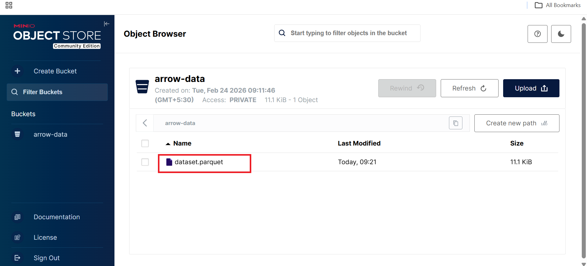
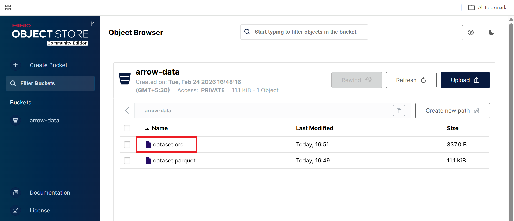

## Analyze columnar data with Apache Arrow

In this section, you use **Apache Arrow’s columnar execution engine to read and write analytical datasets stored in MinIO (S3)**. You will work with **Parquet and ORC formats** and explore predicate pushdown and column pruning, which are key performance optimizations in modern analytics engines.

This section demonstrates how Arrow delivers high-performance, vectorized analytics on arm64 (Axion).

## Architecture overview

```text
Python Analytics Scripts
        |
        v
Apache Arrow Dataset API
        |
        v
Parquet / ORC Columnar Files
        |
        v
MinIO (S3 Object Storage)
```

**What this architecture shows:**

- Compute and execution happen in-memory using Apache Arrow
- Data is stored in object storage (MinIO) using open columnar formats
- Only required data is read from storage, reducing I/O and latency

## Write Parquet data to MinIO

In this step, you create a sample dataset in memory using Apache Arrow and write it to MinIO in Parquet format, the most common columnar format used in analytics engines.

Create a file named `write_parquet.py`.

```python
import pyarrow as pa
import pyarrow.parquet as pq
import s3fs

table = pa.table({
    "id": list(range(1000)),
    "value": [i * 10 for i in range(1000)]
})

fs = s3fs.S3FileSystem(
    key="minioadmin",
    secret="minioadmin",
    client_kwargs={"endpoint_url": "http://127.0.0.1:9000"}
)

pq.write_table(table, "arrow-data/dataset.parquet", filesystem=fs)
```

### Run it

```bash
source arrow-venv/bin/activate
python write_parquet.py
```

### Verify in MinIO UI

Open the arrow-data bucket in the MinIO console. Refresh if needed. Select the "arrow-data" bucket. You should see "dataset.parquet" listed:



**What this confirms:**

- Apache Arrow successfully serialized in-memory data
- Parquet files were written directly to S3-compatible storage
- No local filesystem dependency is required

## Read Parquet using Arrow Dataset API

Next, you read the Parquet dataset using the Arrow Dataset API, which enables efficient scanning, filtering, and projection.

Create a file named `read_parquet.py`.

```python
import pyarrow.dataset as ds
import s3fs

fs = s3fs.S3FileSystem(
    key="minioadmin",
    secret="minioadmin",
    client_kwargs={"endpoint_url": "http://127.0.0.1:9000"}
)

dataset = ds.dataset(
    "arrow-data/dataset.parquet",
    format="parquet",
    filesystem=fs
)

table = dataset.to_table()
print(table.schema)
print("Rows:", table.num_rows)
```

### Run the reader

```bash
python read_parquet.py
```

The output is similar to:

```output
id: int64
value: int64
Rows: 1000
```

**What this demonstrates:**

- Schema inference from Parquet metadata
- Efficient columnar scanning
- Fully vectorized execution on arm64

## Predicate pushdown and column pruning

One of the biggest performance advantages of columnar formats is that queries can **push filters and column selection down to the storage layer**.

Create a file named `filter_parquet.py`.

```python
import pyarrow.dataset as ds
import s3fs

fs = s3fs.S3FileSystem(
    key="minioadmin",
    secret="minioadmin",
    client_kwargs={"endpoint_url": "http://127.0.0.1:9000"}
)

dataset = ds.dataset(
    "arrow-data/dataset.parquet",
    format="parquet",
    filesystem=fs
)

filtered = dataset.to_table(
    filter=ds.field("id") > 990,
    columns=["id"]
)

print(filtered)
```

### Run the filter script

```bash
python filter_parquet.py
```

The output is similar to:

```output
pyarrow.Table
id: int64
----
id: [[991,992,993,994,995,996,997,998,999]]
```

**This confirms:**

- Predicate pushdown: Only rows with id > 990 are read
- Column pruning: Only the id column is loaded
- Vectorized execution: Processing happens in columnar batches

These optimizations significantly reduce I/O and CPU usage for large datasets.

## Write ORC data to MinIO

In addition to Parquet, Apache Arrow also supports ORC, another popular columnar format widely used in Hive and Spark ecosystems.

Create a file named `write_orc.py`.

```python
import pyarrow as pa
import pyarrow.orc as orc
import s3fs

table = pa.table({
    "id": list(range(1000)),
    "value": [i * 10 for i in range(1000)]
})

fs = s3fs.S3FileSystem(
    key="minioadmin",
    secret="minioadmin",
    client_kwargs={"endpoint_url": "http://127.0.0.1:9000"}
)

with fs.open("arrow-data/dataset.orc", "wb") as f:
    orc.write_table(table, f)

print("ORC file written to MinIO")
```

### Run the ORC writer

```bash
python write_orc.py
```

The output is similar to:

```output
ORC file written to MinIO
```

**Verify in MinIO UI:**

In the arrow-data bucket after refreshing, you should now see:

- dataset.orc
- dataset.parquet



## What you've learned and what's next

In this section, you have:

- Written analytical datasets in Parquet and ORC formats
- Stored columnar data in S3-compatible object storage
- Used the Arrow Dataset API for efficient reads
- Applied predicate pushdown and column pruning
- Executed vectorized analytics optimized for arm64 (Axion)

This forms the core analytics layer used by modern engines such as Spark, DuckDB, Trino, and Polars.

In the next section, you will enable high-speed memory-to-memory analytics using Apache Arrow Flight, demonstrating gRPC-based data transfer, zero-copy serialization, and high-throughput analytics communication.
