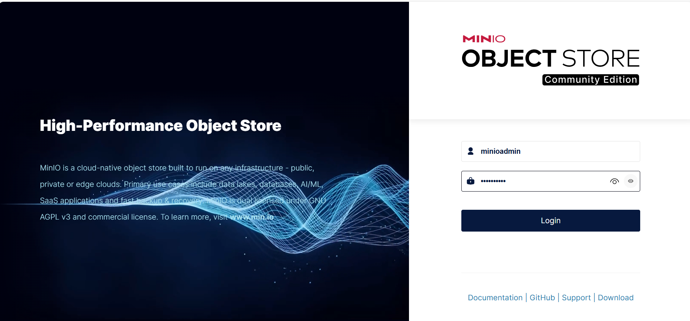
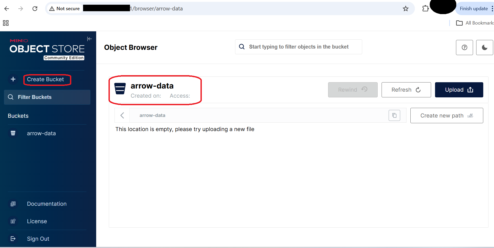

## Apache Arrow Environment and MinIO Setup

In this section, you prepare an **Arm64-based SUSE Linux Enterprise Server (SLES) virtual machine **and install the core components required for high-performance analytics using **Apache Arrow**. You will also deploy **MinIO**, an **S3-compatible object storage service**, which will be used to store analytical datasets in later sections.

This foundation ensures all analytics libraries are natively optimized for Arm64 (Axion).

## Architecture (What You Are Building)


This architecture represents a single-node analytics environment that mirrors how modern cloud analytics stacks operate:
compute and memory-local processing with object storage–backed datasets.

```text
SUSE Linux Enterprise Server (Arm64)
        |
        v
Python 3.11 Virtual Environment
        |
        v
Apache Arrow Libraries
        |
        v
MinIO (S3-Compatible Object Storage)
```

## Install System Dependencies (SUSE)

Install Python, build tools, and system libraries required by Apache Arrow and its ecosystem.

```bash
sudo zypper refresh \
sudo zypper install -y \
  python311 python311-devel python311-pip \
  gcc gcc-c++ make \
  libopenssl-devel \
  libuuid-devel \
  curl git
```

### Verify Python installation:

```bash
python3.11 --version
```

The output is similar to:
```output
Python 3.11.10
```

**Why this matters:**

- Python 3.11 provides better performance and memory efficiency
- Apache Arrow wheels are fully supported on Arm64 for Python 3.11
- Ensures compatibility with modern analytics libraries

## Create Python Virtual Environment

Create an isolated Python environment for Arrow and analytics libraries.

```bash
python3.11 -m venv arrow-venv
source arrow-venv/bin/activate
```

### Upgrade core packaging tools:

```bash
pip install --upgrade pip setuptools wheel
```

**Why this matters:**

- Avoids conflicts with the system Python
- Ensures reproducible analytics environments
- Recommended for production-grade data workloads

## Install Apache Arrow and Required Libraries

Install Apache Arrow and supporting analytics libraries.

```bash
pip install \
  pyarrow \
  pandas \
  numpy \
  s3fs \
  grpcio \
  grpcio-tools \
  fastparquet \
  pyorc
```

### Verify Arrow installation:

```bash
python - <<EOF
import pyarrow as pa
print(pa.__version__)
EOF
```

The output is similar to:
```output
> import pyarrow as pa
> print(pa.__version__)
> EOF
23.0.1
```

This confirms Apache Arrow is correctly installed on Arm64.

## Install and Start MinIO (S3-Compatible Storage)

MinIO provides high-performance, S3-compatible object storage, which is widely used in modern analytics architectures.

Download MinIO (Arm64):

```bash
curl -LO https://dl.min.io/server/minio/release/linux-arm64/minio
chmod +x minio
sudo mv minio /usr/local/bin/
```

## Start MinIO Server

```bash
mkdir -p ~/minio-data

export MINIO_ROOT_USER=minioadmin
export MINIO_ROOT_PASSWORD=minioadmin

minio server ~/minio-data --console-address :9001
```

**MinIO endpoints:**

- **S3 API:** Port 9000
- **Web Console:** Port 9001

Leave this process running.

The output is similar to:
```output
MinIO Object Storage Server
API: http://127.0.0.1:9000
WebUI: http://127.0.0.1:9001
```

## Create MinIO Bucket
Once logged in to the MinIO console, create a bucket that will store analytics datasets.

```bash
http://<VM-IP>:9001
```

**Login credentials:**

- **Username**: minioadmin
- **Password**: minioadmin



### Create a bucket named:

```bash
arrow-data
```



MinIO Bucket View

- This bucket will be used to store:
- Parquet datasets
- ORC datasets
- Analytics output files

### Configure S3 Credentials for Python

In another terminal (same VM, virtual environment active), export S3 credentials so Python libraries can access MinIO.

```bash
export AWS_ACCESS_KEY_ID=minioadmin
export AWS_SECRET_ACCESS_KEY=minioadmin
export AWS_DEFAULT_REGION=us-east-1
```

**Verify:**

```
env | grep AWS
```

The output is similar to:
```output
AWS_SECRET_ACCESS_KEY=minioadmin
AWS_DEFAULT_REGION=us-east-1
AWS_ACCESS_KEY_ID=minioadmin
```

**What this enables:**

- pyarrow
- s3fs
- pandas
- Other S3-compatible analytics libraries

to communicate with MinIO exactly like Amazon S3.

## What You Have Accomplished

- Prepared a SUSE Arm64 analytics environment
- Installed Apache Arrow and dependencies
- Deployed MinIO as S3-compatible object storage
- Configured secure access for analytics workloads

## What’s Next

In the next section, you will use Apache Arrow to write and read Parquet and ORC datasets from MinIO using vectorized analytics APIs.
