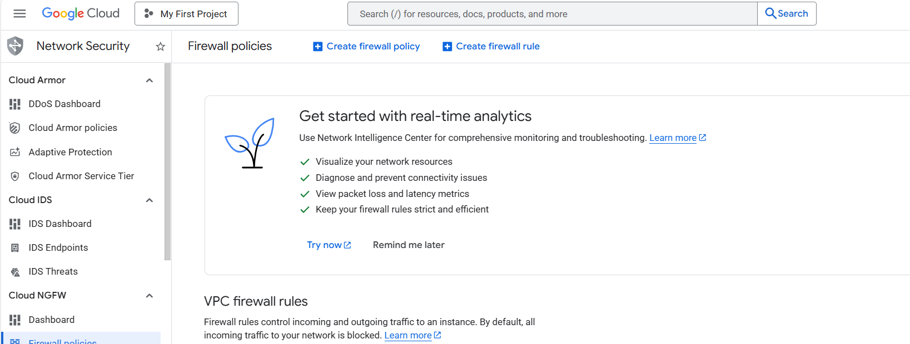
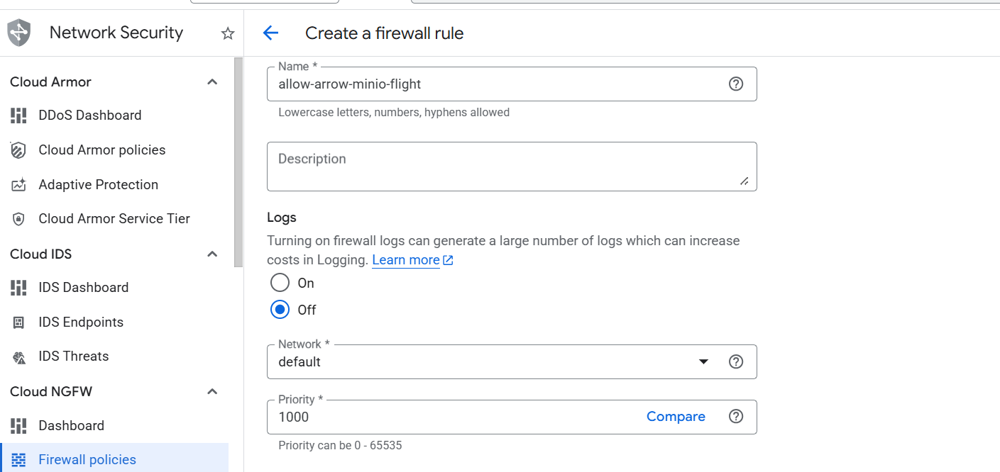
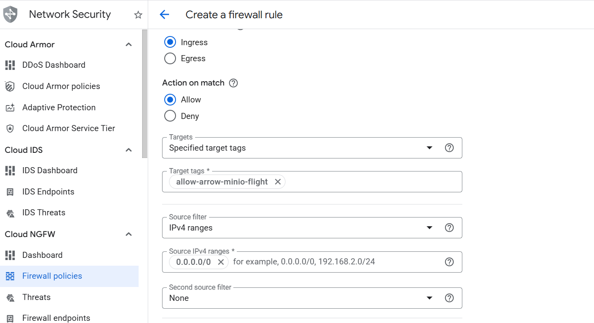
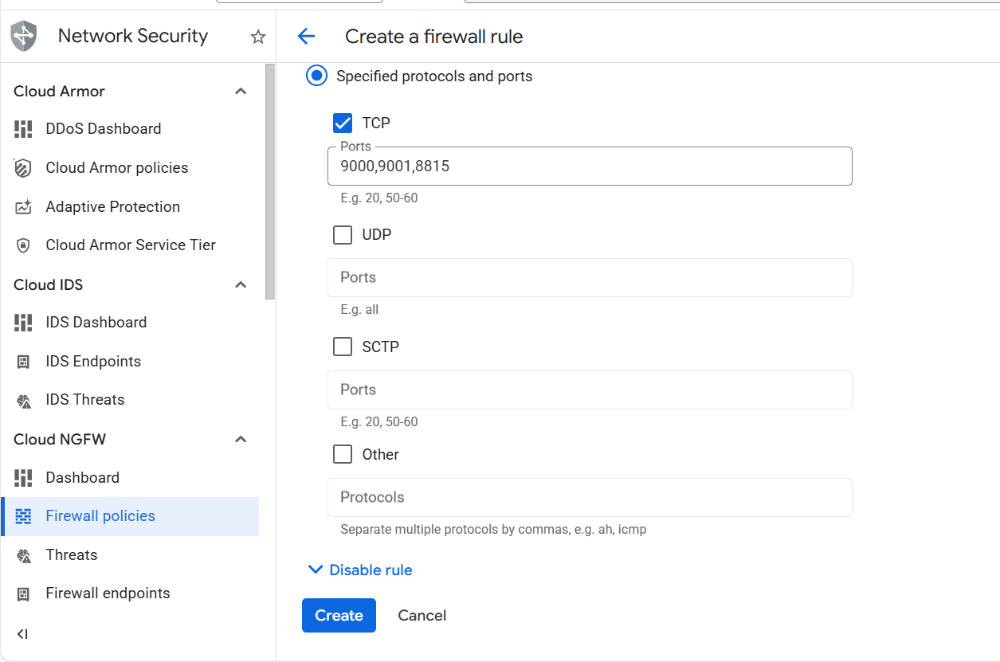

## Configure GCP firewall for Apache Arrow analytics stack

To allow inbound traffic for Apache Arrow–based analytics components, you must create a firewall rule in the Google Cloud Console. These firewall rules enable access to MinIO object storage and Arrow Flight for high-performance data transfer on Axion (Arm64) virtual machines.

{} 
For more information about GCP setup, see [Getting started with Google Cloud Platform](/learning-paths/servers-and-cloud-computing/csp/google/).
{}

## Required ports

| Service | Port | Purpose |
| ------- | ---- | ------- |
| MinIO S3 API | 9000 | S3-compatible object storage access |
| MinIO Web UI | 9001 | Bucket management and object browsing |
| Arrow Flight (gRPC) | 8815 | High-speed in-memory data transfer |

## Create a firewall rule in GCP

To expose the TCP ports listed above, create a firewall rule.

Navigate to the [Google Cloud Console](https://console.cloud.google.com/), go to **VPC Network > Firewall**, and select **Create firewall rule**.

Next, create the firewall rule that exposes the required TCP ports.  
Set the **Name** of the new rule to `allow-arrow-minio-flight`. Select the network you intend to bind to your VM (the default is `default`, but your organization may use a different one).

Set **Direction of traffic** to "Ingress". Set **Allow on match** to "Allow" and **Targets** to "Specified target tags".

Next, enter `allow-arrow-minio-flight` in the **Target tags** field. Set **Source IPv4 ranges** to `0.0.0.0/0`.

Finally, select **Specified protocols and ports** under the **Protocols and ports** section. Select the **TCP** checkbox, enter `9000,9001,8815` in the **Ports** field, and select **Create**.

## What you've accomplished and what's next

You've successfully:

- Created firewall rules in Google Cloud to expose ports for Apache Arrow analytics components
- Enabled external access to MinIO S3 API and Web UI
- Configured network access for Arrow Flight gRPC communication
- Prepared the network for a high-performance analytics stack on Axion (Arm64)

Next, you'll provision a Google Axion C4A Arm virtual machine and deploy Apache Arrow workloads, MinIO object storage, and Arrow Flight services on it.
