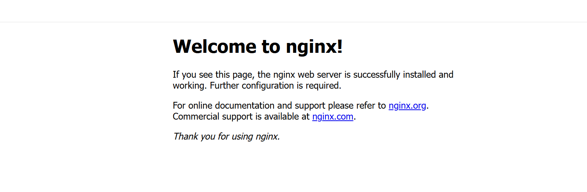
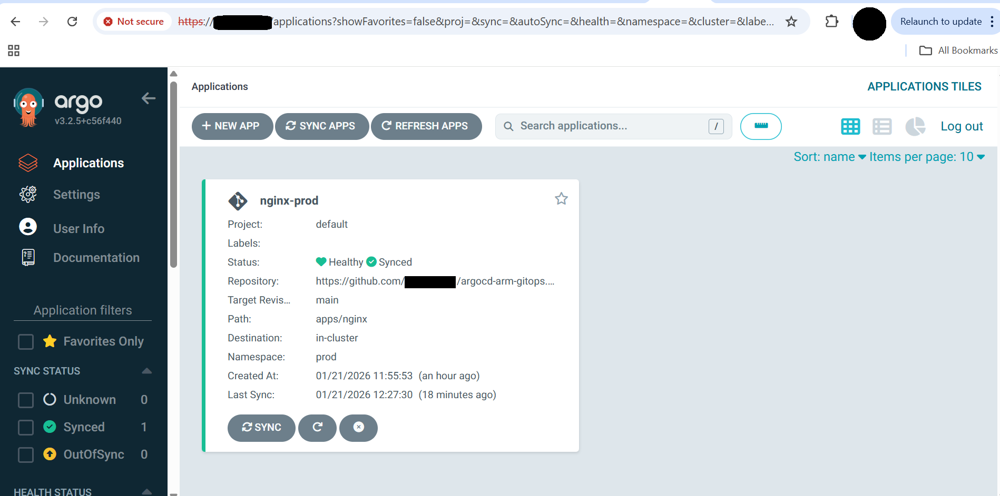

## Overview

In this section, you deploy a **production-ready NGINX application** on an **Arm64-based GKE cluster** using **GitOps with Argo CD**.

All Kubernetes resources are declared in Git and continuously reconciled by Argo CD, ensuring the cluster always matches the desired state stored in the repository.

## Prerequisite

Ensure the following prerequisites are met before proceeding:

* Arm64 GKE cluster is running
* Argo CD is installed and accessible (UI and CLI)
* `kubectl` is configured for the cluster
* A GitHub repository to store GitOps manifests (an empty repo is sufficient)

## Create a GitOps repository

Create a local Git repository that acts as the **single source of truth** for application configuration:

```console
mkdir -p argocd-arm-gitops/apps/nginx
cd argocd-arm-gitops
git init
```

This creates a GitOps-compliant directory structure for managing Kubernetes applications and initializes a local Git repository that you'll push to GitHub. This establishes Git as the only place where application state is defined (no manual `kubectl apply`).


Repository structure:

```text
argocd-arm-gitops/
└── apps/
    └── nginx/
        ├── namespace.yaml
        ├── deployment.yaml
        └── service.yaml
```

## Create Kubernetes manifests

Create declarative Kubernetes manifests that define the desired state of the application.

Create a namespace manifest (`apps/nginx/namespace.yaml`):

```yaml
apiVersion: v1
kind: Namespace
metadata:
  name: prod
```

Create a deployment manifest (`apps/nginx/deployment.yaml`) that deploys an NGINX application with two replicas for high availability:

```yaml
apiVersion: apps/v1
kind: Deployment
metadata:
  name: nginx
  namespace: prod
spec:
  replicas: 2
  selector:
    matchLabels:
      app: nginx
  template:
    metadata:
      labels:
        app: nginx
    spec:
      containers:
      - name: nginx
        image: nginx:1.25
        ports:
        - containerPort: 80
```

Create a service manifest (`apps/nginx/service.yaml`) that exposes NGINX publicly using a LoadBalancer service:

```yaml
apiVersion: v1
kind: Service
metadata:
  name: nginx
  namespace: prod
spec:
  type: LoadBalancer
  selector:
    app: nginx
  ports:
  - port: 80
    targetPort: 80
```

## Create a GitHub repository for the application

Go to `https://github.com/<YOUR_GITHUB_USERNAME>` and create a repository called `argocd-arm-gitops`.

## Commit and push
Push the application manifests to GitHub so Argo CD can continuously track and apply changes:

```console
git add .
git config --global user.email "you@example.com"
git config --global user.name "Your Name"
git commit -m "Initial Arm GitOps app"
git branch -M main
git remote add origin https://github.com/<YOUR_GITHUB_USERNAME>/argocd-arm-gitops.git
git push -u origin main
```

Replace `<YOUR_GITHUB_USERNAME>` with your GitHub username or organization name. These commits define the desired cluster state, and any future Git change automatically triggers reconciliation.

## Register the application in Argo CD

Create an Argo CD Application resource to link GitHub manifests with the GKE cluster.

Create `argo-app.yaml` and replace `<YOUR_GITHUB_USERNAME>` with your GitHub username or organization:

```yaml
apiVersion: argoproj.io/v1alpha1
kind: Application
metadata:
  name: nginx-prod
  namespace: argocd
spec:
  project: default
  source:
    repoURL: https://github.com/<YOUR_GITHUB_USERNAME>/argocd-arm-gitops.git
    targetRevision: main
    path: apps/nginx
  destination:
    server: https://kubernetes.default.svc
    namespace: prod
  syncPolicy:
    automated:
      prune: true
      selfHeal: true
```

Key settings:

* `automated` sync keeps the cluster aligned with Git
* `prune` removes deleted resources
* `selfHeal` restores manual drift

Ensure the `repoURL` points to your GitHub repository.

Apply the application:

```console
kubectl apply -f argo-app.yaml
```

## Verify the GitOps deployment

Confirm that Argo CD has successfully synchronized and deployed the application:

```console
kubectl get pods -n prod
kubectl get svc -n prod
```

The output is similar to:
```output
NAME                     READY   STATUS    RESTARTS   AGE
nginx-55d67f7b54-glhj5   1/1     Running   0          5s
nginx-55d67f7b54-sdh9h   1/1     Running   0          5s

> kubectl get svc -n prod
NAME    TYPE           CLUSTER-IP      EXTERNAL-IP   PORT(S)        AGE
nginx   LoadBalancer   34.118.225.71   34.30.xx.xx   80:32019/TCP   2m11s
```

## Access the application

Validate the deployment by accessing the application through the external load balancer:

```bash
http://<NGINX_EXTERNAL_IP>
```

You should see the NGINX welcome page:



This confirms the application is successfully deployed via GitOps.

## View application status in the Argo CD UI

Return to the Argo CD UI:

```bash
https://<ARGOCD_EXTERNAL_IP>
```
The Argo CD UI provides real-time visibility into application health, sync status, repository source, and deployment history.




Key indicators:

* **Status:** Healthy & Synced
* **Source:** GitHub repository
* **Path:** `apps/nginx`
* **Namespace:** `prod`

## Test self-healing

Validate Argo CD's self-healing capability by manually changing the cluster state:

```console
kubectl scale deployment nginx -n prod --replicas=1
```

Argo CD automatically restores the deployment back to two replicas, matching the Git-defined desired state.

## What you've accomplished and what's next

You've successfully implemented a production-grade GitOps workflow on Arm infrastructure:

- Deployed applications on an Arm64-based GKE cluster
- Configured declarative GitOps deployment
- Enabled Argo CD automated sync and pruning
- Validated continuous reconciliation and self-healing
- Exposed the application externally via LoadBalancer

You can now explore additional Argo CD features or apply these GitOps patterns to your own applications.
