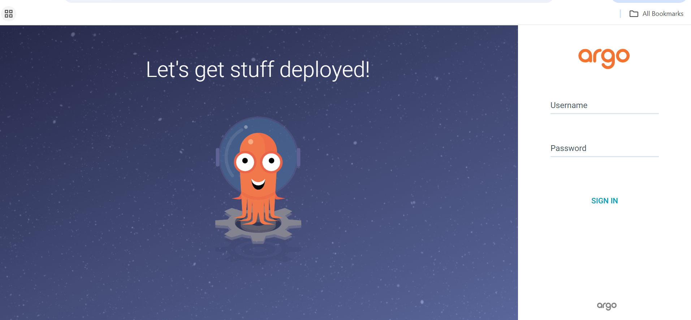

## Overview

In this section, you install Argo CD on an Arm64-based Google Kubernetes Engine (GKE) cluster and make it accessible through both a web browser and the Argo CD CLI.

By the end of this section, you'll have:

* Argo CD installed using official upstream manifests
* External browser access to the Argo CD UI
* Admin credentials retrieved securely
* The Argo CD CLI installed and authenticated

## Install Argo CD

This step installs all Argo CD components into a dedicated Kubernetes namespace using the official manifests maintained by the Argo project.

Create a namespace for Argo CD:

```bash
kubectl create namespace argocd
```

This creates an isolated Kubernetes namespace named `argocd`, keeping Argo CD components logically separated from application workloads.

Install Argo CD using official manifests:

```console
kubectl apply -n argocd \
  -f https://raw.githubusercontent.com/argoproj/argo-cd/stable/manifests/install.yaml
```

This downloads the latest stable Argo CD installation manifest and deploys all required components into the `argocd` namespace, including Deployments, StatefulSets, Services, ConfigMaps, Secrets, and RBAC objects.

Key components installed:

* `argocd-server` – Web UI and API server
* `argocd-repo-server` – Handles Git repository interactions
* `argocd-application-controller` – Continuously reconciles desired vs live state
* `argocd-dex-server` – Identity and authentication service
* `argocd-redis` – Internal cache and state store

All images used support **linux/arm64**, making them compatible with Arm-based GKE nodes.

### Wait for Argo CD Pods to Become Ready

```console
kubectl get pods -n argocd -w
```

This lists all pods in the `argocd` namespace. The `-w` flag watches for changes and continuously updates the output as pod states change.

The output is similar to:
```output
NAME                                               READY   STATUS    RESTARTS   AGE
argocd-application-controller-0                    1/1     Running   0          3h20m
argocd-applicationset-controller-944684d77-p8vcv   1/1     Running   0          3h20m
argocd-dex-server-6944b95798-hzp2j                 1/1     Running   0          3h20m
argocd-notifications-controller-7f5b87f55b-8v4zh   1/1     Running   0          3h20m
argocd-redis-c98d5794d-ckczm                       1/1     Running   0          3h20m
argocd-repo-server-7f86545bc4-gcqcv                1/1     Running   0          3h20m
argocd-server-685f5fb66f-24w8m                     1/1     Running   0          3h20m
```

Once all pods are running, Argo CD is successfully installed. Press **Ctrl-C** to exit.

## Expose Argo CD for external browser access

By default, Argo CD is only accessible inside the cluster. This step exposes the Argo CD server externally using a Kubernetes **LoadBalancer** service.

Patch the Argo CD server service:

```console
kubectl patch svc argocd-server -n argocd \
  -p '{"spec": {"type": "LoadBalancer"}}'
```

This modifies the existing `argocd-server` Service, changing the type from `ClusterIP` to `LoadBalancer`. This instructs GKE to provision a cloud load balancer with a public IP.

### Retrieve the external IP address

Retrieve the external IP address assigned by GKE:

```console
kubectl get svc argocd-server -n argocd -w
```

This displays service details for `argocd-server` and waits until GKE assigns an external IP address.

The output is similar to:
```output
NAME            TYPE           CLUSTER-IP      EXTERNAL-IP   PORT(S)                      AGE
argocd-server   LoadBalancer   34.118.228.71   34.xx.xx.xx   80:30166/TCP,443:30920/TCP   3h22m
```

The value under `EXTERNAL-IP` is used to access the UI and CLI. Press **Ctrl-C** to exit when you've copied the IP address.

## Get the admin password

Argo CD generates an initial admin password and stores it securely as a Kubernetes Secret.

Retrieve the password:

```console
kubectl -n argocd get secret argocd-initial-admin-secret \
  -o jsonpath="{.data.password}" | base64 -d && echo
```

This fetches the `argocd-initial-admin-secret` Secret, extracts the base64-encoded password field, and decodes it into human-readable form.

Save this password — it's required for both UI and CLI login.

## Access the Argo CD UI

Open your browser and navigate to:

```bash
https://<ARGOCD_EXTERNAL_IP>
```

Login with:

- Username: `admin`
- Password: from the previous step

You'll see a TLS warning because Argo CD uses a self-signed certificate by default. This is expected for lab and learning environments.



## Install the Argo CD CLI (Arm64)

The Argo CD CLI allows you to manage applications, sync states, and automate GitOps workflows from the terminal.

Download and install the Argo CD CLI:

```console
curl -LO https://github.com/argoproj/argo-cd/releases/latest/download/argocd-linux-arm64
chmod +x argocd-linux-arm64
sudo mv argocd-linux-arm64 /usr/local/bin/argocd
```

This downloads the latest Argo CD CLI binary for `linux/arm64`, makes it executable, and moves it into `/usr/local/bin` so it's available system-wide.

### Verify CLI installation

```console
argocd version --server <ARGOCD_EXTERNAL_IP> --insecure
```

The output is similar to:
```output
argocd: v3.2.5+c56f440
  BuildDate: 2026-01-14T16:38:17Z
  GitCommit: c56f4400f22c7e9fe9c5c12b85576b74369fb6b8
  GitTreeState: clean
  GoVersion: go1.25.5
  Compiler: gc
  Platform: linux/arm64
argocd-server: v3.2.5+c56f440
```

This confirms version compatibility between the CLI and server.

## Log in via CLI

Authenticate the CLI with the Argo CD server:

```console
argocd login <ARGOCD_EXTERNAL_IP> \
  --username admin \
  --password <PASTE_PASSWORD> \
  --insecure
```

This connects the CLI to the Argo CD API server and authenticates using admin credentials. The `--insecure` flag bypasses TLS verification for the self-signed certificate.

The output is similar to:
```output
'admin:login' logged in successfully
Context '35.232.56.107' updated
```

### Verify CLI connectivity

Query Argo CD for registered applications to confirm CLI authentication and API connectivity:

```console
argocd app list
```

The output is similar to:
```output
NAME  CLUSTER  NAMESPACE  PROJECT  STATUS  HEALTH  SYNCPOLICY  CONDITIONS  REPO  PATH  TARGET
```

## What you've accomplished and what's next

You've successfully installed Argo CD on an Arm64 GKE cluster, exposed the Argo CD server securely via a LoadBalancer, accessed the Argo CD web UI, and installed and authenticated the Argo CD CLI. Your environment is now ready for GitOps-based application deployment and continuous delivery using Argo CD.

In the next section, you'll deploy a production-ready NGINX application using pure GitOps workflows with Argo CD.
