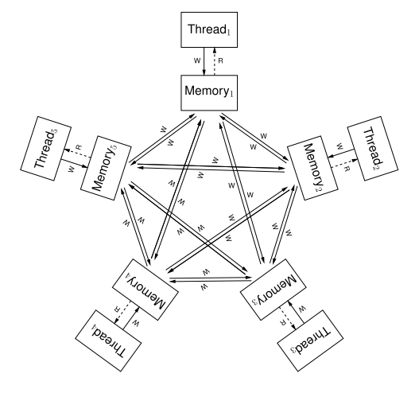

# What Is a Memory Model?

A language’s memory model defines how operations on shared data interleave at runtime, providing rules on what reorderings are allowed by compilers and hardware. In C++, the memory model specifies how threads interact with shared variables, ensuring consistent behavior across different compilers and architectures. You can think of memory ordering in four broad categories.

-  **Source Code Order**: The exact sequence in which you write statements. This is the most intuitive view because it directly reflects how code appears to you;

```output
int x = 5; // A
int z = x * 5 // B
int y = 42 // C 
```

- **Program Order**: The logical sequence recognized by the compiler, which may rearrange or optimize instructions under certain constraints to create a program that takes fewer cycles. Although the statements may appear in a particular order in your source code, the compiler could restructure them if it deems it safe. For example, the pseudo assembly below reorders the source line instructions above;

```output
LDR R1 #5 // A
LDR R2 #42 // C
MULT R3, #R1, #5 // B
```

- **Execution Order**: How instructions are actually issued and executed by the hardware. Modern CPUs often employ techniques to improve instruction-level parallelism such as out-of-order execution and speculation for performance. For instance, on an Arm-based system, you might see instructions issued in different order during runtime. The subtle difference between program order and execution order is that program order refers to the sequence seen in the binary whereas execution is the order in which those instructions are actually issued and retired. Even though the instructions are listed in one order, the CPU might reorder their micro-operations as long as it respects dependencies; and

- **Hardware-Perceived Order**: This is the perspective observed by other devices in the system, which can differ if the hardware buffers writes or merges memory operations. Crucially, the hardware-perceived order can vary between CPU architectures, for example between x86 and Arm, and this should be considered when porting applications. An abstract diagram from the academic paper is shown below (Maranget et. al, 2012). A write operation in one of the 5 threads in the pentagon below may propagate to the other threads in any order. 



# What Are the High-Level Differences Between the Arm Memory Model and the x86 Memory Model?

The memory models of Arm and x86 architectures differ in terms of ordering guarantees and required synchronizations. x86 processors implement a relatively strong memory model, commonly referred to as Total Store Order (TSO). Under TSO, loads and stores appear to execute in program order, with only limited reordering permitted. This strong ordering means that software running on x86 generally relies on fewer memory barrier instructions, making it easier to reason about concurrency.

In contrast, Arm’s memory model is more relaxed, allowing greater reordering of memory operations to optimize performance and energy efficiency. This relaxed model provides less intuitive ordering guarantees, meaning that loads and stores may be observed out of order by other processors. This means that source code needs to correctly follow the language standard to ensure reliable behavior. 