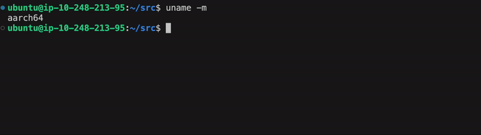

# Creating an Example of a Race Condition When Porting From x86 to Arm

Due to the differences in the hardware-perceived ordering as explained in the earlier sections, source code written for x86 may behave differently when ported to Arm. To demonstrate this we will create a trivial example and run it both on an x86 and Arm cloud instance. 

Start an Arm-based cloud instance. This example uses a `t4g.xlarge` Amazon Web Services (AWS) instance running Ubuntu 22.04 LTS, but other instances types are possible. 

If you are new to cloud-based virtual machines, refer to [Get started with Servers and Cloud Computing](/learning-paths/servers-and-cloud-computing/intro/). 

First confirm you are using a Arm-based instance with the following command.

```bash
uname -m
```
You should see the following output.

```output
aarch64
```

Next, install the required software packages. 

```bash
sudo apt update
sudo apt install g++ clang -y
```

Use a text editor to copy and paste the following code snippet into a file named `relaxed_memory_ordering.cpp`. 

```cpp
#include <iostream>
#include <atomic>
#include <thread>
#include <cassert>
#include <chrono>

struct Node {
    int x;
};
std::atomic<Node*> node{nullptr};

void threadA() {
    auto n = new Node();
    n->x = 42;
    node.store(n, std::memory_order_relaxed);
}

void threadB() {
    Node* n = nullptr;
    while ((n = node.load(std::memory_order_relaxed)) == nullptr) {
        std::this_thread::sleep_for(std::chrono::nanoseconds(50)); // Small sleep to improve scheduling
    }
    if (n->x != 42) {
        std::cerr << "Race condition detected: n->x = " << n->x << std::endl;
        std::terminate();
    }
}

void runTest() {
    for (int i = 0; i < 100000; ++i) { // Run many iterations but eventually time out
        node.store(nullptr, std::memory_order_relaxed);
        std::thread t1(threadA);
        std::thread t2(threadB);
        std::thread t3(threadA);
        std::thread t4(threadA);
        t1.join();
        t2.join();
        t3.join();
        t4.join();
        delete node.load();
    }
}

int main() {
    runTest();
    std::cout << "No Race Condition Occurred in this run" << std::endl;
    return 0;
}
```

The code above is a small example of a data race condition. Thread A creates a node variable and assigns it the number 42. Thread B checks that the variable assigned to the Node is equal to 42. Both functions use the `memory_order_relaxed` model, which allows the possibility for thread B to read an uninitialized variable before it has been assigned the value 42 in thread A. 

Compile the program using the GNU compiler:

```bash
g++ relaxed_memory_ordering.cpp -o relaxed_memory_ordering -O3
```

Run the command below to run the binary 10 times. Multiple runs increases the chance of observing a race condition.

```bash                                                                                                                 
for i in {1..10}; do ./relaxed_memory_ordering; done;
```

If you do not see a race condition, the animation below shows a race condition being triggered on the 3rd run.  
 


As the graphic above illustrates, a race condition is not a guarantee but a probability.  

Unfortunately, in production workloads there may be a more subtle probability that may surface under specific workloads. This is the reason race conditions are difficult to spot.

## How Does This Behave on an x86 Instance?

Due to the more strong memory model associated with x86 processors, programs that do not adhere to the C++ standard may give programmers a false sense of security. To demonstrate this, create an connect to an AWS `t2.2xlarge` instance that uses the x86 architecture. 

Running the following command I can see the underlying hardware is a Intel Xeon E5-2686 Processor

```bash
lscpu | grep -i "Model"
```

```output
Model name:                           Intel(R) Xeon(R) CPU E5-2686 v4 @ 2.30GHz
Model:                                79
```

Follow the same instructions to compile and run the application. 

```bash
g++ relaxed_memory_ordering.cpp -o relaxed_memory_ordering -O3
./relaxed_memory_ordering 
```

Observe there is no race conditions on the x86-based machine.  

The output is:

```output
No race condition occurred in this run
```

# How Do You Use the Correct Memory Ordering of Atomics

As the example above shows, not adhering to the C++ standard can lead to a false sensitivity when running on x86 platforms. To fix the race condition when porting you need to use the correct memory ordering for each thread. The code below updates `threadA` to use the `memory_order_release`, `threadB` to use `memory_order_acquire` and the `runTest` function to use `memory_order_release` on the Node object. 

Use an editor to copy and past the adjusted code below into a file named `correct_memory_ordering.cpp`.

```cpp
#include <iostream>
#include <atomic>
#include <thread>
#include <cassert>
#include <chrono>

struct Node {
    int x;
};
std::atomic<Node*> node{nullptr};

void threadA() {
    auto n = new Node();
    n->x = 42;
    node.store(n, std::memory_order_release);
}

void threadB() {
    Node* n = nullptr;
    while ((n = node.load(std::memory_order_acquire)) == nullptr) {
        std::this_thread::sleep_for(std::chrono::nanoseconds(50)); // Small sleep to improve scheduling
    }
    if (n->x != 42) {
        std::cerr << "Race condition detected: n->x = " << n->x << std::endl;
        std::terminate();
    }
}

void runTest() {
    for (int i = 0; i < 100000; ++i) { // Run many iterations but eventually time out
        node.store(nullptr, std::memory_order_release);
        std::thread t1(threadA);
        std::thread t2(threadB);
        std::thread t3(threadA);
        std::thread t4(threadA);
        t1.join();
        t2.join();
        t3.join();
        t4.join();
        delete node.load();
    }
}

int main() {
    runTest();
    std::cout << "No Race Condition Occurred in this run" << std::endl;
    return 0;
}

```

Compile and run on the Arm-based machine:

```bash
g++ correct_memory_ordering.cpp -o correct_memory_ordering -O3
./correct_memory_ordering 
```

Observe the race condition is gone and the output is:

```output
No Race Condition Occurred in this run
```

