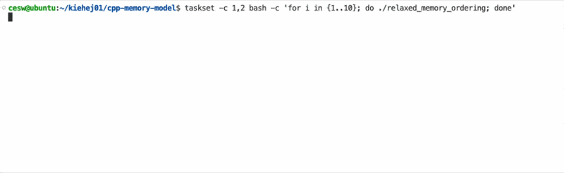

## Example of a race condition when porting from x86 to Arm

Due to the differences in the hardware memory ordering, as explained in the earlier sections, source code written for x86 can behave differently when ported to Arm. 

To demonstrate this, this section walks you through a simple example that is run on both an x86 and an Arm cloud instance. 

### Get Started 

Start an Arm-based cloud instance. This example uses the 1st generation Arm AGI CPU running Ubuntu 24.04 LTS, but you can follow along with other Arm-based processors running linux. 

If you are new to cloud-based virtual machines, see [Get started with Servers and Cloud Computing](/learning-paths/servers-and-cloud-computing/intro/). 

First, confirm you are using a Arm-based instance with the following command.

```bash
uname -m
```
You should see the following output:

```output
aarch64
```

Next, install the required software packages: 

```bash
sudo apt update
sudo apt install g++ clang -y
```

{}

If you are specifically targeting the 1st generation Arm AGI CPU on your own workload, the `-mcpu=armagicpu` was added in [GCC 16.1.0](https://github.com/gcc-mirror/gcc/commit/0f5f728854d2ea93e6806a8632c04383502b0386). As of May 2026, it enables the same architectural features as `-march=neoverse-v3ae` from [GCC 15](https://gcc.gnu.org/gcc-15/changes.html). However in the future there may be differences. Similarly for Clang and LLVM, support is expected to be introduced in LLVM version 23.

As such if you are targeting the Arm AGI CPU for your own workload, we recommend installing the latest version of GCC or Clang . **However, older versions of GCC and Clang are sufficient for running the examples in this learning path.**

{}

Use a text editor to copy and paste the following code snippet into a file named `relaxed_memory_ordering.cpp`: 

```cpp
#include <iostream>
#include <atomic>
#include <thread>
#include <cassert>
#include <chrono>

struct Node {
    int x;
};
std::atomic<Node*> node{nullptr};

void threadA() {
    auto n = new Node();
    n->x = 42;
    node.store(n, std::memory_order_relaxed);
}

void threadB() {
    Node* n = nullptr;
    while ((n = node.load(std::memory_order_relaxed)) == nullptr) {
        std::this_thread::sleep_for(std::chrono::nanoseconds(1)); // Small sleep to improve scheduling
    }
    int observation = n->x;
    if (observation != 42) {
        std::cerr << "Race condition detected: n->x = " << observation << std::endl;
        std::terminate();
    }
}

void runTest() {
    for (int i = 0; i < 100000; ++i) { // Run many iterations but eventually time out
        node.store(nullptr, std::memory_order_relaxed);
        std::thread t1(threadA);
        std::thread t2(threadB);
        std::thread t3(threadA);
        std::thread t4(threadA);
        t1.join();
        t2.join();
        t3.join();
        t4.join();
        delete node.load();
    }
}

int main() {
    runTest();
    std::cout << "No Race Condition Occurred in this run" << std::endl;
    return 0;
}
```

The code above demonstrates a data race condition. Thread A creates a node variable and assigns it the value `42`. Thread B checks that the variable assigned to the Node equals 42. Both threads use `memory_order_relaxed` model, allowing thread B to potentially read an uninitialized variable before thread A assigns the value of `42`. 

Compile the program using the GNU compiler:

```bash
g++ relaxed_memory_ordering.cpp -o relaxed_memory_ordering -O3
```

Run the binary 10 times while pinning execution to two CPU cores to increase the likelihood of triggering the race condition:

```bash                                                                                                               
taskset -c 1,2 bash -c 'for i in {1..10}; do ./relaxed_memory_ordering; done'
```

If you do not see a race condition, the animation below shows a race condition being triggered on the third run:  
 


As the graphic above illustrates, a race condition is probabilistic, and not guaranteed.  

Subtle issues can surface under specific workloads, making them challenging to detect.

### Behavior on an x86 instance

Due to the stronger memory model in x86 processors, programs not adhering to the C++ standard might give programmers a false sense of security. To demonstrate this, create an connect to an AWS `t2.2xlarge` instance that uses the x86 architecture. 

Running the command below you observe the underlying hardware is a Intel Xeon E5-2686 Processor.

```bash
lscpu | grep -i "Model"
```

Here is the output:

```output
Model name:                           Intel(R) Xeon(R) CPU E5-2686 v4 @ 2.30GHz
Model:                                79
```

Follow the same instructions to compile and run the application. 

```bash
g++ relaxed_memory_ordering.cpp -o relaxed_memory_ordering -O3
./relaxed_memory_ordering 
```

Observe there is no race conditions on the x86-based machine.  

The output is:

```output
No race condition occurred in this run
```

## Using correct memory ordering of atomics

As the example above shows, not adhering to the C++ standard can lead to a false sensitivity when running on x86 platforms. To fix the race condition when porting you need to use the correct memory ordering for each thread. The code below updates `threadA` to use the `memory_order_release`, `threadB` to use `memory_order_acquire` and the `runTest` function to use `memory_order_release` on the Node object. 

Use an editor to copy and past the adjusted code below into a file named `correct_memory_ordering.cpp`.

```cpp
#include <iostream>
#include <atomic>
#include <thread>
#include <cassert>
#include <chrono>

struct Node {
    int x;
};
std::atomic<Node*> node{nullptr};

void threadA() {
    auto n = new Node();
    n->x = 42;
    node.store(n, std::memory_order_release);
}

void threadB() {
    Node* n = nullptr;
    while ((n = node.load(std::memory_order_acquire)) == nullptr) {
        std::this_thread::sleep_for(std::chrono::nanoseconds(50)); // Small sleep to improve scheduling
    }
    if (n->x != 42) {
        std::cerr << "Race condition detected: n->x = " << n->x << std::endl;
        std::terminate();
    }
}

void runTest() {
    for (int i = 0; i < 100000; ++i) { // Run many iterations but eventually time out
        node.store(nullptr, std::memory_order_release);
        std::thread t1(threadA);
        std::thread t2(threadB);
        std::thread t3(threadA);
        std::thread t4(threadA);
        t1.join();
        t2.join();
        t3.join();
        t4.join();
        delete node.load();
    }
}

int main() {
    runTest();
    std::cout << "No Race Condition Occurred in this run" << std::endl;
    return 0;
}

```

Compile and run the new code on the Arm-based machine:

```bash
g++ correct_memory_ordering.cpp -o correct_memory_ordering -O3
taskset -c 1,2 bash -c 'for i in {1..10}; do ./correct_memory_ordering ; done'
```

Observe the race condition is gone and the output is:

```output
No Race Condition Occurred in this run
No Race Condition Occurred in this run
No Race Condition Occurred in this run
No Race Condition Occurred in this run
No Race Condition Occurred in this run
No Race Condition Occurred in this run
No Race Condition Occurred in this run
No Race Condition Occurred in this run
No Race Condition Occurred in this run
No Race Condition Occurred in this run
```

