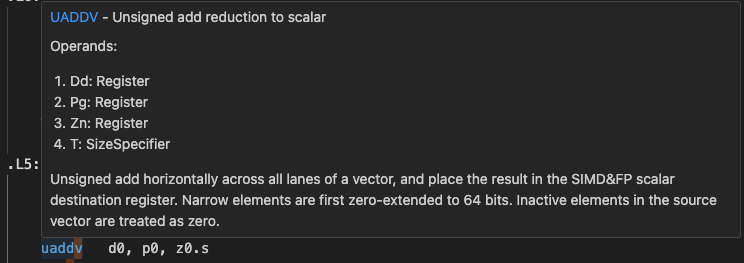

## Conditional Statements

Conditional statements within a for loop allow certain iterations to execute only when specified conditions are met. This mechanism is crucial for processing arrays or vectors selectively, as it lets you skip unnecessary computations or handle edge cases without disrupting the flow of the entire loop.

Arm’s Scalable Vector Extension (SVE) introduces a predicate (mask) to manage these conditional operations on a per-element basis. Instead of processing entire vectors uniformly, SVE uses the mask to enable or disable specific lanes dynamically. This approach is especially powerful for loops whose iteration counts are not exact multiples of the vector length, as it avoids wasted operations. Additionally, SVE supports strided access, meaning it can load or store elements separated by a constant stride in memory, improving efficiency in scenarios like processing slices of arrays.

In contrast, Arm NEON relies on packing data into fixed-width 128-bit registers. Elements are grouped together (packed) and processed simultaneously, but this can lead to overhead when handling irregular loop counts or accessing data with non-contiguous memory layouts. By comparison, SVE’s mask-based approach and flexible vector lengths provide more fine-grained control and higher efficiency for diverse data patterns.

To demonstrate the C++ code snippet below creates initialises 2 arrays of 128 integers. If the value of the index is even it's value is equal to the index, if the index is odd the value is 0. 

```cpp
#include <iostream>

int reduce(int *a, int *b, long N);

int main(){
    int a[128];
    int b[128];
    for (int i = 0; i < 128; ++i){
        if (i % 2 == 0){
            a[i] = i;
            b[i] = 1;
        } 
        else {
            a[i] = 0;
            b[i] = 0;
        }
    }
    long N = 128;
    int s = reduce(a, b, N);
    std::cout << s << std::endl;
    return 0;

}

int reduce(int *a, int *b, long N){
    long i;
    int s = 0;
    for (i = 0; i < N; ++i){
        if (b[i]){
            s += a[i];
        }
    }
    return s;
}
```

This example can be vectorised with SVE strided access. Run the commands below to generate the annotated assembly for both NEON (simd) and SVE. 

```bash
g++ -march=armv8-a+simd -fverbose-asm -O3 pred_loop.cpp -S -o neon_basic.s
g++ -march=armv8-a+sve -O3 -fverbose-asm pred_loop.cpp -S -o sve_basic.s
```

Passing the `-fverbose-asm` command annotates the assembly with the corresponding lines of source code. 

The SVE assembly uses the `st1w` instruction for strided access, whereas the NEON implementation does not. 

```output
// pred_loop.cpp:9:         if (i % 2 == 0){
...
	st1w	z2.s, p0, [x2, x0, lsl 2]	// vect_patt_104.35, loop_mask_124, MEM <vector([4,4]) int> [(int *)_67 + ivtmp.63_15 * 4]
	st1w	z0.s, p0, [x1, x0, lsl 2]	// vect_cstore_25.34, loop_mask_124, MEM <vector([4,4]) int> [(int *)_22 + ivtmp.63_15 * 4]
```

// MAYBE REMOVE
Inspecting the assembly we can see the `UADDV` instruction is being used for this reduction operation. .

## Unknown Loop Size


