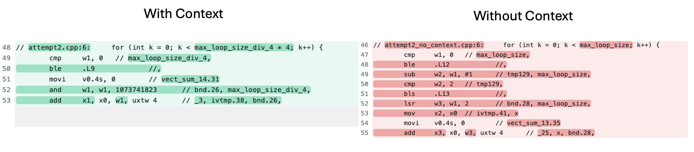

## Adding Context

In some situations, you may already know that a loop will run a multiple of a constant. Making this explicit can help the compiler avoid generating “cleanup” code for leftover iterations. To do this we can change our variable.


Original:

```cpp
int max_loop_size; // max_loop_size is always a multiple of 4. 
for (n = 0; n < max_loop_size; n++) {
    // ...
}
```

Addition of context:

```cpp
int max_loop_size_div_4 = max_loop_size / 4;
for (n = 0; n < max_loop_size_div_4 * 4; n++) {
    // ...
}
```

Your initial observation might be that these calculations are redundant. However, this change allows the compiler to ensure that `max_loop_size` is a multiple of 4. For example, if `max_loop_size` were 9, the division would yield 9/4 as 2 instead of 2.25, because integer division truncates the decimal part. If you want to test this out, run the basic snippet of code below

```cpp
#include <stdio.h>

int main() {
    for (int i = 1; i <= 20; ++i) {
        int result = i / 4;
        printf("Number: %d, Divided by 4: %d\n", i, result);
    }
    return 0;
}
```

## Example

The following example presumes the `max_loop_size` can be any integer.

```cpp
#include <iostream>

void foo(const int* x, int max_loop_size)
{
    int sum = 0;
    for (int k = 0; k < max_loop_size; k++) {
        sum += x[k];
    }
    std::cout << "Sum: " << sum << std::endl;
}

int main() {
    int max_loop_size;
    std::cout << "Enter a value for max_loop_size (must be a multiple of 4): ";
    std::cin >> max_loop_size;


    int x[max_loop_size];

    // Initialize test data
    for(int i = 0; i < max_loop_size; ++i) x[i] = i;

    foo(x, max_loop_size);

    return 0;
}
```

```bash
```

```cpp
#include <iostream>

void foo(const int* x, int max_loop_size_div_4)
{
    int sum = 0;
    for (int k = 0; k < max_loop_size_div_4 * 4; k++) {
        sum += x[k];
    }
    std::cout << "Sum: " << sum << std::endl;
}

int main() {
    int max_loop_size;
    std::cout << "Enter a value for max_loop_size (must be a multiple of 4): ";
    std::cin >> max_loop_size;


    int max_loop_size_div_4 = max_loop_size / 4;

    int x[max_loop_size_div_4 * 4];

    // Initialize test data
    for(int i = 0; i < (max_loop_size_div_4*4); ++i) x[i] = i;

    foo(x, max_loop_size_div_4);

    return 0;
}
```

```bash
g++ -O3 -fverbose-asm -march=armv8-a+simd example_with_context.cpp -S -o example_with_context.s
g++ -O3 -fverbose-asm -march=armv8-a+simd example_no_context.cpp -S -o example_no_context.s
```

```output
wc -l example_with_context.s example_no_context.s 
  259 example_with_context.s
  319 example_no_context.s
```


