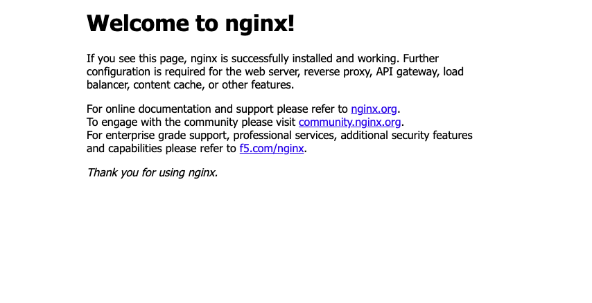

## Synthesize the AWS CDK application

Before you can deploy an application using the AWS CDK, you need to synthesize it. During synthesis, the AWS CDK checks for errors in the application code and then translates the code into an AWS CloudFormation template. 

Within the project directory, synthesize the application:

```bash
cdk synth
```
You can find the generated JSON template at `cdk.out/ArmCdkAppStack.template.json`. 

## Bootstrap the AWS CDK application environment 

After synthesizing your application, you need to bootstrap the environment. In this step, the AWS CDK creates resources such as AWS Identity and Access Management (IAM) roles. 

Within the project directory, bootstrap the environment:

```bash
cdk bootstrap
```

## Deploy the AWS CDK application 

After bootstrapping the environment, you're ready to deploy the application. AWS CDK deploys the application using the AWS CloudFormation stack generated during synthesis and IAM roles created during bootstrap. 

Deploy the application:

```bash
cdk deploy
```
By default, the AWS CDK CLI will prompt you to approve IAM-related changes during deployment. 

For the AWS CDK CLI to deploy the application without the need for approval, set the `--require-approval` flag to `never` during deployment:

```bash
cdk deploy --require-approval never
```

{}
The deployment can take a couple minutes to complete.
{}

When the deployment completes, the last couple lines of the output will include a URL to the web server and the load balancer's DNS name:

```output
Outputs:
ArmCdkAppStack.MyWebServerLoadBalancerDNSXXXXXXX = Hello-MyWeb-ZZZZZZZZZZZZZ-ZZZZZZZZZZ.us-east-1.elb.amazonaws.com
ArmCdkAppStack.MyWebServerServiceURLYYYYYYYY = http://Hello-MyWeb-ZZZZZZZZZZZZZ-ZZZZZZZZZZ.us-east-1.elb.amazonaws.com
```

## Verify application deployment

Open the service URL (`ArmCdkAppStack.MyWebServerServiceURL...`) from the deployment output in a web browser of your choice.

You'll see the following welcome message:



## Clean up AWS resources

After you've validated the deployment, clean up the AWS resources that you created with AWS CDK to avoid incurring costs:

```bash
cdk destroy
```
By default, the AWS CDK CLI will prompt you to approve the deletion of `ArmCDKAppStack`.

For the AWS CDK CLI to clean up resources without the need for approval, use the `--force` or `-f` flag:

```bash
cdk destroy -f
```

{}
The cleanup process can take a couple minutes to complete.
{}

## What you've accomplished

You've now synthesized and deployed a sample containerized application on Arm-based compute using Amazon ECS and the AWS CDK. After verifying that the deployment was successful, you cleaned up resources.

You can use this workflow to programmatically deploy and manage containerized applications on Arm-based compute powered by AWS Graviton processors. 
