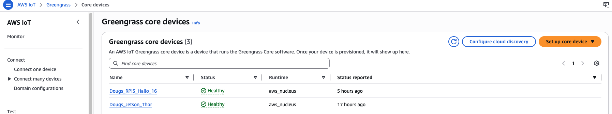
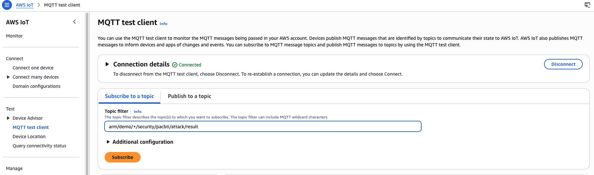
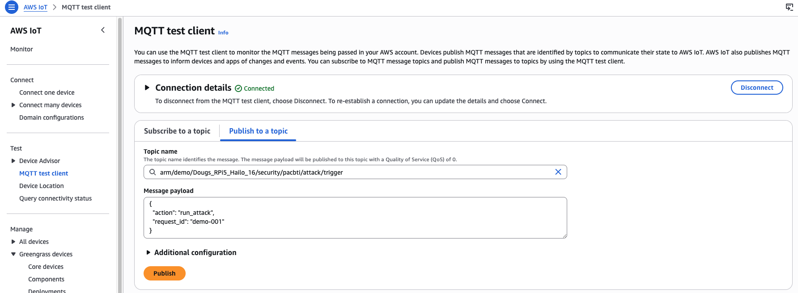

### Introduction

In this section, you run a test through the AWS IoT Core MQTT test client to check PAC/BTI availability on each platform.

### Dispatching the test invocation command

1. In the AWS Console, go to **IoT Core** -> **Greengrass devices** -> **Core devices** and record both core device names.



2. In the AWS Console, open **IoT Core** -> **MQTT test client** and select **Subscribe to a topic**.

Enter the following topic:
```json
Topic: arm/demo/+/security/pacbti/attack/result
```
Select **Subscribe**.



3. While still in MQTT test client, select **Publish to a topic** and enter the following, replacing **YOUR_CORE_DEVICE_NAME** with your Thor device name:

```json
Topic name:  **arm/demo/YOUR_CORE_DEVICE_NAME/security/pacbti/attack/trigger**

Message payload:
{
  "action": "run_attack",
  "request_id": "demo-001"
}
```

Select **Publish**.


### Reading the results

In the subscriptions area of the MQTT test client window, you should see results resembling this for your Thor device:

```output
{
  "binary": "/greengrass/v2/work/danson-com.arm.demo.PacBtiDemo/build/armv9-protected/vuln_demo",
  "build_flavor": "armv9-protected",
  "device": "thor",
  "executed_at": "2026-04-13T14:37:02.512938+00:00",
  "exploit_run": {
    "returncode": 1,
    "stderr": "Traceback (most recent call last):\n  File \"/greengrass/v2/packages/artifacts-unarchived/danson-com.arm.demo.PacBtiDemo/1.0.4/arm-pac-bti-greengrass-demo-mqtt-trigger/arm-pac-bti-greengrass-demo/tools/exploit.py\", line 74, in <module>\n    raise SystemExit(main())\n                     ^^^^^^\n  File \"/greengrass/v2/packages/artifacts-unarchived/danson-com.arm.demo.PacBtiDemo/1.0.4/arm-pac-bti-greengrass-demo-mqtt-trigger/arm-pac-bti-greengrass-demo/tools/exploit.py\", line 66, in main\n    result = run_exploit(args.binary, args.marker)\n             ^^^^^^^^^^^^^^^^^^^^^^^^^^^^^^^^^^^^^\n  File \"/greengrass/v2/packages/artifacts-unarchived/danson-com.arm.demo.PacBtiDemo/1.0.4/arm-pac-bti-greengrass-demo-mqtt-trigger/arm-pac-bti-greengrass-demo/tools/exploit.py\", line 43, in run_exploit\n    payload = build_payload(target_addr, padding)\n              ^^^^^^^^^^^^^^^^^^^^^^^^^^^^^^^^^^^\n  File \"/greengrass/v2/packages/artifacts-unarchived/danson-com.arm.demo.PacBtiDemo/1.0.4/arm-pac-bti-greengrass-demo-mqtt-trigger/arm-pac-bti-greengrass-demo/tools/exploit.py\", line 37, in build_payload\n    return (b\"A\" * padding) + raw\n            ~~~~~^~~~~~~~~\nOverflowError: cannot fit 'int' into an index-sized integer\n",
    "stdout": ""
  },
  "exploit_succeeded": false,
  "interpretation": "Exploit did not reach malicious_success(); on PAC/BTI builds a crash or early termination is expected.",
  "machine": "aarch64",
  "marker_found": false,
  "normal_run": {
    "returncode": 0,
    "stderr": "",
    "stdout": "Usage: vuln_demo <hex_payload>\n"
  },
  "protections": {
    "has_autiasp": true,
    "has_bti": true,
    "has_paciasp": true,
    "has_retaa": true
  },
  "trigger": {
    "payload": {
      "action": "run_attack",
      "request_id": "demo-001"
    },
    "source_topic": "arm/demo/Dougs_Jetson_Thor/security/pacbti/attack/trigger"
  }
}
```

This result indicates the Thor device (Armv9) reports PAC and BTI capabilities.

Now test the RPi5. In **Publish to a topic**, replace **YOUR_CORE_DEVICE_NAME** with your RPi5 core device name:


```json
Topic name:  **arm/demo/YOUR_CORE_DEVICE_NAME/security/pacbti/attack/trigger**

Message payload:
{
  "action": "run_attack",
  "request_id": "demo-001"
}
```

Select **Publish**.



Your output should be similar to the following:

```output
{
  "binary": "/greengrass/v2/work/danson-com.arm.demo.PacBtiDemo/build/armv8-unprotected/vuln_demo",
  "build_flavor": "armv8-unprotected",
  "device": "rpi5-desktop-16",
  "executed_at": "2026-04-13T14:44:07.485179+00:00",
  "exploit_run": {
    "returncode": 1,
    "stderr": "Traceback (most recent call last):\n  File \"/greengrass/v2/packages/artifacts-unarchived/danson-com.arm.demo.PacBtiDemo/1.0.4/arm-pac-bti-greengrass-demo-mqtt-trigger/arm-pac-bti-greengrass-demo/tools/exploit.py\", line 74, in <module>\n    raise SystemExit(main())\n                     ^^^^^^\n  File \"/greengrass/v2/packages/artifacts-unarchived/danson-com.arm.demo.PacBtiDemo/1.0.4/arm-pac-bti-greengrass-demo-mqtt-trigger/arm-pac-bti-greengrass-demo/tools/exploit.py\", line 66, in main\n    result = run_exploit(args.binary, args.marker)\n             ^^^^^^^^^^^^^^^^^^^^^^^^^^^^^^^^^^^^^\n  File \"/greengrass/v2/packages/artifacts-unarchived/danson-com.arm.demo.PacBtiDemo/1.0.4/arm-pac-bti-greengrass-demo-mqtt-trigger/arm-pac-bti-greengrass-demo/tools/exploit.py\", line 43, in run_exploit\n    payload = build_payload(target_addr, padding)\n              ^^^^^^^^^^^^^^^^^^^^^^^^^^^^^^^^^^^\n  File \"/greengrass/v2/packages/artifacts-unarchived/danson-com.arm.demo.PacBtiDemo/1.0.4/arm-pac-bti-greengrass-demo-mqtt-trigger/arm-pac-bti-greengrass-demo/tools/exploit.py\", line 37, in build_payload\n    return (b\"A\" * padding) + raw\n            ~~~~~^~~~~~~~~\nOverflowError: cannot fit 'int' into an index-sized integer\n",
    "stdout": ""
  },
  "exploit_succeeded": false,
  "interpretation": "Exploit did not reach malicious_success(); on PAC/BTI builds a crash or early termination is expected.",
  "machine": "aarch64",
  "marker_found": false,
  "normal_run": {
    "returncode": 0,
    "stderr": "",
    "stdout": "Usage: vuln_demo <hex_payload>\n"
  },
  "protections": {
    "has_autiasp": false,
    "has_bti": false,
    "has_paciasp": false,
    "has_retaa": false
  },
  "trigger": {
    "payload": {
      "action": "run_attack",
      "request_id": "demo-001"
    },
    "source_topic": "arm/demo/Dougs_RPi5_Hailo_16/security/pacbti/attack/trigger"
  }
}
```

This result indicates the RPi5 device (Armv8) does not report PAC and BTI capabilities.

### What we learned

Armv9 devices provide additional control-flow protection features for pointer integrity. You also used AWS IoT Greengrass to deploy and run a custom validation workflow across multiple edge devices.