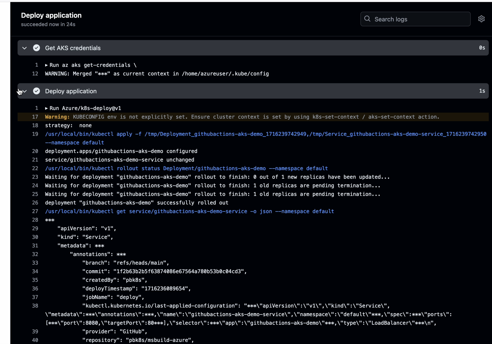

In this Learning Path, you will build a .NET 8-based web application using a self-hosted GitHub Actions Arm64 runner. You will deploy the application in an Azure Kubernetes Cluster, running on Microsoft Cobalt 100-based VMs. Self-hosted runners offer increased control and flexibility in terms of infrastructure, operating systems, and tools, in comparison to GitHub-hosted runners.

{}
* GitHub-hosted Arm64 runners have now reached General Availability. If your GitHub account is part of a Team or an Enterprise Cloud plan, you can use GitHub-hosted Arm64 runners. 

* To learn how you can configure a GitHub-managed runner, see the Learning Path [*Build multi-architecture container images with GitHub Arm-hosted runners*](/learning-paths/cross-platform/github-arm-runners/).
{}

## How do I create an Azure Virtual Machine?
Creating a virtual machine based on Azure Cobalt 100 is no different from creating any other VM in Azure. To create an Azure virtual machine, launch the [Azure portal](https://portal.azure.com/) and navigate to Virtual Machines. 

Select `Create Azure Virtual Machine`, and fill in the details such as `Name`, and `Region`. 

In the `Size` field, click on `See all sizes` and select the `D-Series v6` family of VMs. Select `D2psv6` from the list and create the VM.


{}
To learn more about Arm-based VMs in Azure, refer to "Getting Started with Microsoft Azure" in  [*Get started with Arm-based cloud instances*](/learning-paths/servers-and-cloud-computing/csp/azure).
{}

## How do I configure the GitHub repository?

The source code for the application and configuration files that you require to follow this Learning Path are hosted in this [msbuild-azure github repository](https://github.com/pbk8s/msbuild-azure). This repository also contains the Dockerfile and Kubernetes deployment manifests that you require to deploy the .NET 8 based application. 

Follow these steps:

* Start by forking the repository.

* Once the GitHub repository is forked, navigate to the `Settings` tab, and click on `Actions` in the left navigation pane. 

 * In `Runners`, select `New self-hosted runner`, which opens up a new page to configure the runner. 

* For `Runner image`, select `Linux`, and for `Architecture`, select `ARM64`. 

* Using the commands shown, execute them on the `D2psv6` VM you created in the previous step.

* Once you have configured the runner successfully, you will see a self-hosted runner appear on the same page in GitHub.

{}
To learn more about creating an Arm-based self-hosted runner, see this Learning Path [*Use Self-Hosted Arm64-based runners in GitHub Actions for CI/CD*](/learning-paths/laptops-and-desktops/self_hosted_cicd_github/).
{}

## How do I create an AKS cluster with Arm-based Azure Cobalt 100 nodes using Terraform?

You can create an Arm-based AKS cluster by following the steps in this Learning Path [*Create an Arm-based Kubernetes cluster on Microsoft Azure Kubernetes Service*](/learning-paths/servers-and-cloud-computing/aks/cluster_deployment/). 

Make sure to update the `main.tf` file with the correct VM as shown below:

```console
`vm_size` = `Standard_D2ps_v6`
```
Once you have successfully created the cluster, you can proceed to the next section.

## How do I create a container registry with Azure Container Registry (ACR)?

To create a container registry in Azure Container Registry to host the Docker images for your application, use the following command:

```console
az acr create --resource-group myResourceGroup --name mycontainerregistry
```
## How do I set up GitHub Secrets?

The next step allows GitHub Actions to access the Azure Container Registry to push application docker images and Azure Kubernetes Service to deploy application pods. 

Create the following secrets in your GitHub repository:

- Populate `ACR_Name` with the name of your Azure Container Registry.
- Populate `AZURE_CREDENTIALS` with Azure Credentials of a Service Principal.
- Populate `CLUSTER_NAME` with the name of your AKS cluster.
- Populate `CLUSTER_RESOURCE_GROUP_NAME` with the name of your resource group.

Refer to this [guide](https://learn.microsoft.com/en-us/azure/developer/github/connect-from-azure-secret) for further information about signing into Azure using GitHub Actions. 

## Deploy a .NET-based application 

.NET added support for Arm64 applications starting with version 6. Several performance enhancements have been made in later versions. The latest version that supports Arm64 targets is .NET 9. In this Learning Path, you will use the .NET 8 SDK for application development.

Follow these steps:

* In your fork of the GitHub repository, inspect the `aks-ga-demo.csproj` file. 

* Verify that the `TargetFramework` field has `net8.0` as the value. 

The contents of the file are shown below:

```console
<Project Sdk="Microsoft.NET.Sdk.Web">

  <PropertyGroup>
    <TargetFramework>net8.0</TargetFramework>
    <RootNamespace>aks_ga_demo</RootNamespace>
  </PropertyGroup>

</Project>
```

You can inspect the contents of the `Dockerfile` within your repository as well. This is a multi-stage Dockerfile with the following stages: 

1. `base` stage - prepares the base environment with the `.NET 8 SDK` and exposes ports 80 and 443.

2. `build` stage - restores dependencies and builds the application.

3. `publish` stage - publishes the application making it ready for deployment.

4. `final` stage - copies the published application into the final image and sets the entry point to run the application.

```console
FROM mcr.microsoft.com/dotnet/sdk:8.0 AS base
WORKDIR /app
EXPOSE 80
EXPOSE 443

FROM mcr.microsoft.com/dotnet/sdk:8.0 AS build
WORKDIR /src
COPY ["aks-ga-demo.csproj", "./"]
RUN dotnet restore "./aks-ga-demo.csproj"
COPY . .
WORKDIR "/src/."
RUN dotnet build "aks-ga-demo.csproj" -c Release -o /app/build

FROM build AS publish
RUN dotnet publish "aks-ga-demo.csproj" -c Release -o /app/publish

FROM base AS final
WORKDIR /app
COPY --from=publish /app/publish .
ENTRYPOINT ["dotnet", "aks-ga-demo.dll"]
```

Next, navigate to the `k8s` folder and check the Kubernetes yaml files. The `deployment.yml` file defines a deployment for the application. It specifies the container image to use from ACR and exposes port 80 for the application. The deployment ensures that the application runs with the defined resource constraints and is accessible on the specified port.

```yaml
apiVersion: apps/v1
kind: Deployment
metadata:
  name: githubactions-aks-demo
spec:
  selector:
    matchLabels:
      app: githubactions-aks-demo
  template:
    metadata:
      labels:
        app: githubactions-aks-demo
    spec:
      containers:
      - name: githubactions-aks-demo
        image: msbuilddemo.azurecr.io/githubactions-aks-demo
        resources:
          limits:
            memory: "128Mi"
            cpu: "500m"
        ports:
        - containerPort: 80
```

The `service.yml` file defines a `Service` and uses `LoadBalancer` to expose the service externally on port 8080, directing traffic to the application’s container on port 80.

```yaml
apiVersion: v1
kind: Service
metadata:
  name: githubactions-aks-demo-service
spec:
  selector:
    app: githubactions-aks-demo
  type: LoadBalancer
  ports:
  - port: 8080
    targetPort: 80
```

Finally, have a look at the GitHub Actions file located at `.github/workflows/deploytoAKS.yml` 

```yaml
name: Deploy .NET app

on:
  workflow_dispatch:
  push:
  

jobs:
  deploy:
    name: Deploy application
    runs-on: self-hosted
    
    steps:
      - name: Checkout repo
        uses: actions/checkout@v2

      - name: Build image
        run: docker build -t githubactions-aks-demo:'${{github.sha}}' .
      
      - name: Azure login
        uses: azure/login@v1.4.6
        with:
          creds: '${{ secrets.AZURE_CREDENTIALS }}'

      - name: ACR login
        run: az acr login --name msbuilddemo

      - name: Tag and push image
        run: |
          docker tag githubactions-aks-demo:'${{github.sha}}' msbuilddemo.azurecr.io/githubactions-aks-demo:'${{github.sha}}'
          docker push msbuilddemo.azurecr.io/githubactions-aks-demo:'${{github.sha}}'

      - name: Get AKS credentials
        env:
          CLUSTER_RESOURCE_GROUP_NAME: ${{ secrets.CLUSTER_RESOURCE_GROUP_NAME }}
          CLUSTER_NAME: ${{ secrets.CLUSTER_NAME }}
        run: |
          az aks get-credentials \
            --resource-group $CLUSTER_RESOURCE_GROUP_NAME \
            --name $CLUSTER_NAME \
            --overwrite-existing
      
      - name: Deploy application
        uses: Azure/k8s-deploy@v1
        with:
          action: deploy
          manifests: |
           k8s/deployment.yml
           k8s/service.yml
          images: |
            msbuilddemo.azurecr.io/githubactions-aks-demo:${{github.sha }}
```

This GitHub Actions yaml file defines a workflow to deploy a .NET application to Azure Kubernetes Service (AKS). This workflow runs on the self-hosted GitHub Actions runner that you configured in a previous step. This workflow can be triggered manually, or on a push to the repository. 

It has the following main steps:

1. `Checkout repo` - checks out the repository code.
2. `Build image` - builds a Docker image of the application.
3. `Azure login` - logs in to Azure using stored credentials in GitHub Secrets.
4. `ACR login` - logs in to Azure Container Registry (ACR).
5. `Tag and push image` - tags and pushes the Docker image to Azure Container Registry.
6. `Get AKS credentials` - retrieves Azure Kubernetes Cluster credentials.
7. `Deploy application` - deploys the application to AKS using specified Kubernetes manifests.

## How do I run the CI/CD pipeline?

The next step is to trigger the pipeline manually by navigating to `Actions` tab in the GitHub repository. Select `Deploy .NET app`, and click on `Run Workflow`. You can also execute the pipeline by making a commit to the repository. Once the pipeline executes successfully, you will see the Actions output in a format similar to what is shown below:



You can check your kubernetes cluster and see new application pods deployed on the cluster as shown below:


