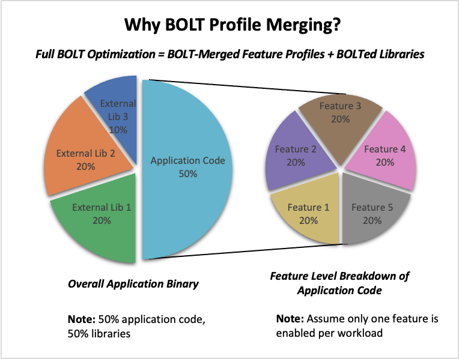

[BOLT](https://github.com/llvm/llvm-project/blob/main/bolt/README.md) is a post-link binary optimizer that uses Linux Perf data to reorder executable code layout. This improves instruction cache locality, reduces memory overhead, and boosts runtime performance.

Before you begin, ensure that you have the following installed:

- [BOLT](/install-guides/bolt/) 
- [Linux Perf](/install-guides/perf/)

You should use an Arm-based Linux system with at least 8 CPUs and 16 GB of RAM. This Learning Path was tested on Ubuntu 24.04, but other Linux distributions are also supported.

## What will I do in this Learning Path?

In this Learning Path, you'll learn how to use BOLT to optimize both applications and shared libraries. You'll walk through a real-world example using MySQL and two of its dependent libraries: `libssl.so` and `libcrypto.so`.

You will:

- **Collect and merge BOLT profiles from multiple workloads, such as read-only and write-only** - a read-only workload typically involves operations that only retrieve or query data, such as running SELECT statements in a database without modifying any records. In contrast, a write-only workload focuses on operations that modify data, such as INSERT, UPDATE, or DELETE statements. Profiling both types ensures that the optimized binary performs well under different usage patterns.

- **Independently optimize application binaries and external user-space libraries, such as `libssl.so` and `libcrypto.so`** - this means you can apply BOLT optimizations not just to your main application, but also to shared libraries it depends on, resulting  in a more comprehensive performance improvement across your entire stack.

- **Merge profile data for broader code coverage** - by combining the profile data collected from different workloads and libraries, you create a single, comprehensive profile that represents a wide range of application behaviors. This merged profile allows BOLT to optimize code paths that are exercised under different scenarios, leading to better overall performance and coverage than optimizing for a single workload.

- **Run BOLT on each binary application and library** - with the merged profile, you apply BOLT optimizations separately to each binary and shared library. This step ensures that both your main application and its dependencies are optimized based on real-world usage patterns, resulting in a more efficient and responsive software stack.

- **Link the final optimized binary with the separately optimized libraries to deploy a fully optimized runtime stack** - after optimizing each component, you combine them to create a deployment where both the application and its libraries benefit from BOLT's enhancements.

## What is BOLT profile merging?

BOLT profile merging is the process of combining profiling from multiple runs into a single profile. This merged profile enables BOLT to optimize binaries for a broader set of real-world behaviors, ensuring that the final optimized application or library performs well across diverse workloads, not just a single use case. By merging profiles, you capture a wider range of code paths and execution patterns, leading to more robust and effective optimizations.

## What are good applications for BOLT?

MySQL and Sysbench are used as example applications, but you can use this method for any feature-rich application that:

1. Exhibits multiple runtime paths  

    Applications often have different code paths depending on the workload or user actions. Optimizing for just one path can leave performance gains untapped in others. By profiling and merging data from various workloads, you ensure broader optimization coverage.

2. Uses dynamic libraries  

    Most modern applications rely on shared libraries for functionality. Optimizing these libraries alongside the main binary ensures consistent performance improvements throughout the application.

3. Requires full-stack binary optimization for performance-critical deployment  

    In scenarios where every bit of performance matters, such as high-throughput servers or latency-sensitive applications, optimizing the entire binary stack can yield significant benefits.

