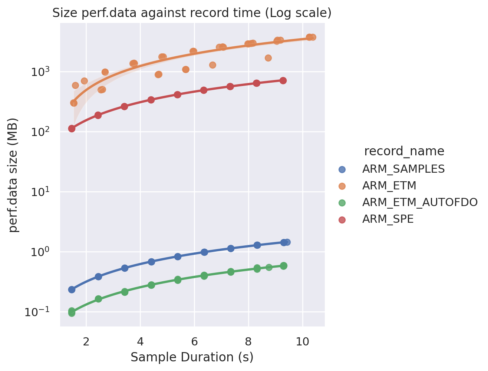

## Appendix A - Perf Record Size Rates

### Perf Record Size Rates

All of data collected and shown below was recorded on a [Neoverse N1 Software Development Platform (N1SDP)](https://developer.arm.com/Tools%20and%20Software/Neoverse%20N1%20SDP) running the [CoreMark](https://github.com/eembc/coremark) benchmark tool.

The perf record methods listed in the [Collect Profile Information](/learning-paths/servers-and-cloud-computing/bolt/collect-profile-information/) section were run with CoreMark for different lengths of time and the size of `perf.data` output was collected.
```bash
perf record -e <method> -- coremark.exe 0 0 0 <iterations>
```

- `method` is the args for the record method
- `iterations` is the number of iterations for CoreMark to run and this varies how long it runs for. Iteration values between 20000 and 200000 were used and these correspond roughly to running CoreMark between 1 seconds and 9 seconds.

Each method and iteration value was run 4 times.



The graph shows that if you recorded Samples and ETM for the same time the `perf.data` from ETM would be over 1000 times larger. Large `perf.data` files it will increase the time `perf2bolt` takes to run some `perf script` commands and to parse the output.

### ETM vs ETM AutoFDO

ETM is the prefered perf record method because you can get branch information from the output, allows you to do Branch Aggregation and this improves BOLTs maximum performance gains. But that does come at the downside of creating large `perf.data` files. One way around this is to use ETM AutoFDO option, it will still record ETM data and you can use Branch Aggregation but it won't record at such a large rate and is useful for long benchmarks.
