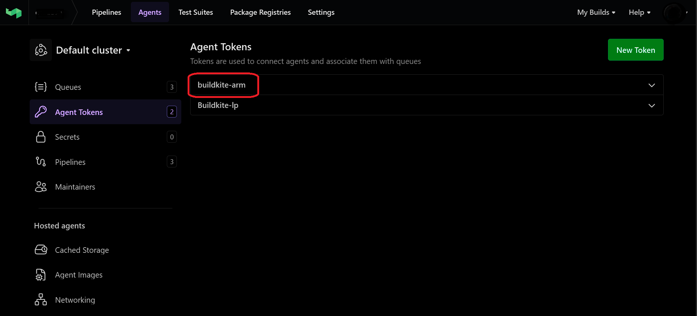
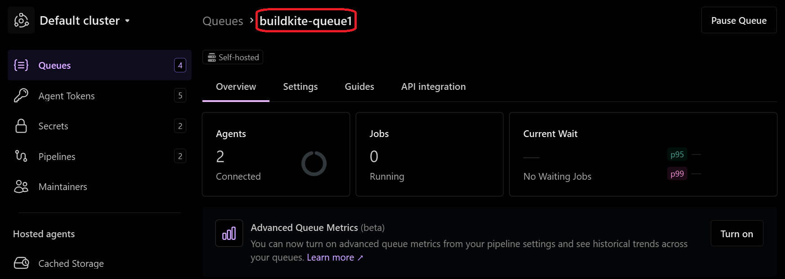
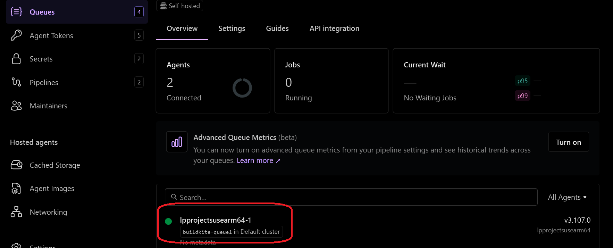

# Set up a Buildkite agent

After installing the Buildkite agent binary on a Google Axion C4A Arm VM, you can set up and configure a Buildkite agent and queue.

## 1. Create an Agent Token

Before configuring the agent, you need an agent token from your Buildkite organization.

1. Log in to your Buildkite account (you can login with GitHub), and go to your Organization Settings
2. Click Agents in the left menu
3. Click Create Agent Token  
4. Enter a name for your token, such as `buildkite-arm`
5. Click Create Token
6. Copy the token immediately, you won’t be able to see it again after leaving the page.




## 2. Configure Buildkite Agent

Create the configuration directory and file on your local system with the commands below:

```console
sudo tee /root/.buildkite-agent/buildkite-agent.cfg > /dev/null <<EOF
token="YOUR_AGENT_TOKEN"
tags="queue=buildkite-queue1"
EOF
```

Replace `YOUR_AGENT_TOKEN` with the token you generated from your Buildkite Agents page.  

{}
You find it easier to copy the commands above into a text file named `config-agent.sh` and run the file.
```console
bash ./config-agent.sh
```
{}

In Buildkite `tags` are key-value labels that let you match pipeline steps to specific agents, ensuring jobs run only on agents with the required tag.

The `name` field is optional; if omitted, Buildkite will assign a default name.


Verify the configuration:

```console
sudo cat /root/.buildkite-agent/buildkite-agent.cfg
```

You should see output similar to:

```output
# The token from your Buildkite "Agents" page
token="YOUR-GENERATED-TOKEN-VALUE"
tags="queue=buildkite-queue1"
```

## 3. Create a Queue in Buildkite

Now that your agent is created, you can create a queue. 

1. Go to your Buildkite Organization select Queues and then select Create Queue
2. Name the queue, for example `buildkite-queue1`
3. Save the queue

{}
Make sure the queue name matches the `tags` field in the agent configuration.
{}



## 4. Verify the agent in the Buildkite UI

First, start the agent on your local computer: 

```console
sudo /root/.buildkite-agent/bin/buildkite-agent start --build-path="/var/lib/buildkite-agent/builds"
```

Then, confirm it is visible in the Buildkite UI:

Go Buildkite and select Agents

Confirm that the agent is online and connected to the queue `buildkite-queue1`.



The Buildkite agent is ready, you can proceed to use Buildkit for building multi-arch images. 
