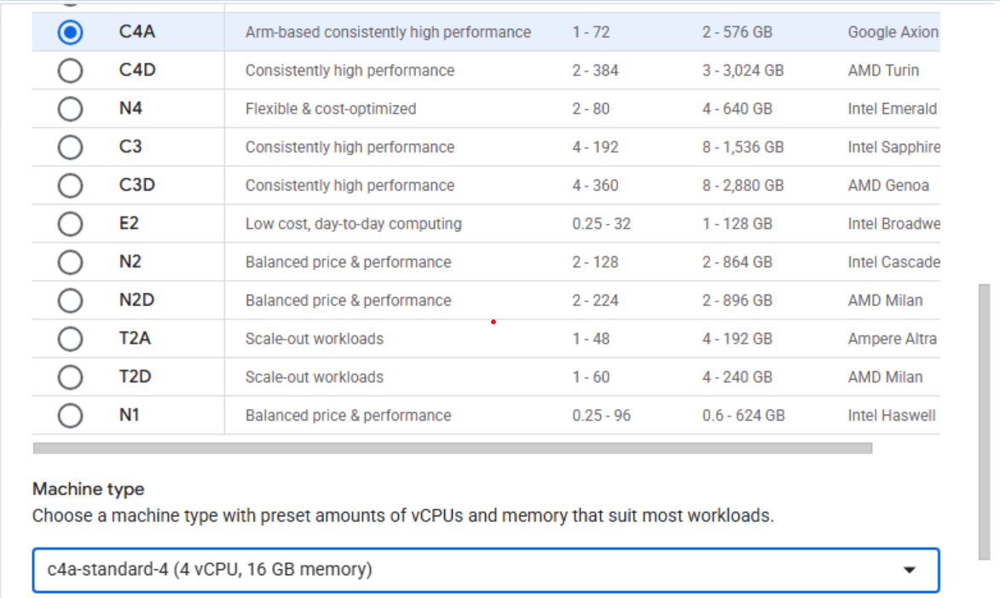

## Overview

In this section, you'll learn how to provision a Google Axion C4A Arm virtual machine on Google Cloud Platform (GCP) using the `c4a-standard-4` instance type with 4 vCPUs and 16 GB memory in the Google Cloud Console.

## Provision a Google Axion C4A VM in the Google Cloud Console

To create a virtual machine based on the C4A instance type:

1. Navigate to the [Google Cloud Console](https://console.cloud.google.com/).
2. Go to Compute Engine > VM Instances and select **Create Instance**.
3. Under **Machine configuration**:
   - Populate fields such as **Instance name**, **Region**, and **Zone**.
   - Set **Series** to **C4A**.
   - Select **c4a-standard-4** for machine type.

   

4. Under **OS and Storage**, select **Change**, then choose an Arm64-based OS image. For this Learning Path, use **SUSE Linux Enterprise Server** or **Ubuntu**. Select your preferred version for the operating system. Ensure you choose the Arm version, then select **Select**.
5. Under **Networking**, enable **Allow HTTP traffic**.
6. Select **Create** to launch the instance.

Once the instance is running, connect using SSH