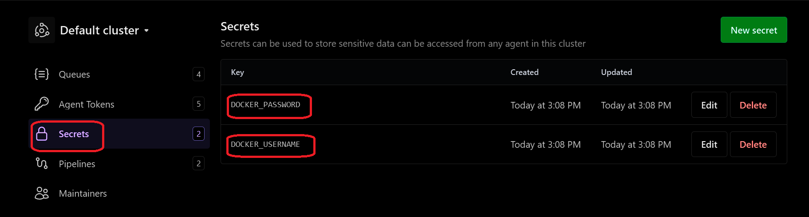
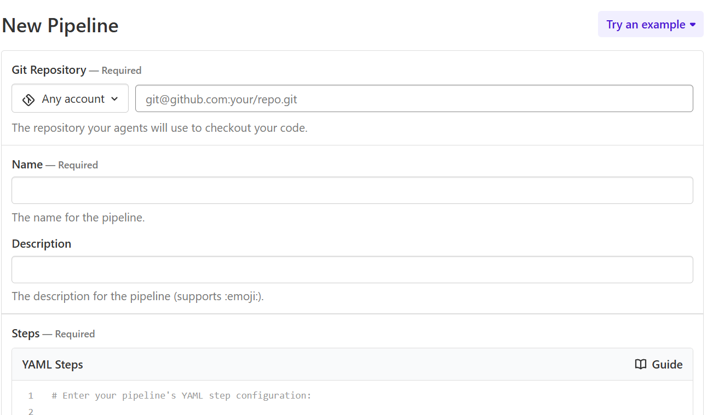
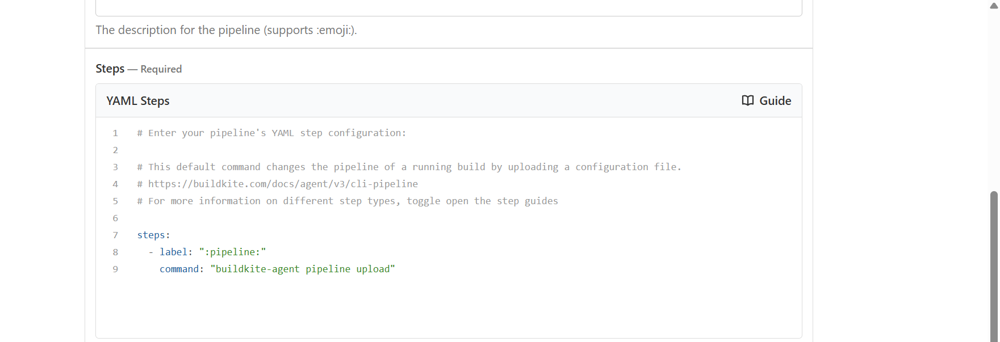
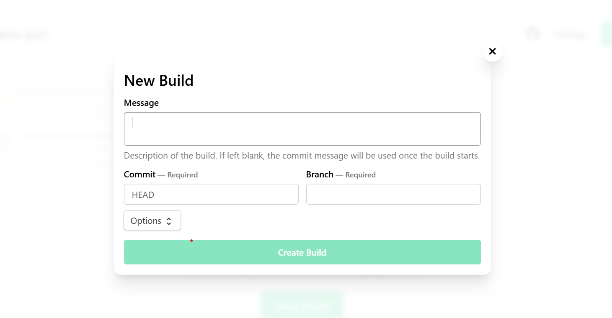

## Create an application

You can now create an application to containerize with Docker. The example below is a simple Flask-based Python application.

Create a new public GitHub repository where you can create the Dockerfile and the Python file for the application.

### Create a Dockerfile

In a GitHub repo, add a new file named `Dockerfile` with this content:

```dockerfile
FROM python:3.12-slim

WORKDIR /app

COPY app.py .

RUN pip install flask

EXPOSE 5000

CMD ["python", "app.py"]
```

### Create a Python application

In the same repo, add a Python source file named `app.py`:

```python
from flask import Flask
app = Flask(__name__)

@app.route('/')
def hello():
    return "Hello from Arm-based Buildkite runner!"

if __name__ == "__main__":
    app.run(host="0.0.0.0", port=5000)
```

This Python code defines a simple Flask web server that listens on all interfaces (0.0.0.0) at port 5000 and responds with "Hello from Arm-based Buildkite runner!" when the root URL (/) is accessed.

### Add the code to your GitHub repository

Before triggering the pipeline, your GitHub repository should have:

- `Dockerfile` (defines your multi-arch image)
- `app.py` (your Python microservice)

You will need the path to the GitHub repository when you create a Buildkite pipeline below.

### Add Docker credentials as Buildkite secrets

Make sure to add your Docker credentials as secrets in the Buildkite UI.

Navigate to Buildkite and select Agents and then Secrets and add `DOCKER_USERNAME` and `DOCKER_PASSWORD`.



### Create a Buildkite pipeline for multi-arch builds

In Buildkite, define your pipeline using YAML through the UI.

Go to the Buildkite Dashboard and select Pipelines and New Pipeline

Fill out the form:

   - Git Repository: Enter your GitHub repository URL (SSH or HTTPS).  
   - Name: Enter a name for your pipeline.



In the Steps (YAML Steps) section, paste your pipeline YAML.

```yaml
steps:
  - label: "Build and Push Multiarch App"
    env:
      DOCKER_CONFIG: "~/.docker"
    commands:
      - echo "Testing env hook..."
      - env | grep DOCKER
      - ~/.buildkite-agent/bin/buildkite-agent secret get "DOCKER_PASSWORD" | docker login -u "$(~/.buildkite-agent/bin/buildkite-agent secret get "DOCKER_USERNAME")" --password-stdin
      - docker buildx rm mybuilder || true
      - docker buildx create --use --name mybuilder
      - docker buildx inspect --bootstrap
      - docker buildx build --platform linux/amd64,linux/arm64 -t "$(~/.buildkite-agent/bin/buildkite-agent secret get "DOCKER_USERNAME")/multi-arch-app:latest" --push . 
    agents:
      queue: buildkite-queue1
```   



Click Create Pipeline.

Trigger a new build by clicking New Build on your pipeline’s dashboard.



## What you've accomplished

You've now created a simple Flask application, added a Dockerfile, set up your GitHub repository, and configured a Buildkite pipeline for multi-architecture builds on Arm. You also added Docker credentials as secrets and defined your pipeline steps in YAML. These steps prepare you to build, push, and test containerized applications using Arm-based infrastructure. You're now ready to validate your setup and run your first build!
