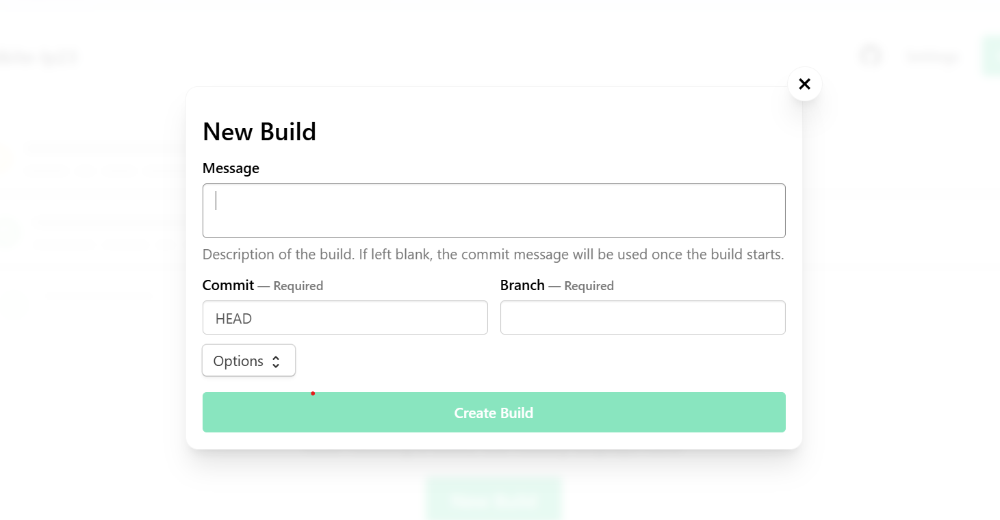

## Run the Buildkite pipeline for multi-arch builds

Follow the steps below to run your pipeline on an Arm-based Buildkite agent. You will use Docker Buildx to create a multi-architecture image for both `arm64` and `amd64`. 

## Ensure the agent is running

Before your pipeline can execute, the Buildkite agent must be running and connected to your Buildkite account. To verify the agent status, run the following command on your VM:

```console
sudo /root/.buildkite-agent/bin/buildkite-agent status
```

This command checks the current state of your Buildkite agent and displays its connection status. When the agent is properly running and connected, you'll see logs indicating "Registered agent" in the output, confirming that the agent is online and ready to receive jobs from Buildkite. The agent continuously listens for new pipeline jobs and executes the steps you've defined in your configuration.

## Trigger the pipeline

To start your pipeline, navigate to your pipeline in the Buildkite web interface. From your Buildkite dashboard, select the pipeline you created and click the "New Build" button. Choose the branch you want to build from the dropdown menu, then click "Start Build" to begin execution.



When you trigger the pipeline, Buildkite sends the job to your Arm-based agent and begins executing the steps defined in your YAML configuration file. The agent will process each step in sequence, starting with Docker login, followed by creating the Buildx builder, and finally building and pushing your multi-architecture Docker image.

## Monitor the Build

You can see the logs of your build live in the Buildkite UI.

The steps include:
- Docker login
- Buildx builder creation
- Multi-arch Docker image build and push


## Verify multi-arch image

After the pipeline completes successfully, you can go to Docker Hub and verify the pushed multi-arch images:


## Run the Flask application

```console
docker pull <DOCKER_USERNAME>/multi-arch-app:latest
docker run --rm -p 80:5000 <DOCKER_USERNAME>/multi-arch-app:latest
```

This command runs the Flask application inside a container, exposing it on port 5000 inside the container and mapping it to port 80 on the host machine.

You can now visit the VM’s Public IP to access the Flask application.

```console
http://<VM_IP>
```
You should see output similar to:


Your pipeline is working, and you have successfully built and ran the Flask application using your Arm-based Buildkite agent.

## Recap your progress

You've now completed the key steps to run a Buildkite pipeline on an Arm-based Google Axion C4A VM. You verified your agent connection, triggered and monitored a multi-architecture build, and successfully deployed and tested a Flask application in a Docker container. This workflow demonstrates how to use Arm infrastructure for modern CI/CD pipelines and multi-architecture container builds. Great work, you're now ready to apply these skills to your own Arm-based projects!