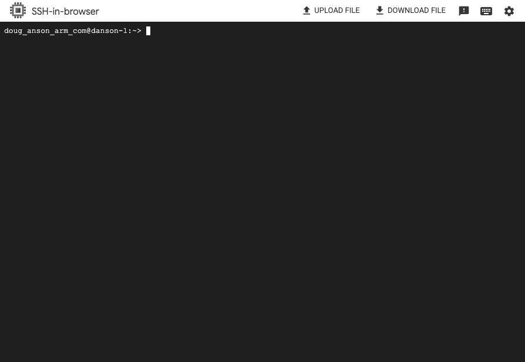

## Overview

This section shows you how to provision a Google Axion C4A Arm virtual machine on Google Cloud Platform (GCP) using the `c4a-standard-4` (4 vCPUs, 16 GB memory) machine type in the Google Cloud Console.  

{}
For support on GCP setup, see the Learning Path [Getting started with Google Cloud Platform](/learning-paths/servers-and-cloud-computing/csp/google/).
{}

## Provision a Google Axion C4A Arm VM

To create a virtual machine based on the C4A instance type:
- Navigate to the [Google Cloud Console](https://console.cloud.google.com/).
- Go to **Compute Engine > VM Instances** and select **Create Instance**. 
- Under **Machine configuration**:
   - Populate fields such as **Instance name**, **Region**, and **Zone**.
   - Set **Series** to `C4A`.
   - Select `c4a-standard-4` for machine type.

   


- Under **OS and Storage**, select **Change**, then choose an Arm64-based OS image. For this Learning Path, use **SUSE Linux Enterprise Server** or **Ubuntu**. 
   - If using **SUSE Linux Enterprise Server**, select "Pay As You Go" for the license type. 
   - If using **Ubuntu**, under the **Version** tab, scroll down and select the aarch64 version of **Ubuntu 22.04 LTS**.
- Once appropriately selected, select **Select**. 
- Under **Networking**, enable **Allow HTTP traffic**.
- Select **Create** to launch the instance.
- Once created, you see an **SSH** option to the right in your list of VM instances. Select this to launch an SSH shell into your VM instance:


- A browser window opens and displays a shell into your VM instance:




## Explore your instance: run uname

Use the [uname](https://en.wikipedia.org/wiki/Uname) utility to verify that you are using an Arm-based server. For example:

```console
uname -m
```

The output identifies the host machine as `aarch64`.

## Run hello world

Install the `gcc` compiler:


  
sudo apt update
sudo apt install -y build-essential
  
  
sudo zypper refresh
sudo zypper install -y gcc
  


Using a text editor of your choice, create a file named `hello.c` with the contents below:

```C
#include <stdio.h>
int main(){
    printf("hello world\n");
    return 0;
}
```
Build and run the application:

```console
gcc hello.c -o hello
./hello
```

The output is:

```output
hello world
```

## Automate Arm infrastructure deployment

Cloud infrastructure deployment is typically done via Infrastructure as Code (IaC) automation tools. There are Cloud Service Provider-specific tools like [Google Cloud Deployment Manager](https://docs.cloud.google.com/deployment-manager/docs/).

There are also Cloud Service Provider-agnostic tools like [Terraform](https://www.terraform.io/). Review the Learning Path[Deploy Arm virtual machines on Google Cloud Platform (GCP) using Terraform](/learning-paths/servers-and-cloud-computing/gcp) next.