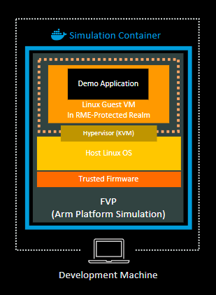

---
# User change
title: "Overview: Realms"

weight: 2 # 1 is first, 2 is second, etc.

# Do not modify these elements
layout: "learningpathall"
---
## Overview: Realms

The Arm Confidential Compute Architecture (CCA) enables the construction of protected execution environments called *Realms*. 

Realms allow lower-privileged software, such as an application or a virtual machine, to
protect its content and execution from attacks by higher-privileged software, such as an OS or a hypervisor. Realms provide an environment for confidential computing, without requiring the Realm owner to trust the software components that manage the resources that the Realm uses.

The Realm Management Extension (RME) is an extension to the Armv9 A-profile architecture. It defines the set of hardware features and properties that are required to comply with the Arm CCA architecture. 

RME introduces a new security state, *Realm world*, in addition to the traditional Secure and Non-secure states.

In this Learning Path, you will learn how to run the reference integration software stack for Arm CCA in a pre-built docker container. 

The graphic below shows the software stack you will run on your development machine:

Within the pre-built docker container, you will learn how to create a Realm that runs a guest Linux kernel, and run a simple application within the Realm. You will also learn how to obtain a CCA attestation token from the running guest in the Realm. 

This Learning Path focuses on the common practice of using a Realm to protect an entire virtual machine.